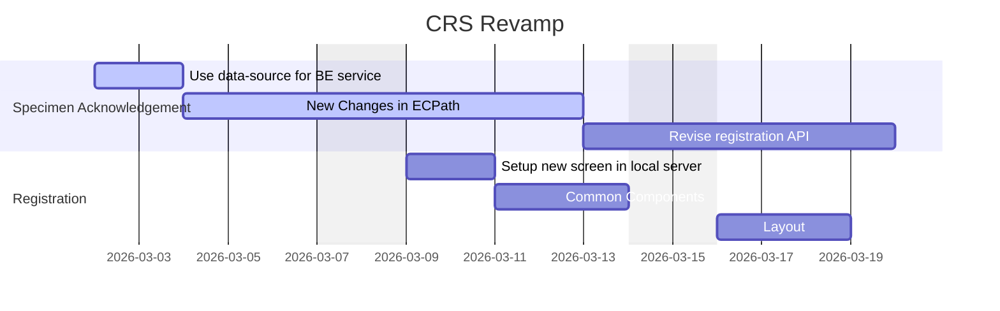

```mermaid
gantt
    dateFormat  YYYY-MM-DD
    title       CRS Revamp
    excludes    weekends
    %% (`excludes` accepts specific dates in YYYY-MM-DD format, days of the week ("sunday") or "weekends", but not the word "weekdays".)

    section Specimen Acknowledgement
    Use data-source for BE service      :active,  des1, 2026-03-02, 2d
    New Changes in ECPath               :active,  des2, 2026-03-04, 7d
    Revise registration API             :  des3, after des2, 5d

    section Registration
    Setup new screen in local server    :         des1, 2026-03-09, 2d
    Common Components:                  :         des2, after des1, 3d
    Layout                              : 3d
```
