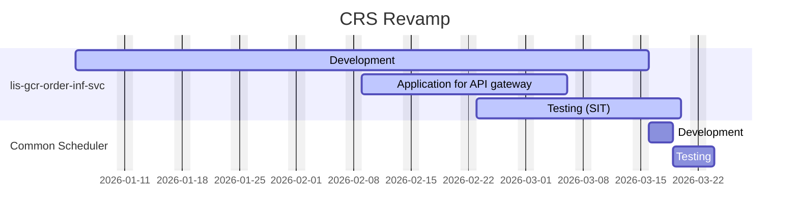

```mermaid
gantt
    dateFormat  YYYY-MM-DD
    title       CRS Revamp
    excludes    weekends
    %% (`excludes` accepts specific dates in YYYY-MM-DD format, days of the week ("sunday") or "weekends", but not the word "weekdays".)

    section lis-gcr-order-inf-svc
    Development                         :active,  des1, 2026-01-05, 2026-03-16
    Application for API gateway         :active,  des3, 2026-02-09, 2026-03-06
    Testing (SIT)                       :active,  des2, 2026-02-23, 2026-03-20

    section Common Scheduler
    Development    :         des1, 2026-03-16, 3d
    Testing    : 3d

```
