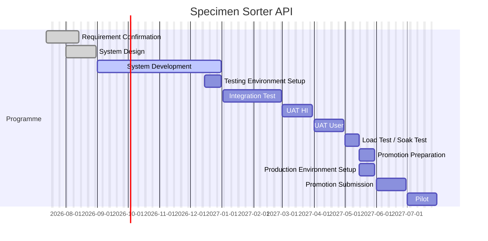

# Specimen Sorter

Programme home. LIS API dossier: [[TMP-specimen-sorter-api — Specimen Sorter API/_Dossier]].

## LIS API schedule

Draft: [[05 Project Plan]]. Estimates not accepted. `plan` gate not closed.

Schedules backwards from **Promotion submission** (01–30 Jun 2027). The 2027 window is **not** on [[Promotion Windows]] (last named: 2026-24). Dossier target **30 May 2027** is Promotion Preparation end, not submission.

| Stage | Start | End | Owner |
|---|---|---|---|
| Requirement Confirmation | 13 Jul 2026 | 14 Aug 2026 | LIS Product Team, LIS Support Team, HI |
| System Design | 01 Aug 2026 | 31 Aug 2026 | LIS Support Team, Vendor |
| System Development | 01 Sep 2026 | 31 Dec 2026 | LIS Product Team, Vendor |
| Testing Environment Setup | 15 Dec 2026 | 31 Dec 2026 | Vendor, Local IT |
| Integration Test | 02 Jan 2027 | 28 Feb 2027 | LIS Product Team, Vendor |
| UAT (HI) | 01 Mar 2027 | 30 Mar 2027 | HI |
| UAT (User) | 01 Apr 2027 | 30 Apr 2027 | User |
| Load Test / Soak Test | 01 May 2027 | 15 May 2027 | LIS Product Team, Vendor |
| Promotion Preparation | 15 May 2027 | 30 May 2027 | LIS Product Team |
| Production Environment Setup | 15 May 2027 | 30 May 2027 | Vendor, Local IT |
| Promotion Submission | 01 Jun 2027 | 30 Jun 2027 | LIS Product Team |
| Pilot | 01 Jul 2027 | 30 Jul 2027 | LIS Product Team, LIS Support Team, Vendor, User |

Negative slack on this draft: design closed 10 Sep vs 31 Aug (~7 working days); no JIRA key; unnamed 2027 promotion window. Package effort (41 working days) fits the remaining Sep–Dec development window.
