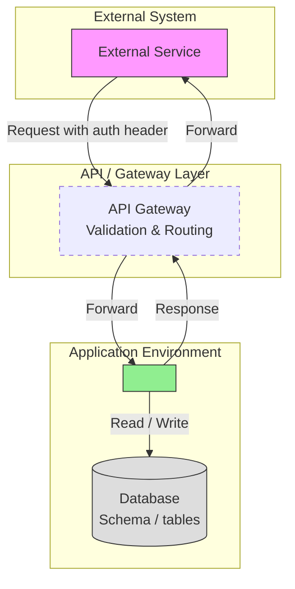

# App Wiki Skill

This skill produces developer-facing Markdown wiki documentation for application services. The target audience is engineers who need to understand system architecture, data flows, API contracts, and processing logic at a glance — without reading source code.

---

## Guiding Principles

Internalize these principles before writing — they govern every decision:

**1. Named entities, plain-English actions**
Infrastructure names are precise and important — always use them. Database table names, schema names, actual service names (from the codebase or Helm values), external system names, feature flag names — these all belong in diagrams and prose so a reader can trace exactly what is happening.

What does NOT belong is code-level detail: no internal class names as diagram participants, no method signatures on arrows, no parameter lists, no variable names in action labels. Replace all of that with a plain English sentence describing what the action achieves.

Good: `SVC->>PATIENT_TABLE: Validate patient record exists`
Bad: `patientSvc->>patientRepo: findByHospAndPatId(hosp, patId)`

Good: `SVC->>MESSAGE_QUEUE: Mark message as complete`
Bad: `senderSvc->>mqRepo: updateStatus(msgId, "COMPLETE")`

**2. One logical unit per system boundary**
Group all internal application logic (controllers, service classes, repository calls, builders) behind a single participant representing the microservice — named after the actual service. Only add separate participants for named external resources: a specific database table, a third-party API, another named microservice.

**3. Only branch on business decisions**
Use `alt` / `else` blocks for decisions that matter to the reader: validation failures, status checks, routing decisions. Skip branches for internal error handling, null-safety guards, or minor fallback paths that don't affect observable behavior.

**4. Return arrows only when the value is used**
Show `-->>` only when the caller uses the returned value in a subsequent step. If the response is just an acknowledgement, omit the return arrow.

**5. Keep diagrams focused**
Each sequence diagram covers one operation, endpoint, or message type. If a diagram grows beyond ~20 arrows, split it.

---

## Research Phase

Before writing, gather context from the codebase:

1. **Structure and shape** — what kind of service is this? Inbound-only (receives and stores)? Outbound-only (polls and sends)? Bidirectional? Synchronous REST? Async queue-based? This determines the wiki page structure.
2. **Endpoints and operations** — read controllers, handlers, routers. Capture path, method, request/response shape for each.
3. **Outbound calls** — HTTP clients, message publishers, external API integrations. Capture URLs, auth mechanism, payload structure.
4. **Database interactions** — which tables are read/written per operation. Name them exactly as they appear in the database.
5. **Feature flags and configuration** — control tables, environment variables, config files that alter runtime behaviour.
6. **External dependencies** — schedulers, API gateways, identity/auth services, other microservices.
7. **Reference material** — if the user provides technical diagrams or a reference wiki, align naming and style with those.
8. **Tested vs. untested** — mark operations that have not yet completed integration testing with ⚠️.

---

## Wiki Structure

Choose pages based on what the service actually does. Common patterns:

| Service type | Typical pages |
|---|---|
| Bidirectional integration (receives and sends) | Home, System-Overview, Receiver, Sender |
| Inbound-only REST API | Home, System-Overview, API |
| Async message processor | Home, System-Overview, Message-Processing |
| Multi-feature service | Home, System-Overview, one page per major feature area |

Every wiki should have **Home** and **System-Overview**. Everything else depends on the service.

**Home.md** — navigation index, one-paragraph description, quick-reference tables for key operations.

**System-Overview.md** — always included. See section below.

Additional pages — name them after what the service does (e.g., `Receiver.md`, `Sender.md`, `Message-Processing.md`, `API.md`), not after internal class names.

---

## System-Overview.md

### Sections to include

- **Background / Migration Context** — what problem this service solves, what it replaces (if anything). A comparison table (protocol, framework, deployment) works well for migration scenarios.
- **System Architecture** — one or more architecture diagrams. If the service has distinct inbound and outbound flows, use separate diagrams for each — a single combined diagram often becomes too complex to read.
- **Environment Endpoints** — table of base URLs per environment (SIT / AAT / PRD or equivalent).
- **Security** — authentication and authorisation mechanisms per direction or endpoint group.
- **Data Model** — tables grouped by domain. Two columns: `Table` / `Purpose`. Omit if the service has no persistent storage.
- **Key Patterns** — document any cross-cutting patterns (optimistic locking, version checks, retry mechanisms, feature flags) that recur throughout the service.

### Architecture Diagram Style

Use `flowchart TD` with named subgraphs for each environment zone. Use the actual service name from the codebase, not a generic placeholder.



Adapt the subgraph names, node labels, and arrow labels to match the actual system. If there is no gateway layer, remove it. If there is a scheduler or trigger service, add it.

---

## Inbound API / Receiver Pages

For each page covering inbound operations (a REST API, an inbound message handler, etc.), include:

1. **Endpoint / Entry Point** — path, method, required headers, auth.
2. **Request structure** — JSON/XML/HL7 payload with annotated fields. Use a code block with a representative example.
3. **Response structure** — success and error responses with examples.
4. **Supported Operations** — table listing all operations/message types: Code or Path | Description | Handler | Tested (✅ / ⚠️).
5. **Dispatch / Routing Flow** — one sequence diagram showing how the service receives, routes, and responds.
6. **Per-operation detail** — one subsection per operation with:
   - What the operation does (one paragraph)
   - Key request fields table
   - Flow sequence diagram
   - Validation rules (if any)

### Sequence Diagram Pattern for Inbound Operations

```mermaid
sequenceDiagram
    participant Caller as <external caller name>
    participant SVC as <actual-service-name>
    participant <DB_TABLE_1>
    participant <DB_TABLE_2>

    Caller->>SVC: Send <operation> request
    SVC->><DB_TABLE_1>: Check <business precondition>
    alt Precondition not met
        SVC-->>Caller: Return error
    end
    SVC->><DB_TABLE_1>: Validate <condition>
    alt Validation fails
        SVC-->>Caller: Return error
    end
    SVC->><DB_TABLE_2>: Save / update record
    SVC->><DB_TABLE_1>: Update version / status
    SVC-->>Caller: Return success
```

**Participant rules:**
- The microservice is one participant, named after the actual service.
- Each database table that is meaningfully read or written gets its own participant.
- If several closely related child tables are written in one logical step, group them into one arrow with a descriptive label.
- External callers, gateways, schedulers, and other named services are their own participants.
- No internal class names, repository names, or DTO class names as participants.

If many operations share a common validation sequence, document it once at the bottom of the page as a `flowchart TD` and reference it from each operation section rather than repeating it.

---

## Outbound / Sender Pages

For pages covering outbound operations (sending queued messages, polling and forwarding, scheduled exports, etc.), include:

1. **Trigger mechanism** — what initiates the outbound flow (scheduled call, event, HTTP trigger). A `flowchart TD` showing the trigger path works well.
2. **Trigger API** (if HTTP-triggered) — endpoint, parameters, response.
3. **Flow Overview** — a comprehensive sequence diagram covering the full processing loop.
4. **Queue / State Lifecycle** — if there is a message queue or status tracking table, use `stateDiagram-v2` to show the status transitions.
5. **Feature flags** — control-table flags that alter sending behaviour.
6. **Supported message / operation types** — summary table with any special data sources noted.
7. **Payload structure** — the outbound JSON/XML envelope with annotated fields.
8. **Per-type detail** — one subsection per outbound type with trigger description, payload fields table, and flow diagram.
9. **Connectivity settings** — base URL, auth headers, endpoint path.
10. **Notes** — retry behaviour, exclusions (e.g., hospitals that skip certain steps), pagination.

### Sequence Diagram Pattern for Outbound Operations

```mermaid
sequenceDiagram
    participant Trigger as <trigger name>
    participant SVC as <actual-service-name>
    participant <CONTROL_TABLE>
    participant <QUEUE_TABLE>
    participant <OTHER_DB_TABLE>
    participant Dest as <destination service name>

    Trigger->>SVC: Initiate outbound processing
    SVC->><CONTROL_TABLE>: Check feature flag / configuration

    loop Each batch of outstanding records
        SVC->><QUEUE_TABLE>: Retrieve pending records
        SVC->><QUEUE_TABLE>: Mark records as processing

        loop Each record
            alt Extra data needed
                SVC->><OTHER_DB_TABLE>: Retrieve supplementary data
            end
            SVC->>Dest: Send message
            Dest-->>SVC: Acknowledge
            alt Success
                SVC->><QUEUE_TABLE>: Mark as complete
            else Error
                SVC->><QUEUE_TABLE>: Mark for retry
            end
        end
    end
    SVC-->>Trigger: Return result
```

---

## Diagram Quick Reference

| Situation | Diagram type | Key rule |
|---|---|---|
| System architecture | `flowchart TD` with subgraphs | One diagram per distinct flow direction when complex |
| API / message routing overview | `sequenceDiagram` | Show gateway and DB as separate hops |
| Per-operation inbound flow | `sequenceDiagram` | One participant per DB table touched |
| Per-operation outbound flow | `sequenceDiagram` | Include trigger, queue table, destination |
| Queue / status state transitions | `stateDiagram-v2` | Show all status values |
| Shared validation / decision flow | `flowchart TD` | Document once, reference from each operation |

---

## Formatting Conventions

- **Page title**: `# <Page Name>` — matches the wiki page name.
- **Sections**: `## ` for top-level, `### ` for sub-topics.
- **Test status**: `✅` = tested, `⚠️` = implemented but integration testing not yet complete. Include the legend: `> ⚠️ = Logic implemented in code but integration testing not yet completed`.
- **Tables**: `|---|---|` separator. Left-align content.
- **Code blocks**: ` ```json ` for JSON, ` ```mermaid ` for diagrams, ` ```xml ` for XML.
- **Inline code**: backticks for table names, field names, status values, endpoint paths, flag names.
- **Notes**: `> Note: ...` blockquote syntax.
- **Operation subsection heading**: `### <CODE or name> — <Description>` (em dash, not hyphen).
