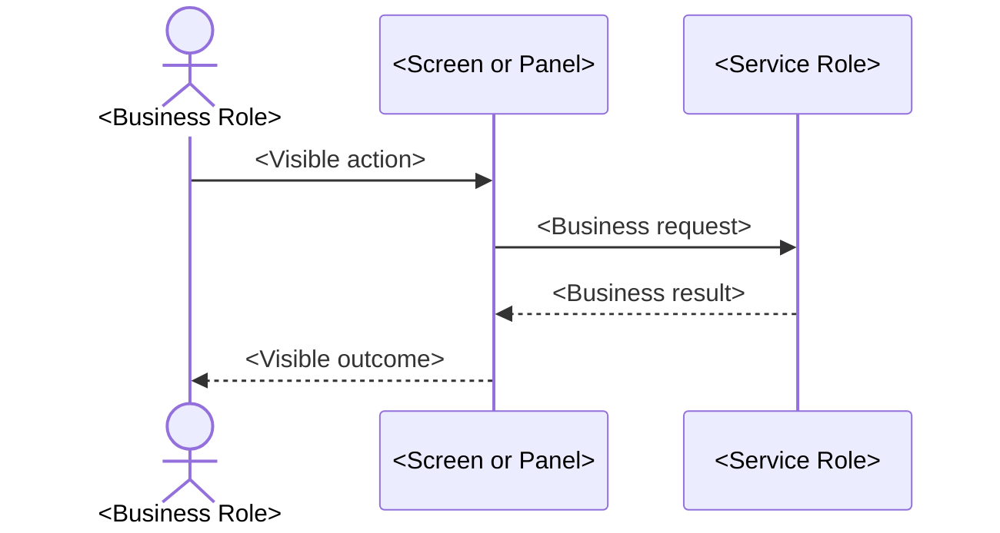

# Workflow Note Template

Use applicable sections in this order. If a required-looking section genuinely does not apply, add a short explanation rather than silently omitting it.

````markdown
---
title: <Business Workflow Name>
status: documented
context_type: <screen | service>
screen: <Screen Name; omit for service workflow>
service: <Service Name; omit for screen workflow>
epic: <Epic ID>
user_story: <CRST ID>
tags:
  - workflow
  - <screen-or-service-tag>
---

# <Business Workflow Name>

## Overview

<2–5 sentences: purpose, actor/system trigger, business value/risk, and mechanism.>

---

## Related User Stories

- **[[<CRST-ID>]]** - <Story title>

**Epic:** <Epic ID and title>

---

## Key Concepts

### <Business Term>
<Plain-English definition and relevant domain rule.>

---

## Trigger Point

> <Event that begins the workflow and its place in the wider process.>

---

## Workflow Scenarios

### Scenario 1: <Business Scenario Name>

#### Prerequisites

- <Condition>

#### Process Flow



#### Step-by-Step Details

1. <User action using the visible UI label.>
2. <System condition and outcome.>
3. <What happens next.>

---

## Summary Tables

### Message Definitions

| Code | Text | Type | Buttons | Trigger Point |
|---|---|---|---|---|
| `<code>` | <Exact text> | <Type> | <Buttons> | <When shown> |

### Decision Matrix

| Condition | Outcome |
|---|---|
| <Condition> | <Outcome> |

### Data Written

| Field Label | Table | Column | Notes |
|---|---|---|---|
| <Visible field label> | `<exact_table>` | `<exact_column>` | <Write behavior> |

<If no writes occur, state explicitly that the workflow is read-only and distinguish later workflows that do write.>

---

## Data Sources

| Data | Business Source | Table | Column | Notes |
|---|---|---|---|---|
| <Business data name> | <Source role> | `<exact_table>` | `<exact_column>` | <Meaning> |

---

## Configuration

| Setting | Option Code | Source | Purpose | Enabled | Disabled or Missing |
|---|---|---|---|---|---|
| <Business setting> | `<exact code>` | <Exact store/group> | <Purpose> | <Effect> | <Effect> |

---

## Business Rules

1. <Declarative implementation-independent rule.>

---

## Related Workflows

- [[<Workflow Name>]] — <Relationship.>

---

<details>
<summary>Technical Notes — Legacy and Revamp Traceability</summary>

- <Legacy behavior and evidence.>
- <Revamp behavior and evidence.>
- <Parity assessment and impact.>
- <Missing or weak test coverage.>
- <Unresolved clarification.>

</details>
````

## Template Rules

- Repeat the scenario block for every distinct path.
- Add focused summary tables for visibility, field state, messages, status mapping, user choices, or other dense rules.
- Omit the Data Written table when nothing is saved, but include an explicit read-only statement.
- Keep source-code locations out of the main narrative. Put traceability evidence in Technical Notes when useful.
- Use exact database identifiers only after direct verification.
- For a screen workflow, set `context_type: screen`, include `screen`, and omit `service`.
- For a service workflow, set `context_type: service`, include `service`, and omit `screen`.
