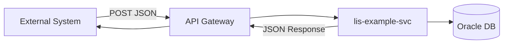

# JIRA Log Note Template

Use this structure for the Obsidian note body (frontmatter is separate).

---

```markdown
# <Request Summary — exact; same as frontmatter title (filename = this with / \ → -)>

## Request Type

**Type:** Change Request  
**Priority:** Medium

## Request Summary

<Identical to frontmatter title / H1 — no shortening or rephrasing>

## Background

<Paragraph 1: current state / legacy behaviour>

<Paragraph 2: problem, migration driver, or enhancement need>

<Paragraph 3 (optional): scope — what this change covers and what it does not>

## Change Description

1. **<Work item title>:**
   - <Specific change with class/file/API names>
   - <Sub-detail>

2. **<Work item title>:**
   - <Specific change>

## Justification

<1–2 paragraphs on reliability, data integrity, architecture alignment, load handling, or DHP migration>

## Target Completion Date

<Dth Mon YYYY>

## Design

<!-- Populated by generate-design skill before CP3 review. See design-template.md. -->

## Reference Logs

- LIS-XXXX
```

---

## Optional: architecture diagram

Add inside Change Description when documenting a new service or API flow:

```markdown
### System Architecture


```

---

## Email-ready output

When the user needs copy-paste text for email (SM → SA), reproduce the same sections
as plain text with bold headings matching team convention:

```
**Request Type**
Change Request
Priority: Medium

**Request Summary**
...

**Background**
...

**Change Description**
...

**Justification**
...

**Target Completion Date**
...
```
