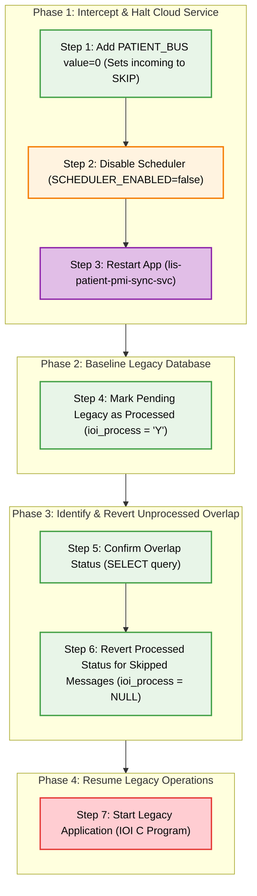

| Seqeunce | Type                                                         | Description                                                                                                        | SQL                                                                                                                                                                                                                                                                                                                                                                                                                                                                                                                                                                                                                                                                                                                                                                                                                                                                                                                                                                                                                                                                                                                                                                                                                                                                                                                                                                                                                                                                                                                                                                                                                                                                                                                                                                                                                                                                                                                                                                                                                                                              | Remarks                                                                                                     |
| -------- | ------------------------------------------------------------ | ------------------------------------------------------------------------------------------------------------------ | ---------------------------------------------------------------------------------------------------------------------------------------------------------------------------------------------------------------------------------------------------------------------------------------------------------------------------------------------------------------------------------------------------------------------------------------------------------------------------------------------------------------------------------------------------------------------------------------------------------------------------------------------------------------------------------------------------------------------------------------------------------------------------------------------------------------------------------------------------------------------------------------------------------------------------------------------------------------------------------------------------------------------------------------------------------------------------------------------------------------------------------------------------------------------------------------------------------------------------------------------------------------------------------------------------------------------------------------------------------------------------------------------------------------------------------------------------------------------------------------------------------------------------------------------------------------------------------------------------------------------------------------------------------------------------------------------------------------------------------------------------------------------------------------------------------------------------------------------------------------------------------------------------------------------------------------------------------------------------------------------------------------------------------------------------------------- | ----------------------------------------------------------------------------------------------------------- |
| 1        | Setup lab_option                                         | Add PATIENT_BUS setup  Reminder Change <HOSP>                                                          | INSERT INTO lab_option_master (option_hospital, option_labno, option_group, option_code, option_value, option_text, option_default, option_desc, updated_by, update_datetime, option_enable) VALUES ('<HOSP>', 9, 'LIS_PAS_PATIENT_SYNC_SVC', 'PATIENT_BUS', 0, NULL, NULL, 'Enable dual patient_bus writing for patient data validation', '<Your Name>',getdate(),'Y')                                                                                                                                                                                                                                                                                                                                                                                                                                                                                                                                                                                                                                                                                                                                                                                                                                                                                                                                                                                                                                                                                                                                                                                                                                                                                                                                                                                                                                                                                                                                                                                                                                                                                          | Set status to SKIP for incoming messages                                                                    |
| 2        | OpenShift ConfigMap patient-pmi-sync-config              | Update : Set SCHEDULER_ENABLED to false                                                                        | oc patch configmap patient-pmi-sync-config --type merge --patch-file LIS-10567-fallback-patient-pmi-sync-config-step2.json                                                                                                                                                                                                                                                                                                                                                                                                                                                                                                                                                                                                                                                                                                                                                                                                                                                                                                                                                                                                                                                                                                                                                                                                                                                                                                                                                                                                                                                                                                                                                                                                                                                                                                                                                                                                                                                                                                                                       | Stop processing outstanding message by lis-patient-pmi-sync-svc                                             |
| 3        | Application lis-patient-pmi-sync-svc                     | Restart Rollout                                                                                                    |                                                                                                                                                                                                                                                                                                                                                                                                                                                                                                                                                                                                                                                                                                                                                                                                                                                                                                                                                                                                                                                                                                                                                                                                                                                                                                                                                                                                                                                                                                                                                                                                                                                                                                                                                                                                                                                                                                                                                                                                                                                                  |                                                                                                             |
| 4        | Table cpi_transaction                                    | Update : Set ioi_process to 'Y'                                                                        | UPDATE cpi_transaction SET ioi_process = 'Y' WHERE ioi_process IS NULL AND transaction_datetime >= '2026-03-18 14:29'; -- Replace with the actual cutover time                                                                                                                                                                                                                                                                                                                                                                                                                                                                                                                                                                                                                                                                                                                                                                                                                                                                                                                                                                                                                                                                                                                                                                                                                                                                                                                                                                                                                                                                                                                                                                                                                                                                                                                                                                                                                                                                                       | Set all outstanding records to processed                                                                    |
| 5        | Table cpi_transaction patient_pmi_sync_message_queue | Confirm status for cpi_transaction & patient_pmi_sync_message_queue records  Reminder Change datetimes | SELECT c.transaction_datetime, c.transaction_type, c.ioi_process, q.created_date, q.message_id, q.hospital_code, q.hkid, q.case_no, q.message_type, q.status, q.processed_date, datediff(ss, c.transaction_datetime, q.created_date) as time_diff FROM COM_DB.dbo.cpi_transaction c LEFT JOIN LAB_DB.dbo.patient_pmi_sync_message_queue q ON q.hospital_code = c.hospital_code  AND q.hkid  = RTRIM(LTRIM(c.hkid))  AND (q.case_no = RTRIM(LTRIM(c.case_no)) OR (q.case_no IS NULL AND c.case_no IS NULL))  AND q.message_type = CASE           WHEN c.transaction_type = '030' THEN 'A08'          WHEN c.transaction_type = '100' AND c.case_type = 'I' THEN 'A01'          WHEN c.transaction_type = '100' AND (c.case_type != 'I' OR c.case_type IS NULL) THEN 'A04'          WHEN c.transaction_type = '300' THEN 'A04'          WHEN c.transaction_type IN ('121', '341', '033', '034') THEN 'A08'          WHEN c.transaction_type IN ('140', '700') THEN 'A02'          WHEN c.transaction_type = '160' THEN 'A21'          WHEN c.transaction_type = '170' THEN 'A22'          WHEN c.transaction_type LIKE '13%' OR c.transaction_type LIKE '33%' THEN 'A03'          WHEN c.transaction_type IN ('200', '201') THEN 'A11'          WHEN c.transaction_type LIKE '21%' OR c.transaction_type LIKE '35%' OR c.transaction_type IN ('230', '240') THEN 'A13'          WHEN c.transaction_type IN ('220', '710') THEN 'A12'          WHEN c.transaction_type = '020' THEN 'A40'          WHEN c.transaction_type = '010' THEN 'A28'          WHEN c.transaction_type = '031' THEN 'A47'          WHEN c.transaction_type = '040' THEN 'A45'      END     AND q.created_date >= '2026-03-18 14:29' -- Replace with the actual cutover time WHERE c.transaction_datetime >= '2026-03-18 14:29' -- Replace with the actual cutover time AND (datediff(ss, c.transaction_datetime, q.created_date) BETWEEN 0 AND 120 OR transaction_datetime IS NULL) | Check status for both table for confirmation                                                                |
| 6        | Table cpi_transaction                                    | Update : Set ioi_process to NULL for those   Reminder Change datetime                              | UPDATE cpi_transaction SET ioi_process = NULL  FROM COM_DB.dbo.cpi_transaction c INNER JOIN LAB_DB.dbo.patient_pmi_sync_message_queue q     ON q.hospital_code = c.hospital_code     AND q.hkid = RTRIM(LTRIM(c.hkid))     AND (q.case_no = RTRIM(LTRIM(c.case_no)) OR (q.case_no IS NULL AND c.case_no IS NULL))     AND q.message_type = CASE          WHEN c.transaction_type = '030' THEN 'A08'         WHEN c.transaction_type = '100' AND c.case_type = 'I' THEN 'A01'         WHEN c.transaction_type = '100' AND (c.case_type != 'I' OR c.case_type IS NULL) THEN 'A04'         WHEN c.transaction_type = '300' THEN 'A04'         WHEN c.transaction_type IN ('121', '341', '033', '034') THEN 'A08'         WHEN c.transaction_type IN ('140', '700') THEN 'A02'         WHEN c.transaction_type = '160' THEN 'A21'         WHEN c.transaction_type = '170' THEN 'A22'         WHEN c.transaction_type LIKE '13%' OR c.transaction_type LIKE '33%' THEN 'A03'         WHEN c.transaction_type IN ('200', '201') THEN 'A11'         WHEN c.transaction_type LIKE '21%' OR c.transaction_type LIKE '35%' OR c.transaction_type IN ('230', '240') THEN 'A13'         WHEN c.transaction_type IN ('220', '710') THEN 'A12'         WHEN c.transaction_type = '020' THEN 'A40'         WHEN c.transaction_type = '010' THEN 'A28'         WHEN c.transaction_type = '031' THEN 'A47'         WHEN c.transaction_type = '040' THEN 'A45'     END WHERE      c.transaction_datetime >= '2026-03-18 14:29'      AND q.created_date >= '2026-03-18 14:29'     AND q.status = 'SKIP'     AND datediff(ss, c.transaction_datetime, q.created_date) BETWEEN 0 AND 120;                                                                                                                                                                                                                                                                         | Update cpi_transaction ioi_process to NULL for corresponding SKIP message in patient_pmi_sync_message_queue |
| 7        | Application IOI C Program                                | Start Application                                                                                                  |                                                                                                                                                                                                                                                                                                                                                                                                                                                                                                                                                                                                                                                                                                                                                                                                                                                                                                                                                                                                                                                                                                                                                                                                                                                                                                                                                                                                                                                                                                                                                                                                                                                                                                                                                                                                                                                                                                                                                                                                                                                                  |                                                                                                             |