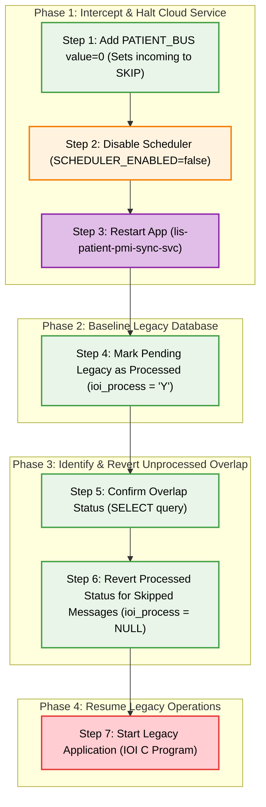

```mermaid
flowchart TD
    classDef config fill:#fff3e0,stroke:#f57c00,stroke-width:2px,color:#000
    classDef app fill:#e1bee7,stroke:#8e24aa,stroke-width:2px,color:#000
    classDef db fill:#e8f5e8,stroke:#43a047,stroke-width:2px,color:#000
    classDef legacy fill:#ffcdd2,stroke:#e53935,stroke-width:2px,color:#000

    subgraph Phase1 [Phase 1: Intercept & Halt Cloud Service]
        direction TB
        S1["Step 1: Add PATIENT_BUS value=0 (Sets incoming to SKIP)"]
        S2["Step 2: Disable Scheduler (SCHEDULER_ENABLED=false)"]
        S3["Step 3: Restart App (lis-patient-pmi-sync-svc)"]
        S1 --> S2 --> S3
    end

    subgraph Phase2 [Phase 2: Baseline Legacy Database]
        direction TB
        S4["Step 4: Mark Pending Legacy as Processed (ioi_process = 'Y')"]
        S3 --> S4
    end

    subgraph Phase3 [Phase 3: Identify & Revert Unprocessed Overlap]
        direction TB
        S5["Step 5: Confirm Overlap Status (SELECT query)"]
        S6["Step 6: Revert Processed Status for Skipped Messages (ioi_process = NULL)"]
        S4 --> S5 --> S6
    end

    subgraph Phase4 [Phase 4: Resume Legacy Operations]
        direction TB
        S7["Step 7: Start Legacy Application (IOI C Program)"]
        S6 --> S7
    end

    %% Class Assignments
    class S1,S4,S5,S6 db
    class S2 config
    class S3 app
    class S7 legacy
```

