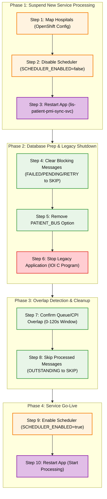

| Seqeunce | Type                                                         | Description                                                                                                                                 | SQL                                                                                                                                                                                                                                                                                                                                                                                                                                                                                                                                                                                                                                                                                                                                                                                                                                                                                                                                                                                                                                                                                                                                                                                                                                                                                                                                                                                                                                                                                                                                                                                                                                                                                                                                                                                                                                                                                                                                                                                                                | Remarks                                                                                                                        |
| -------- | ------------------------------------------------------------ | ------------------------------------------------------------------------------------------------------------------------------------------- | ------------------------------------------------------------------------------------------------------------------------------------------------------------------------------------------------------------------------------------------------------------------------------------------------------------------------------------------------------------------------------------------------------------------------------------------------------------------------------------------------------------------------------------------------------------------------------------------------------------------------------------------------------------------------------------------------------------------------------------------------------------------------------------------------------------------------------------------------------------------------------------------------------------------------------------------------------------------------------------------------------------------------------------------------------------------------------------------------------------------------------------------------------------------------------------------------------------------------------------------------------------------------------------------------------------------------------------------------------------------------------------------------------------------------------------------------------------------------------------------------------------------------------------------------------------------------------------------------------------------------------------------------------------------------------------------------------------------------------------------------------------------------------------------------------------------------------------------------------------------------------------------------------------------------------------------------------------------------------------------------------------------ | ------------------------------------------------------------------------------------------------------------------------------ |
| 1        | OpenShift ConfigMap patient-pmi-sync-config              | Update: Set SERVER_HOSPITAL_MAP to {"AHN":"AHN","TPH":"AHN"}                                                                            |                                                                                                                                                                                                                                                                                                                                                                                                                                                                                                                                                                                                                                                                                                                                                                                                                                                                                                                                                                                                                                                                                                                                                                                                                                                                                                                                                                                                                                                                                                                                                                                                                                                                                                                                                                                                                                                                                                                                                                                                                    |                                                                                                                                |
| 2        | OpenShift ConfigMap patient-pmi-sync-config              | Update : Set SCHEDULER_ENABLED to false                                                                                                 |                                                                                                                                                                                                                                                                                                                                                                                                                                                                                                                                                                                                                                                                                                                                                                                                                                                                                                                                                                                                                                                                                                                                                                                                                                                                                                                                                                                                                                                                                                                                                                                                                                                                                                                                                                                                                                                                                                                                                                                                                    | Stop processing outstanding message by lis-patient-pmi-sync-svc                                                                |
| 3        | Application lis-patient-pmi-sync-svc                     | Restart Rollout                                                                                                                             |                                                                                                                                                                                                                                                                                                                                                                                                                                                                                                                                                                                                                                                                                                                                                                                                                                                                                                                                                                                                                                                                                                                                                                                                                                                                                                                                                                                                                                                                                                                                                                                                                                                                                                                                                                                                                                                                                                                                                                                                                    |                                                                                                                                |
| 4        | Table patient_pmi_sync_message_queue                     | Update records with FAIL, PENDING status to SKIP                                                                                            | UPDATE patient_pmi_sync_message_queue SET status = 'SKIP' WHERE status IN ('FAILED', 'PENDING', 'RETRY');                                                                                                                                                                                                                                                                                                                                                                                                                                                                                                                                                                                                                                                                                                                                                                                                                                                                                                                                                                                                                                                                                                                                                                                                                                                                                                                                                                                                                                                                                                                                                                                                                                                                                                                                                                                                                                                                                                  | Remove blocking messages which would affect outstanding message processing after live-run Need to change COMPLETED status? |
| 5        | Setup lab_option                                         | Remove PATIENT_BUS setup  Reminder Change <HOSP>                                                                                | DELETE from lab_option_master  WHERE option_group = 'LIS_PAS_PATIENT_SYNC_SVC' AND option_code = 'PATIENT_BUS' and option_hospital = '<HOSP>'                                                                                                                                                                                                                                                                                                                                                                                                                                                                                                                                                                                                                                                                                                                                                                                                                                                                                                                                                                                                                                                                                                                                                                                                                                                                                                                                                                                                                                                                                                                                                                                                                                                                                                                                                                                                                                                              | Allow process patient updates to PATIENT instead PATIENT_BUS                                                                   |
| 6        | Application IOI C Program                                | Stop Application                                                                                                                            |                                                                                                                                                                                                                                                                                                                                                                                                                                                                                                                                                                                                                                                                                                                                                                                                                                                                                                                                                                                                                                                                                                                                                                                                                                                                                                                                                                                                                                                                                                                                                                                                                                                                                                                                                                                                                                                                                                                                                                                                                    |                                                                                                                                |
| 7        | Table patient_pmi_sync_message_queue cpi_transaction | Confirm status for patient_pmi_sync_message_queue  & cpi_transaction records  Reminder Change datetime                      | SELECT q.created_date, q.message_id, q.hospital_code, q.hkid, q.case_no, q.message_type, q.status, q.processed_date, c.transaction_datetime, c.transaction_type, c.ioi_process, datediff(ss, c.transaction_datetime, q.created_date) as time_diff FROM LAB_DB.dbo.patient_pmi_sync_message_queue q LEFT JOIN COM_DB.dbo.cpi_transaction c  ON q.hospital_code = c.hospital_code  AND q.hkid  = RTRIM(LTRIM(c.hkid))  AND (q.case_no = RTRIM(LTRIM(c.case_no)) OR (q.case_no IS NULL AND c.case_no IS NULL))  AND q.message_type = CASE           WHEN c.transaction_type = '030' THEN 'A08'          WHEN c.transaction_type = '100' AND c.case_type = 'I' THEN 'A01'          WHEN c.transaction_type = '100' AND (c.case_type != 'I' OR c.case_type IS NULL) THEN 'A04'          WHEN c.transaction_type = '300' THEN 'A04'          WHEN c.transaction_type IN ('121', '341', '033', '034') THEN 'A08'          WHEN c.transaction_type IN ('140', '700') THEN 'A02'          WHEN c.transaction_type = '160' THEN 'A21'          WHEN c.transaction_type = '170' THEN 'A22'          WHEN c.transaction_type LIKE '13%' OR c.transaction_type LIKE '33%' THEN 'A03'          WHEN c.transaction_type IN ('200', '201') THEN 'A11'          WHEN c.transaction_type LIKE '21%' OR c.transaction_type LIKE '35%' OR c.transaction_type IN ('230', '240') THEN 'A13'          WHEN c.transaction_type IN ('220', '710') THEN 'A12'          WHEN c.transaction_type = '020' THEN 'A40'          WHEN c.transaction_type = '010' THEN 'A28'          WHEN c.transaction_type = '031' THEN 'A47'          WHEN c.transaction_type = '040' THEN 'A45'      END     AND c.transaction_datetime >= '2026-03-18 14:29' WHERE q.created_date >= '2026-03-18 14:29' AND (datediff(ss, c.transaction_datetime, q.created_date) BETWEEN 0 AND 120 OR transaction_datetime IS NULL) ORDER BY q.created_date DESC | Check status for both table for confirmation                                                                                   |
| 8        | Table patient_pmi_sync_message_queue                     | Update : Set records with OUTSTANDING status to SKIP,  where the records are processed by IOI  Reminder Change datetime | UPDATE LAB_DB.dbo.patient_pmi_sync_message_queue SET status = 'SKIP' WHERE message_id IN (  SELECT q.message_id  FROM LAB_DB.dbo.patient_pmi_sync_message_queue q  INNER JOIN COM_DB.dbo.cpi_transaction c   ON q.hospital_code = c.hospital_code   AND q.hkid  = RTRIM(LTRIM(c.hkid))   AND (q.case_no = RTRIM(LTRIM(c.case_no)) OR (q.case_no IS NULL AND c.case_no IS NULL))   AND q.message_type = CASE            WHEN c.transaction_type = '030' THEN 'A08'           WHEN c.transaction_type = '100' AND c.case_type = 'I' THEN 'A01'           WHEN c.transaction_type = '100' AND (c.case_type != 'I' OR c.case_type IS NULL) THEN 'A04'           WHEN c.transaction_type = '300' THEN 'A04'           WHEN c.transaction_type IN ('121', '341', '033', '034') THEN 'A08'           WHEN c.transaction_type IN ('140', '700') THEN 'A02'           WHEN c.transaction_type = '160' THEN 'A21'           WHEN c.transaction_type = '170' THEN 'A22'           WHEN c.transaction_type LIKE '13%' OR c.transaction_type LIKE '33%' THEN 'A03'           WHEN c.transaction_type IN ('200', '201') THEN 'A11'           WHEN c.transaction_type LIKE '21%' OR c.transaction_type LIKE '35%' OR c.transaction_type IN ('230', '240') THEN 'A13'           WHEN c.transaction_type IN ('220', '710') THEN 'A12'           WHEN c.transaction_type = '020' THEN 'A40'           WHEN c.transaction_type = '010' THEN 'A28'           WHEN c.transaction_type = '031' THEN 'A47'           WHEN c.transaction_type = '040' THEN 'A45'       END      AND c.transaction_datetime >= '2026-03-18 14:29'  WHERE q.created_date >= '2026-03-18 14:29'  AND (datediff(ss, c.transaction_datetime, q.created_date) BETWEEN 0 AND 120 OR transaction_datetime IS NULL)  AND status IN ('OUTSTANDING') AND ioi_process = 'Y' )                                                              | Update message status to SKIP where the update is processed by IOI already                                                     |
| 9        | OpenShift ConfigMap patient-pmi-sync-config              | Update : Set SCHEDULER_ENABLED to true                                                                                                  |                                                                                                                                                                                                                                                                                                                                                                                                                                                                                                                                                                                                                                                                                                                                                                                                                                                                                                                                                                                                                                                                                                                                                                                                                                                                                                                                                                                                                                                                                                                                                                                                                                                                                                                                                                                                                                                                                                                                                                                                                    | Start processing outstanding message by lis-patient-pmi-sync-svc                                                               |
| 10       | Application lis-patient-pmi-sync-svc                     | Restart Rollout                                                                                                                             |                                                                                                                                                                                                                                                                                                                                                                                                                                                                                                                                                                                                                                                                                                                                                                                                                                                                                                                                                                                                                                                                                                                                                                                                                                                                                                                                                                                                                                                                                                                                                                                                                                                                                                                                                                                                                                                                                                                                                                                                                    |                                                                                                                                |