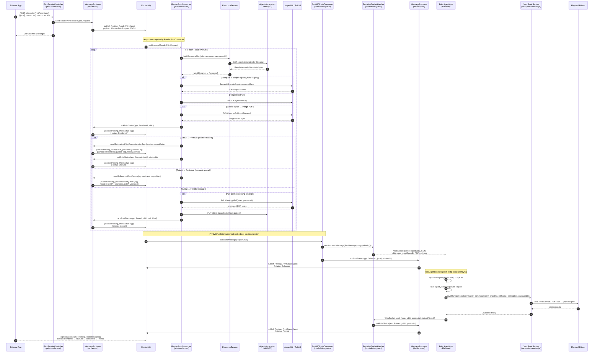
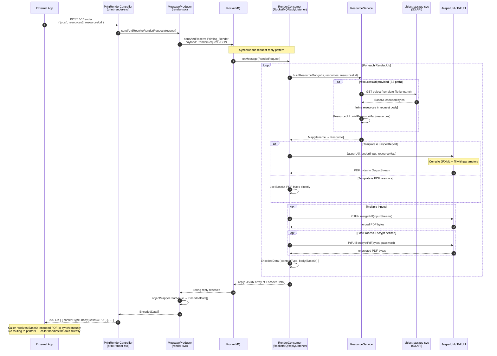

# Overview

```mermaid
flowchart TB
    subgraph External["External Callers"]
        App["External Application<br>(any microservice)"]
        LocalCaller["Local Caller<br>(same machine)"]
    end

    subgraph RenderSvc["print-render-svc  :8080"]
        Controller["PrintRenderController<br>POST /v1/render<br>POST /v1/renderPrint<br>POST /v1/print"]
        RenderProducer["MessageProducer<br>(rocketMQTemplate<br>+ deliveryRocketMQTemplate)"]
        RenderConsumer["RenderConsumer<br>RocketMQReplyListener<br>Printing_Render"]
        PrintConsumer["PrintConsumer<br>RocketMQListener<br>Printing_Print"]
        RPConsumer["RenderPrintConsumer<br>RocketMQListener<br>Printing_RenderPrint"]
        ResourceSvc["ResourceService<br>buildResourceMap()"]
        StorageSvc["StorageService<br>MinIO/S3 client"]
        JasperUtil["JasperUtil<br>JasperReports engine"]
        PdfUtil["PdfUtil<br>iText PDF merge/<br>encrypt/decrypt"]
    end

    subgraph ObjectStorage["object-storage-svc  :9000  (S3-compatible)"]
        S3API["S3 REST API<br>(AWS Signature V4)"]
        FS["Filesystem Storage<br>bucket/object path"]
    end

    subgraph RocketMQ["Apache RocketMQ  :9876"]
        T_Render["Printing_Render<br>(sync reply)"]
        T_Print["Printing_Print<br>(async)"]
        T_RenderPrint["Printing_RenderPrint<br>(async)"]
        T_PrintQueue["Printing_PrintQueue_{location}<br>(per-location)"]
        T_PersonalQueue["Printing_PersonalPrintQueue<br>(per-user)"]
        T_Status["Printing_PrintStatus<br>(status acks)"]
    end

    subgraph DeliverySvc["print-delivery-svc  :8089"]
        WSHandler["PrintWebSocketHandler<br>WebSocket endpoint<br>/ws"]
        MQConsumer["PrintMQPushConsumer<br>(one per location/session)"]
        SessionMgr["WebSocketSessionManager<br>ConcurrentHashMap<br>sessions"]
        DeliveryProducer["MessageProducer<br>Printing_PrintStatus"]
        LocationSvc["LocationLookupService<br>hostname → location"]
    end

    subgraph AgentApp["print-agent-app  (Electron Desktop)"]
        HttpServer["Express HTTP :18300<br>POST /v1/print"]
        ReactUI["React Frontend<br>useReportQueue hook<br>fastq concurrency=1"]
        IPCBridge["IPC Bridge<br>contextBridge"]
        ElectronMain["Electron Main<br>ipcMain handlers"]
        SQLite["SQLite DB<br>TypeORM<br>job history"]
        JavaProc["Java Process<br>local-print-service.jar<br>PDF/text printing"]
        Printer["Physical Printer<br>Windows/Unix/Network"]
    end

    App -->|"POST /v1/renderPrint<br>POST /v1/render<br>POST /v1/print"| Controller
    LocalCaller -->|"POST /v1/print"| HttpServer
    Controller --> RenderProducer

    RenderProducer -->|"Printing_Render (sync)"| T_Render
    RenderProducer -->|"Printing_Print (async)"| T_Print
    RenderProducer -->|"Printing_RenderPrint (async)"| T_RenderPrint
    RenderProducer -->|"Printing_PrintQueue_{loc} (delivery)"| T_PrintQueue
    RenderProducer -->|"Printing_PersonalPrintQueue"| T_PersonalQueue
    RenderProducer -->|"Printing_PrintStatus (ack)"| T_Status

    T_Render --> RenderConsumer
    T_Print --> PrintConsumer
    T_RenderPrint --> RPConsumer

    RPConsumer --> ResourceSvc
    PrintConsumer --> PdfUtil
    RenderConsumer --> ResourceSvc
    ResourceSvc --> StorageSvc
    StorageSvc <-->|"S3 GET/PUT"| S3API
    S3API --> FS

    RPConsumer --> JasperUtil
    RenderConsumer --> JasperUtil
    RPConsumer --> PdfUtil
    RenderConsumer --> PdfUtil

    T_PrintQueue --> MQConsumer
    T_PersonalQueue --> MQConsumer

    WSHandler --> SessionMgr
    WSHandler --> LocationSvc
    WSHandler --> MQConsumer
    MQConsumer -->|"TextMessage JSON"| WSHandler
    WSHandler --> DeliveryProducer
    DeliveryProducer -->|"Printing_PrintStatus<br>Delivered/Printed"| T_Status

    AgentApp <-->|"WebSocket<br>ws://print-delivery-svc/ws<br>?locationTag=...&hospCode=..."| WSHandler
    HttpServer -->|"IPC event<br>printRequest"| ReactUI
    ReactUI --> IPCBridge
    IPCBridge --> ElectronMain
    ElectronMain --> SQLite
    ElectronMain --> JavaProc
    JavaProc --> Printer
    ElectronMain --> Printer

    App -.->|"consume Printing_PrintStatus<br>for async tracking"| T_Status

```
# Sequence Digram

```mermaid
sequenceDiagram
    autonumber
    participant App as External App
    participant RenderCtrl as PrintRenderController<br/>(print-render-svc)
    participant MQProd as MessageProducer<br/>(render-svc)
    participant MQ as RocketMQ
    participant RPCons as RenderPrintConsumer<br/>(print-render-svc)
    participant ResourceSvc as ResourceService
    participant S3 as object-storage-svc<br/>:9000 (S3)
    participant Jasper as JasperUtil / PdfUtil
    participant DeliveryMQCons as PrintMQPushConsumer<br/>(print-delivery-svc)
    participant WS as PrintWebSocketHandler<br/>(print-delivery-svc)
    participant DelivProd as MessageProducer<br/>(delivery-svc)
    participant Agent as Print Agent App<br/>(Electron)
    participant Java as Java Print Service<br/>(local-print-service.jar)
    participant Printer as Physical Printer

    App->>RenderCtrl: POST /v1/renderPrint?app={app}<br/>{ jobs[], resources[], resourcesUrl }

    RenderCtrl->>MQProd: sendRenderPrintRequest(app, request)
    MQProd->>MQ: publish Printing_RenderPrint:{app}<br/>payload: RenderPrintRequest JSON
    RenderCtrl-->>App: 200 OK (fire-and-forget)

    Note over MQ,RPCons: Async consumption by RenderPrintConsumer

    MQ->>RPCons: onMessage(RenderPrintRequest)

    loop For each RenderPrintJob
        RPCons->>ResourceSvc: buildResourceMap(jobs, resources, resourcesUrl)
        ResourceSvc->>S3: GET object (templates by filename)
        S3-->>ResourceSvc: Base64-encoded template bytes
        ResourceSvc-->>RPCons: Map[filename → Resource]

        alt Template is JasperReport (.jrxml/.jasper)
            RPCons->>Jasper: JasperUtil.render(input, resourceMap)
            Jasper-->>RPCons: PDF OutputStream
        else Template is PDF
            RPCons->>Jasper: use PDF bytes directly
        end

        opt Multiple inputs → merge PDFs
            RPCons->>Jasper: PdfUtil.mergePdf(inputStreams)
            Jasper-->>RPCons: merged PDF bytes
        end

        RPCons->>MQProd: ackPrintStatus(app, Rendered, jobId)
        MQProd->>MQ: publish Printing_PrintStatus:{app}<br/>{ status: Rendered }

        alt Output → Printouts (location-based)
            RPCons->>MQProd: sendToLocationPrintQueue(locationTag, location, reportData)
            MQProd->>MQ: publish Printing_PrintQueue_{location}:{locationTag}<br/>payload: ReportData { jobId, app, report, printout }
            RPCons->>MQProd: ackPrintStatus(app, Queued, jobId, printoutId)
            MQProd->>MQ: publish Printing_PrintStatus:{app}<br/>{ status: Queued }
        else Output → Recipient (personal queue)
            RPCons->>MQProd: sendToPersonalPrintQueue(tag, recipient, reportData)
            MQProd->>MQ: publish Printing_PersonalPrintQueue:{tag}<br/>headers: X-HA-HospCode, X-HA-UserCode
        else Output → File (S3 storage)
            opt PDF post-processing (encrypt)
                RPCons->>Jasper: PdfUtil.encryptPdf(bytes, password)
                Jasper-->>RPCons: encrypted PDF bytes
            end
            RPCons->>S3: PUT object (alias/bucket/path pattern)
            RPCons->>MQProd: ackPrintStatus(app, Stored, jobId, null, fileId)
            MQProd->>MQ: publish Printing_PrintStatus:{app}<br/>{ status: Stored }
        end
    end

    Note over MQ,DeliveryMQCons: PrintMQPushConsumer subscribed per location/session

    MQ->>DeliveryMQCons: consumeMessage(ReportData)
    DeliveryMQCons->>WS: session.sendMessage(TextMessage(msg.getBody()))
    WS-->>Agent: WebSocket push: ReportData JSON<br/>{ jobId, app, report(base64 PDF), printout }

    DeliveryMQCons->>DelivProd: ackPrintStatus(app, Delivered, jobId, printoutId)
    DelivProd->>MQ: publish Printing_PrintStatus:{app}<br/>{ status: Delivered }

    Note over Agent: Print Agent queues job in fastq (concurrency=1)

    Agent->>Agent: ipc.saveReport(reportData) → SQLite
    Agent->>Agent: useReportQueue enqueues Report

    Agent->>Java: javaManager.sendCommand({ command:'print', args:[file, jobName, printOption, password] })
    Java->>Printer: Java Print Service / PDFTools → physical print
    Printer-->>Java: print complete
    Java-->>Agent: { success: true }

    Agent->>WS: WebSocket send: { app, jobId, printoutId, status:Printed }
    WS->>DelivProd: ackPrintStatus(app, Printed, jobId, printoutId)
    DelivProd->>MQ: publish Printing_PrintStatus:{app}<br/>{ status: Printed }

    App-->>MQ: (optional) consume Printing_PrintStatus:{app}<br/>to track Rendered → Queued → Delivered → Printed
```
# Sequence Diagram 2

```mermaid
sequenceDiagram
    autonumber
    participant App as External App
    participant RenderCtrl as PrintRenderController<br/>(print-render-svc)
    participant MQProd as MessageProducer<br/>(render-svc)
    participant MQ as RocketMQ
    participant RenderCons as RenderConsumer<br/>(RocketMQReplyListener)
    participant ResourceSvc as ResourceService
    participant S3 as object-storage-svc<br/>(S3 API)
    participant Jasper as JasperUtil / PdfUtil

    App->>RenderCtrl: POST /v1/render<br/>{ jobs[], resources[], resourcesUrl }

    RenderCtrl->>MQProd: sendAndReceiveRenderRequest(request)
    MQProd->>MQ: sendAndReceive Printing_Render<br/>payload: RenderRequest JSON
    Note over MQ,RenderCons: Synchronous request-reply pattern

    MQ->>RenderCons: onMessage(RenderRequest)

    loop For each RenderJob
        RenderCons->>ResourceSvc: buildResourceMap(jobs, resources, resourcesUrl)

        alt resourcesUrl provided (S3 path)
            ResourceSvc->>S3: GET object (template file by name)
            S3-->>ResourceSvc: Base64-encoded bytes
        else inline resources in request body
            ResourceSvc->>ResourceSvc: ResourceUtil.buildResourceMap(resources)
        end
        ResourceSvc-->>RenderCons: Map[filename → Resource]

        alt Template is JasperReport
            RenderCons->>Jasper: JasperUtil.render(input, resourceMap)
            Note over Jasper: Compile JRXML + fill with parameters
            Jasper-->>RenderCons: PDF bytes in OutputStream
        else Template is PDF resource
            RenderCons->>RenderCons: use Base64 PDF bytes directly
        end

        opt Multiple inputs
            RenderCons->>Jasper: PdfUtil.mergePdf(inputStreams)
            Jasper-->>RenderCons: merged PDF bytes
        end

        opt PostProcess.Encrypt defined
            RenderCons->>Jasper: PdfUtil.encryptPdf(bytes, password)
            Jasper-->>RenderCons: encrypted PDF bytes
        end

        RenderCons->>RenderCons: EncodedData { contentType, body(Base64) }
    end

    RenderCons-->>MQ: reply: JSON array of EncodedData[]
    MQ-->>MQProd: String reply received
    MQProd->>MQProd: objectMapper.readValue → EncodedData[]
    MQProd-->>RenderCtrl: EncodedData[]
    RenderCtrl-->>App: 200 OK [ { contentType, body(Base64 PDF) }, ... ]

    Note over App: Caller receives Base64-encoded PDF(s) synchronously.<br/>No routing to printers — caller handles the data directly.
```
# Print-only flow Sequence Diagram