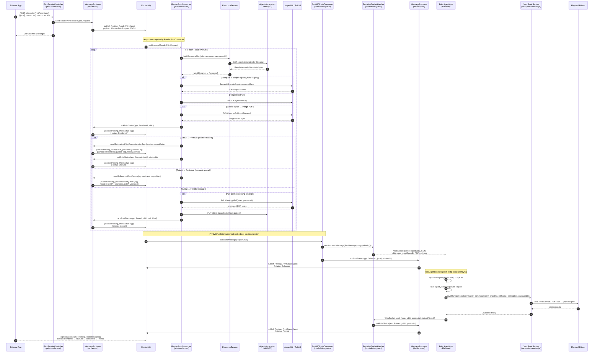
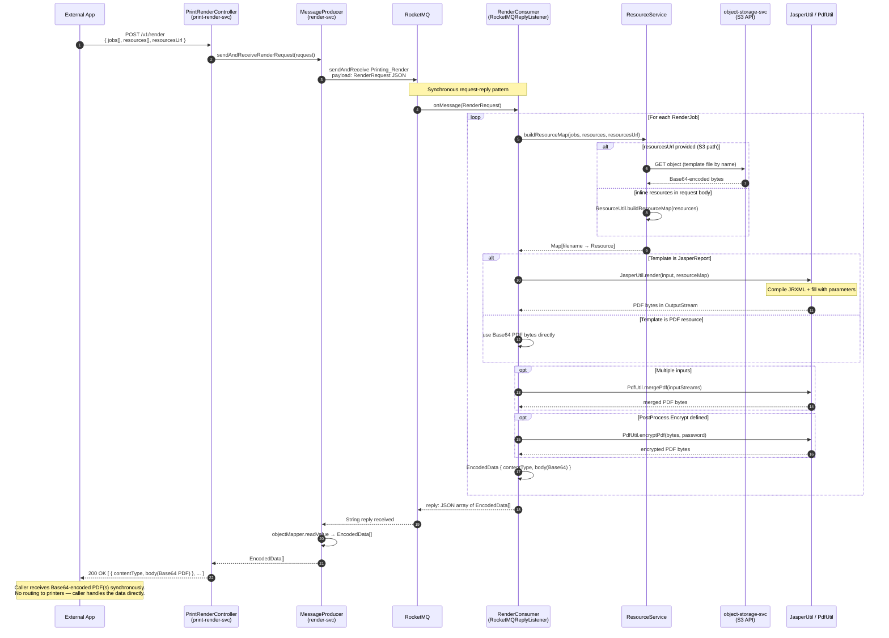
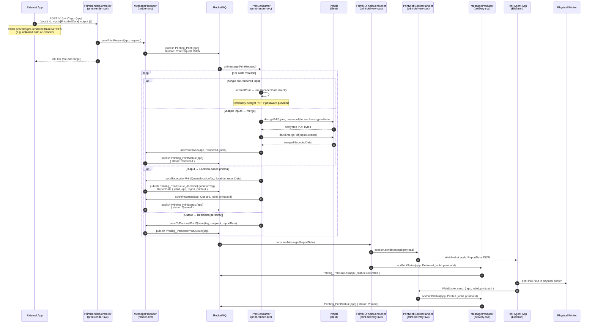
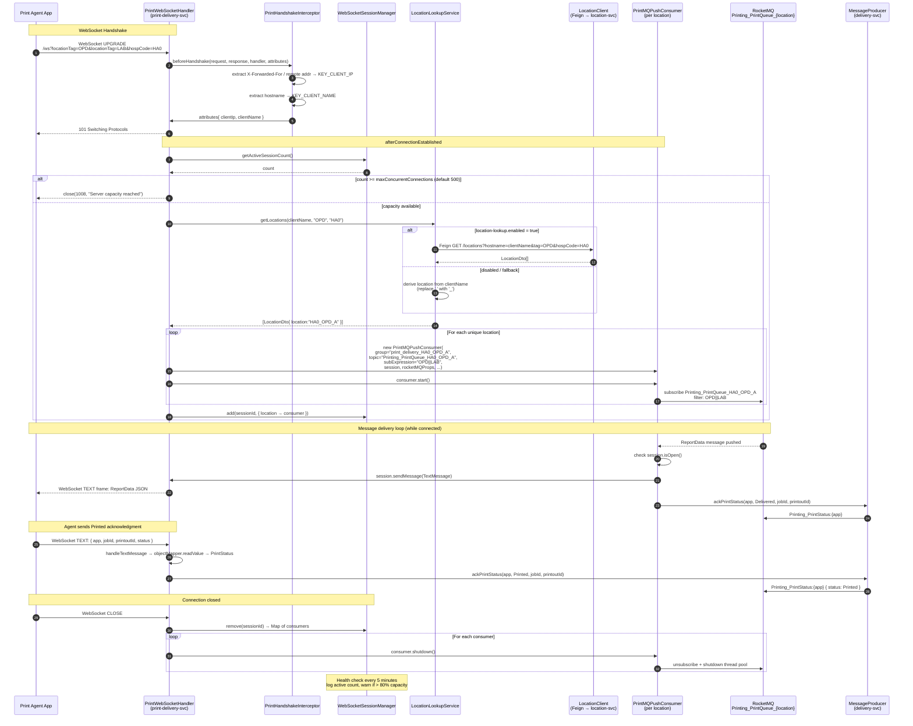
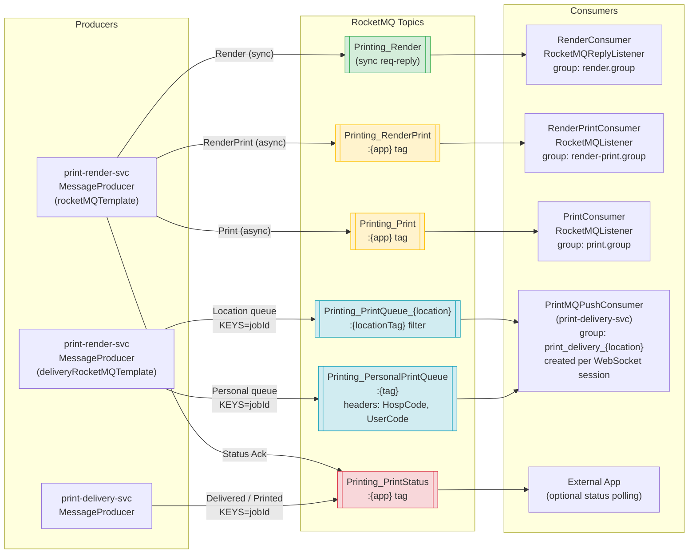

# Printing Suite — Mechanism Documentation

> Generated: 2026-04-15  
> Services covered: `print-render-svc`, `object-storage-svc`, `print-delivery-svc`, `print-agent-app`

---

## Table of Contents

1. [Architecture Overview](#1-architecture-overview)
2. [RenderPrint Flow — Full Async Sequence](#2-renderprint-flow--full-async-sequence)
3. [Render-Only Flow — Synchronous Request-Reply](#3-render-only-flow--synchronous-request-reply)
4. [Print-Only Flow — Async Pre-rendered PDF](#4-print-only-flow--async-pre-rendered-pdf)
5. [Print Agent App — Internal Processing Flow](#5-print-agent-app--internal-processing-flow)
6. [Print Delivery Service — WebSocket Connection Lifecycle](#6-print-delivery-service--websocket-connection-lifecycle)
7. [RocketMQ Topic Map](#7-rocketmq-topic-map)
8. [Print Job Status — Lifecycle State Diagram](#8-print-job-status--lifecycle-state-diagram)

---

## 1. Architecture Overview

The complete topology of all four services, their internal components, and every communication channel — RocketMQ topics, WebSocket connections, S3 API calls, HTTP REST, IPC bridge, SQLite, Java process, and physical printers.

```mermaid
flowchart TB
    subgraph External["External Callers"]
        App["External Application\n(any microservice)"]
        LocalCaller["Local Caller\n(same machine)"]
    end

    subgraph RenderSvc["print-render-svc  :8080"]
        Controller["PrintRenderController\nPOST /v1/render\nPOST /v1/renderPrint\nPOST /v1/print"]
        RenderProducer["MessageProducer\n(rocketMQTemplate\n+ deliveryRocketMQTemplate)"]
        RenderConsumer["RenderConsumer\nRocketMQReplyListener\nPrinting_Render"]
        PrintConsumer["PrintConsumer\nRocketMQListener\nPrinting_Print"]
        RPConsumer["RenderPrintConsumer\nRocketMQListener\nPrinting_RenderPrint"]
        ResourceSvc["ResourceService\nbuildResourceMap()"]
        StorageSvc["StorageService\nMinIO/S3 client"]
        JasperUtil["JasperUtil\nJasperReports engine"]
        PdfUtil["PdfUtil\niText PDF merge/\nencrypt/decrypt"]
    end

    subgraph ObjectStorage["object-storage-svc  :9000  (S3-compatible)"]
        S3API["S3 REST API\n(AWS Signature V4)"]
        FS["Filesystem Storage\nbucket/object path"]
    end

    subgraph RocketMQ["Apache RocketMQ  :9876"]
        T_Render["Printing_Render\n(sync reply)"]
        T_Print["Printing_Print\n(async)"]
        T_RenderPrint["Printing_RenderPrint\n(async)"]
        T_PrintQueue["Printing_PrintQueue_{location}\n(per-location)"]
        T_PersonalQueue["Printing_PersonalPrintQueue\n(per-user)"]
        T_Status["Printing_PrintStatus\n(status acks)"]
    end

    subgraph DeliverySvc["print-delivery-svc  :8089"]
        WSHandler["PrintWebSocketHandler\nWebSocket endpoint\n/ws"]
        MQConsumer["PrintMQPushConsumer\n(one per location/session)"]
        SessionMgr["WebSocketSessionManager\nConcurrentHashMap\nsessions"]
        DeliveryProducer["MessageProducer\nPrinting_PrintStatus"]
        LocationSvc["LocationLookupService\nhostname → location"]
    end

    subgraph AgentApp["print-agent-app  (Electron Desktop)"]
        HttpServer["Express HTTP :18300\nPOST /v1/print"]
        ReactUI["React Frontend\nuseReportQueue hook\nfastq concurrency=1"]
        IPCBridge["IPC Bridge\ncontextBridge"]
        ElectronMain["Electron Main\nipcMain handlers"]
        SQLite["SQLite DB\nTypeORM\njob history"]
        JavaProc["Java Process\nlocal-print-service.jar\nPDF/text printing"]
        Printer["Physical Printer\nWindows/Unix/Network"]
    end

    App -->|"POST /v1/renderPrint\nPOST /v1/render\nPOST /v1/print"| Controller
    LocalCaller -->|"POST /v1/print"| HttpServer
    Controller --> RenderProducer

    RenderProducer -->|"Printing_Render (sync)"| T_Render
    RenderProducer -->|"Printing_Print (async)"| T_Print
    RenderProducer -->|"Printing_RenderPrint (async)"| T_RenderPrint
    RenderProducer -->|"Printing_PrintQueue_{loc} (delivery)"| T_PrintQueue
    RenderProducer -->|"Printing_PersonalPrintQueue"| T_PersonalQueue
    RenderProducer -->|"Printing_PrintStatus (ack)"| T_Status

    T_Render --> RenderConsumer
    T_Print --> PrintConsumer
    T_RenderPrint --> RPConsumer

    RPConsumer --> ResourceSvc
    PrintConsumer --> PdfUtil
    RenderConsumer --> ResourceSvc
    ResourceSvc --> StorageSvc
    StorageSvc <-->|"S3 GET/PUT"| S3API
    S3API --> FS

    RPConsumer --> JasperUtil
    RenderConsumer --> JasperUtil
    RPConsumer --> PdfUtil
    RenderConsumer --> PdfUtil

    T_PrintQueue --> MQConsumer
    T_PersonalQueue --> MQConsumer

    WSHandler --> SessionMgr
    WSHandler --> LocationSvc
    WSHandler --> MQConsumer
    MQConsumer -->|"TextMessage JSON"| WSHandler
    WSHandler --> DeliveryProducer
    DeliveryProducer -->|"Printing_PrintStatus\nDelivered/Printed"| T_Status

    AgentApp <-->|"WebSocket\nws://print-delivery-svc/ws\n?locationTag=...&hospCode=..."| WSHandler
    HttpServer -->|"IPC event\nprintRequest"| ReactUI
    ReactUI --> IPCBridge
    IPCBridge --> ElectronMain
    ElectronMain --> SQLite
    ElectronMain --> JavaProc
    JavaProc --> Printer
    ElectronMain --> Printer

    App -.->|"consume Printing_PrintStatus\nfor async tracking"| T_Status
```



---

## 2. RenderPrint Flow — Full Async Sequence

The primary end-to-end path. The caller fires `POST /v1/renderPrint` and gets an immediate `200 OK`. All subsequent work is asynchronous, with status updates flowing through `Printing_PrintStatus:{app}`.



---

## 3. Render-Only Flow — Synchronous Request-Reply

`POST /v1/render` uses RocketMQ's **request-reply** pattern. `RenderConsumer` implements `RocketMQReplyListener` and returns `EncodedData[]` (Base64 PDFs) synchronously back to the HTTP caller. No delivery or printing occurs — the caller receives and handles the PDF bytes directly.



---

## 4. Print-Only Flow — Async (Pre-rendered PDF)

`POST /v1/print` accepts already-rendered Base64 PDFs from the caller (e.g. obtained from `/v1/render`). `PrintConsumer` optionally decrypts and merges them, then routes to location print queues — same downstream delivery path as RenderPrint.



---

## 5. Print Agent App — Internal Processing Flow

How the Electron desktop application starts up, connects to the delivery service, receives jobs via two ingress paths, and executes them sequentially on the physical printer.

```mermaid
flowchart TD
    subgraph Startup["App Startup (Electron Main)"]
        A([App launched]) --> B[Initialize SQLite DB via TypeORM]
        B --> C[Start Express HTTP server :18300]
        C --> D[Load pending reports from DB]
        D --> E[Start Java process manager\nlocal-print-service.jar via stdin/stdout]
    end

    subgraph WebSocketConn["WebSocket Connection (React Frontend)"]
        F[Connect to print-delivery-svc\nws://PRINT_SERVER_URL/ws\n?locationTag=...&hospCode=...]
        F --> G{Connection accepted?}
        G -->|capacity exceeded| H[Connection closed 1008]
        G -->|accepted| I[Server creates PrintMQPushConsumer\nsubscribes Printing_PrintQueue_location]
    end

    subgraph Ingress["Job Ingress — Two Paths"]
        J1["WebSocket message received\n(from print-delivery-svc)"]
        J2["HTTP POST /v1/print :18300\n(from local caller)"]
        J1 --> K[IPC event 'printRequest'\nforward to renderer via win.webContents.send]
        J2 --> K
    end

    subgraph Queue["Print Queue Processing (useReportQueue hook)"]
        K --> L[ipc.saveReport → SQLite\nReportStatus = Pending]
        L --> M[fastq.push report\nconcurrency = 1 — sequential]
        M --> N{Queue paused?}
        N -->|yes| O[Wait / resume]
        N -->|no| P[dequeue next report\ninner.printReport called]
        O --> P
        P --> Q{Report ID in\ndeleted set?}
        Q -->|deleted| R[Skip — no print]
        Q -->|active| S[ipc.printReport → IPC invoke\n'printReport' to Electron Main]
    end

    subgraph PrintExec["Print Execution (Electron Main — printReport.ts)"]
        S --> T{File type?}
        T -->|PDF or TXT on Windows| U{Java process running?}
        U -->|yes| V[javaManager.sendCommand\n{ command:'print', args:[file, jobName, option, password] }]
        V --> W{waitForPrintResult?}
        W -->|yes| X[getWin32PrintLog → Windows Event Log\ncheck for successful print event]
        W -->|no| Y[sleep 1000ms]
        X --> Z{Event ID 824?}
        Z -->|error event| AA[ReportStatus = Failed\nreturn error]
        Z -->|success| AB[continue]
        Y --> AB
        U -->|no| AC[fallback path]
        T -->|PDF or TXT on Unix| AD[lp command\nlp -n copies -d printer file]
        T -->|Direct path printer\nWindows| AE[COPY /B file printer]
        T -->|Unix path printer| AF[copy file to printer path]
        AD --> AB
        AE --> AB
        AF --> AB
        AB --> AG[reportRepository.updateStatus\nReportStatus = Completed]
        AG --> AH[setReports filter out completed]
        AH --> AI["notifyPrinted(report)"]
        AI --> AJ[ipc send PrintStatus{Printed}\nback over WebSocket]
    end

    E --> F
    I --> J1
    D --> M
```

---

## 6. Print Delivery Service — WebSocket Connection Lifecycle

Full lifecycle of a WebSocket session in `print-delivery-svc`, from the initial `UPGRADE` handshake through dynamic consumer creation, message forwarding, ack handling, and clean shutdown.



---

## 7. RocketMQ Topic Map

All 6 topics, which producer publishes to them, which consumer reads from them, how tags and filters work, and the `KEYS=jobId` header used for message tracing.



### Topic Reference Table

| Topic | Pattern | Direction | Notes |
|---|---|---|---|
| `Printing_Render` | Sync req-reply | render-svc internal | `rocketMQTemplate.sendAndReceive` |
| `Printing_RenderPrint` | Async, tag=`{app}` | render-svc internal | Fire-and-forget from controller |
| `Printing_Print` | Async, tag=`{app}` | render-svc internal | Pre-rendered PDFs only |
| `Printing_PrintQueue_{location}` | Async, filter=`{locationTag}` | render-svc → delivery-svc | `deliveryRocketMQTemplate`, `KEYS=jobId` |
| `Printing_PersonalPrintQueue` | Async, tag=`{app}` | render-svc → delivery-svc | Headers: `X-HA-HospCode`, `X-HA-UserCode` |
| `Printing_PrintStatus` | Async, tag=`{app}` | render-svc / delivery-svc → caller | Statuses: `Rendered`, `Queued`, `Stored`, `Delivered`, `Printed`, `Error` |

---

## 8. Print Job Status — Lifecycle State Diagram

All possible states a print job passes through, including parallel output paths (print, store, render-only) and error states.

```mermaid
stateDiagram-v2
    [*] --> Submitted : App calls POST /v1/renderPrint<br/>or POST /v1/print

    state "RocketMQ Published" as Submitted
    state "Rendering in progress" as Rendering {
        [*] --> FetchingTemplates : buildResourceMap()
        FetchingTemplates --> RunningJasper : templates loaded from S3
        RunningJasper --> MergingPDFs : JasperUtil.render() per input
        MergingPDFs --> PostProcessing : PdfUtil.mergePdf()
        PostProcessing --> [*] : BytesData ready
    }

    Submitted --> Rendering : RenderPrintConsumer<br/>or RenderConsumer<br/>picks up message

    Rendering --> Rendered : ackPrintStatus(Rendered)<br/>Printing_PrintStatus

    state "Render-Only Output" as RenderOnly
    Rendered --> RenderOnly : POST /v1/render (sync reply)<br/>Returns EncodedData[] to caller

    state "File Storage Output" as Stored
    Rendered --> Stored : output.files defined<br/>PUT to object-storage-svc<br/>ackPrintStatus(Stored)

    state "Queued for printing" as Queued
    Rendered --> Queued : output.printouts defined<br/>Printing_PrintQueue_{location} published<br/>ackPrintStatus(Queued)

    Queued --> Delivered : PrintMQPushConsumer<br/>forwards via WebSocket<br/>ackPrintStatus(Delivered)

    state "Delivered to agent" as Delivered

    state "Printing in progress" as Printing {
        [*] --> Saved : saveReport → SQLite
        Saved --> Enqueued : fastq.push(report)
        Enqueued --> Executing : dequeued (concurrency=1)
        Executing --> SentToJava : Java Process (Windows PDF/TXT)
        Executing --> SentToLp : lp command (Unix)
        Executing --> SentToCopy : COPY /B (Windows direct path)
        SentToJava --> WaitingLog : waitForPrintResult=true
        WaitingLog --> [*] : Windows Event ID success
        SentToJava --> [*]
        SentToLp --> [*]
        SentToCopy --> [*]
    }

    Delivered --> Printing : Print Agent App<br/>receives WebSocket push

    Printing --> Printed : print complete<br/>Agent sends PrintStatus over WebSocket<br/>ackPrintStatus(Printed)

    state "Error" as ErrorState
    Rendered --> ErrorState : exception during render<br/>ackPrintStatus(Error)
    Printing --> ErrorState : Java print failed<br/>or Windows Event 824<br/>ReportStatus = Failed

    Printed --> [*]
    RenderOnly --> [*]
    Stored --> [*]
    ErrorState --> [*]

    note right of Queued : Topic: Printing_PrintQueue_{location}<br/>or Printing_PersonalPrintQueue<br/>(for recipient-based delivery)
    note right of Delivered : print-delivery-svc acts as<br/>RocketMQ ↔ WebSocket bridge
    note right of Printed : Printing_PrintStatus:{app}<br/>consumed by original caller<br/>for end-to-end tracking
```

---

## Key Design Decisions

| Concern | Decision | Rationale |
|---|---|---|
| Render sync vs async | `/v1/render` is sync (req-reply), `/v1/renderPrint` and `/v1/print` are async | Sync render suits callers needing the PDF bytes immediately; async suits fire-and-forget workflows |
| Two RocketMQ templates | `rocketMQTemplate` for internal ops, `deliveryRocketMQTemplate` for print queues | Print queues may target a different RocketMQ nameserver from internal topics |
| Dynamic consumer creation | `PrintMQPushConsumer` created per WebSocket session, not at startup | Location binding happens at connect time from client hostname/locationTag query params |
| Sequential print queue | `fastq` with concurrency=1 in `useReportQueue` | Prevents overlapping print jobs on a single physical printer |
| Java process for printing | `local-print-service.jar` via stdin/stdout JSON on Windows | Java Print Service API provides reliable cross-printer PDF/text support on Windows |
| Status tracking | `Printing_PrintStatus:{app}` carries all lifecycle events keyed by `jobId` | Enables caller to correlate async events back to the originating job |
