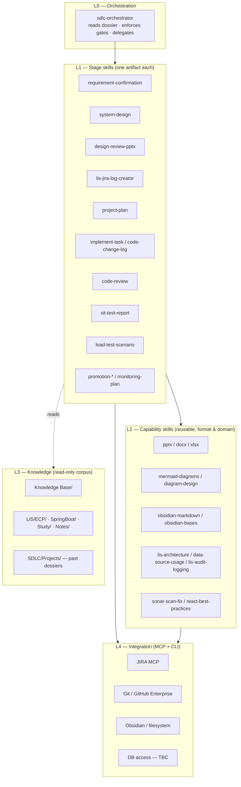

# Architecture

Part of [[SDLC Agentic Workflow]].

## Four layers



## The one rule

> [!important] Layer discipline
> **L0 never writes an artifact. L1 never writes format code. L2 never decides a stage.**

Everything that goes wrong with large skill sets — bloated `SKILL.md` bodies, skills that trigger on each other's prompts, drifting duplicated logic — comes from breaking this. Concretely:

- `sdlc-orchestrator` outputs *routing decisions and gate verdicts*, never a `.pptx`, never a design section.
- `system-design` outputs *design content*, never pptxgenjs coordinates — it hands off to `design-review-pptx`, which hands off to the `pptx` capability.
- `mermaid-diagrams` renders a diagram when asked. It never says "you should now move to SIT".

## How the orchestrator actually runs

`sdlc-orchestrator` is the only skill you pin. In Cursor it is activated as a **Custom Mode** (`Option+Enter`) so it stays loaded for the whole session rather than being re-matched on every prompt.

Its loop, every turn:

```
1. RESOLVE   Find the dossier. Explicit key > open dossier in editor > single active dossier > ask.
2. READ      Load _Dossier.md frontmatter: stage, gates_passed, status, services, repos, jira.
3. REPORT    State current stage, gates passed, gates outstanding, next action. Two lines.
4. GATE      If the user asks for stage N+1 but stage N's exit gate is unmet:
             name the missing condition, offer (a) close the gate now, (b) proceed with a
             recorded exception written into the Gate Log. Never silently skip.
5. DELEGATE  Invoke exactly one L1 stage skill with a resolved input contract.
6. RECORD    On skill completion, write back: artifact wikilink, gate result, updated stage,
             one Decision Log line. Then stop and re-report.
```

Step 6 is the part that is easy to skip and the part that makes the system work. A dossier that is not written back is a state machine with no memory.

## Why the vault is the brain, not the repos

Code answers *what the system does now*. It does not hold intent, rejected alternatives, the reason a design was cut down at CP3, what the pilot found, or what the promotion rollback was. Those live in notes. Two consequences:

1. **Retrieval before generation.** Every L1 skill starts by pulling related notes — prior dossiers for the same service, `Knowledge Base/` workflow notes, `LIS/ECP/<service>/` architecture notes. `load-context` is the reusable front-half of this and should be generalized out of its CRS-Revamp hardcoding (see [[Skill Catalogue#Generalize]]).
2. **Write-back is mandatory.** A stage that produces only chat output has produced nothing. Every L1 skill ends by writing a note and linking it from the dossier.

## Separating design from the JIRA log

You flagged this and it is the right call. Today `generate-design` writes a `## Design` section *into* the JIRA note and `design-review-pptx` reads it from there. That couples three things that change at different rates: the change request, the technical design, and the review deck.

**Target:**

```
SDLC/Projects/<key>/02 System Design.md      ← canonical design, owns its own history
LIS/JIRA/<Summary>.md                        ← change request; frontmatter: design: "[[02 System Design]]"
<Title>.deck.json → .pptx                    ← rendered from the design note
```

**Migration without breaking anything** — teach `design-review-pptx` to resolve its design source by precedence:

1. `design` wikilink in the JIRA note frontmatter → read that note (new path)
2. `## Design` section in the JIRA note (legacy path, still works)

Old notes keep rendering; new notes get the clean split. No bulk migration needed.

## Context budget

Cursor loads only `name` + `description` for every discovered skill at session start, and the body only on invocation. With ~40 skills that startup cost is small — but the **router quality** degrades if descriptions overlap. Two disciplines:

- Every `description` states *when to use* **and** *when not to*, naming the sibling. `design-review-pptx` already does this (it points at `generate-pptx`); make it the house style.
- Use the `paths` frontmatter field to scope file-bound skills — e.g. `react-best-practices` to `**/*.tsx`, `lis-audit-logging` to `**/*.java`. Scoped skills stop competing for unrelated prompts.

## Related

- [[Dossier Schema]] · [[Skill Catalogue]] · [[Cursor Setup]]
