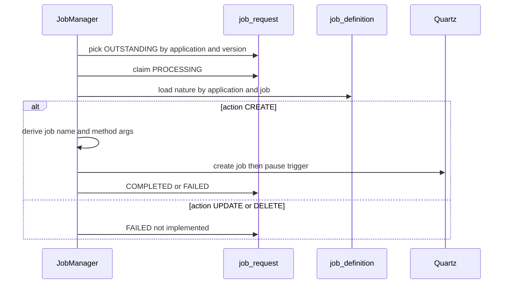

# 02 System Design — Normalize lis-scheduler jobs

Traces to: [[01 Requirement Confirmation]] R1–R7.

**Review type:** incremental  
Delta on `lis-scheduler` 1.0.0 ([[Release lis-scheduler - LIS Common Scheduler Framework with Dynamic Job Creation and Versioning]], LIS-10748).

**Gate:** Requirement co-delivered on fast path; design proceeds as draft until `reviewed_by` is set.

> [!warning] Draft
> `agent_assisted: true` with empty `reviewed_by`. Regenerate CP3 deck only after human review.

## Context and problem

Traces to: R1, R5

Table-driven scheduling stores job nature and instance details in one wide table. Operators duplicate `bean_name`, `method`, `concurrent`, and `skip_on_overdue` for every hospital/lab combination and must manually choose Quartz job names. That does not scale for multi-site consumers and invites naming drift.

Normalization separates **what the job is** (`job_definition`) from **what to create now** (`job_request`), and centralizes name derivation in `JobManager`.

## Existing design

Traces to: R4 (as-is)

| Piece | Role |
|---|---|
| `dynamic_job_definition` | Single table: nature + cron + hosp/lab + explicit `job_name` + status |
| `DynamicJobDefinition` / `DynamicJobDefinitionService` | JPA + CRUD for the monolithic table |
| `DynamicJobCreatorJob` | `@CmsScheduler` poller; claims `OUTSTANDING`; creates Quartz job; pauses trigger |
| `LisSchedulerController` | REST: create-job, replicate-jobs, list jobs |
| Versioning | `SCHEDULER_INCLUDE_VERSION` + `APP_VERSION` isolate `sched_name` for canary |

Poller flow today: pick row → read all columns from one table → create Quartz job with stored name → `COMPLETED` / `FAILED`.

## Proposed change — overview

Traces to: R1–R7

1. **Schema:** Drop `dynamic_job_definition`. Add `job_definition` + `job_request`.
2. **Poller:** Rename `DynamicJobCreatorJob` → `JobManager`. Query `job_request`; join `job_definition` for nature.
3. **Naming:** Derive Quartz job name and method argument list in `JobManager` (not persisted on `job_request`).
4. **Actions:** Implement `CREATE` only. `UPDATE` / `DELETE` → `FAILED` with fixed not-implemented message.
5. **Release:** `lis-scheduler` 1.1.0; breaking DDL; ConfigMap key renames for JobManager cron.



## Component / class design

Traces to: R2, R4, R5

| Piece | Change |
|---|---|
| `JobDefinition` / `JobDefinitionRepository` | New entity for `job_definition` catalog |
| `JobRequest` / `JobRequestRepository` | New entity for work queue; pickup index on `(application, status, version, updated_at)` |
| `JobManager` | Replaces `DynamicJobCreatorJob`; orchestrates claim → load nature → derive name → Quartz create |
| `JobNameDeriver` (or package-private helper) | `{PascalCase(application)}_{job}_{hosp}_{lab}_{params}_Sch{schedule}`; omit blank segments; args = hosp, lab, split parameters |
| `DynamicJobDefinition*` | Removed |
| `LisSchedulerController` | Unchanged contract; internal services write to new tables if create-job API inserts rows |
| `SchedulerJobReplicationService` | Unchanged behaviour; operates on Quartz job store (not table shape) |

**CREATE algorithm**

1. Select oldest `OUTSTANDING` row for `spring.application.name` and current `version` (if include-version on).
2. Optimistic claim → `PROCESSING`.
3. Load `job_definition` by `(application, job)`; missing FK → `FAILED`.
4. If `action` ≠ `CREATE` → `FAILED` ("UPDATE/DELETE not implemented in 1.1.0").
5. Build Quartz name via deriver; build method arg array `[hosp, lab, …params]`.
6. Invoke existing Quartz job creation path (same as 1.0.x: create job, pause trigger, retry count 0).
7. Set `COMPLETED` or `FAILED` + `status_message`.

## Data model

Traces to: R1, R2, R3

### `scheduler.job_definition`

Catalog of job nature. PK `(application, job)`.

```sql
CREATE TABLE scheduler.job_definition (
  application      VARCHAR(120) NOT NULL,
  job              VARCHAR(200) NOT NULL DEFAULT '',
  bean_name        VARCHAR(200) NOT NULL,
  method           VARCHAR(200) NOT NULL,
  concurrent       BOOLEAN      NOT NULL DEFAULT FALSE,
  skip_on_overdue  BOOLEAN      NOT NULL DEFAULT FALSE,
  created_at       TIMESTAMP,
  updated_at       TIMESTAMP,
  CONSTRAINT pk_job_definition PRIMARY KEY (application, job)
);
```

- `job = ''` — default nature for the application.
- `max_retry` and `enabled` from 1.0.x **removed**; table-driven create always retry 0.

### `scheduler.job_request`

Work queue. FK to `job_definition`.

```sql
CREATE TABLE scheduler.job_request (
  id               BIGSERIAL PRIMARY KEY,
  application      VARCHAR(120) NOT NULL,
  job              VARCHAR(200) NOT NULL DEFAULT '',
  version          VARCHAR(64),
  action           VARCHAR(16)  NOT NULL DEFAULT 'CREATE',
  schedule         VARCHAR(32),
  cron_expression  VARCHAR(120),
  hosp             VARCHAR(32),
  lab              VARCHAR(32),
  parameters       VARCHAR(500),
  status           VARCHAR(16)  NOT NULL DEFAULT 'OUTSTANDING',
  status_message   VARCHAR(500),
  created_at       TIMESTAMP,
  updated_at       TIMESTAMP,
  CONSTRAINT fk_job_request_definition
    FOREIGN KEY (application, job)
    REFERENCES scheduler.job_definition (application, job)
);

CREATE INDEX idx_job_request_pickup
  ON scheduler.job_request (application, status, version, updated_at);
```

| Column | Notes |
|---|---|
| `version` | `APP_VERSION` when canary on; else NULL |
| `action` | `CREATE` implemented; `UPDATE` / `DELETE` → FAILED |
| `schedule` | Optional; suffix `Sch{n}` in derived name |
| `cron_expression` | Required for CREATE |

### Migration / rollback

Forward (per consumer, coordinated with 1.1.0 deploy):

```sql
-- 1. Create new tables (DDL above)
-- 2. Migrate data: dedupe nature → job_definition; one job_request per old row
-- 3. Drop legacy table
DROP TABLE IF EXISTS scheduler.dynamic_job_definition;
```

Rollback:

```sql
-- Recreate dynamic_job_definition from 1.0.x DDL if needed
-- job_definition / job_request may remain unused
DROP TABLE IF EXISTS scheduler.job_request;
DROP TABLE IF EXISTS scheduler.job_definition;
```

Data migration script (operator-run): group old rows by `(application, bean_name, method, concurrent, skip_on_overdue, job key)` → insert `job_definition`; map each old row → `job_request` with `action=CREATE`, copy cron/hosp/lab/parameters/status fields; **do not** copy old `job_name` (re-derived on next successful CREATE).

## Interface / API contract

Traces to: R6

No breaking REST changes in 1.1.0:

| Endpoint | Change |
|---|---|
| `POST /api/scheduler/create-job` | Internal persistence targets `job_request` (+ ensures `job_definition` exists) |
| `POST /api/scheduler/replicate-jobs` | Unchanged |
| `GET /api/scheduler/jobs` | Unchanged |

## Configuration

Traces to: R6, R7

| Key | DEVQA / SIT / PROD | Change |
|---|---|---|
| `CRON_EXPRESSION_JOB_MANAGER` | `0 0/1 * * * ?` | Renamed from `CRON_EXPRESSION_DYNAMIC_JOB_CREATOR` |
| `JOB_MANAGER_ENABLED` | `true` | Renamed from dynamic creator enable flag |
| `SCHEDULER_INCLUDE_VERSION` | per env | Unchanged |
| `APP_VERSION` | from deployment | Unchanged |
| `SCHEDULER_DB_SCHEMA` | `scheduler` | Unchanged |

Consumers on 1.0.x keys must update ConfigMap before or with 1.1.0 deploy.

## Error handling, logging, audit

- Missing `job_definition` for FK → `FAILED`, message cites `(application, job)`.
- Invalid cron on CREATE → `FAILED`, Quartz error in `status_message`.
- UPDATE/DELETE → `FAILED`, message "not implemented in 1.1.0".
- Log derived Quartz name and `job_request.id` at INFO; no PHI in `parameters` (operator responsibility).
- Framework audit only; no new HA audit-logging events in this library release.

## Non-functional

- Pickup index supports one poller per application/version (same concurrency model as 1.0.x).
- Breaking upgrade: no runtime compatibility between 1.0.x poller and 1.1.0 schema.
- Canary: only rows matching pod `APP_VERSION` are claimed when include-version is on.

## Rejected alternatives

| Alternative | Why rejected |
|---|---|
| Single table with nullable nature columns | Duplication problem remains |
| Store derived Quartz name on `job_request` | Drift if naming rules change; JIRA requires derive-at-create |
| Implement UPDATE/DELETE in 1.1.0 | Scope held to CREATE; queue schema reserved for later |
| Keep `max_retry` / `enabled` | Removed per requirement; simplify operator model |
| Non-breaking 1.0.x compatible DDL | Two-table model cannot coexist with monolithic poller |

## Promotion impact and fallback

**Promotion**

1. Apply DDL on scheduler PostgreSQL (both tables + indexes; drop legacy table after data migrate).
2. Publish `lis-scheduler` 1.1.0 to Artifactory.
3. Per consumer: bump dependency; update ConfigMap keys; run data migration script.
4. Deploy consumer; pause old-version Quartz jobs if canary cutover.
5. Insert `job_definition` rows (nature catalog) then `job_request` OUTSTANDING rows.
6. JobManager runs; verify COMPLETED; resume triggers when ready.

| Step | New deploy | Version upgrade | New consumer |
|---|---|---|---|
| ConfigMap key rename | Yes | Yes | Yes |
| Library 1.1.0 | Yes | Yes | Yes |
| DDL + data migrate | Yes | Yes | Yes |
| Pause old sched_name jobs | — | Yes | — |
| Trigger JobManager | Yes | Yes | Yes |

**Fallback**

1. Revert consumer to `lis-scheduler` 1.0.1.
2. Restore `dynamic_job_definition` via rollback SQL if dropped.
3. Pause JobManager trigger / restore `CRON_EXPRESSION_DYNAMIC_JOB_CREATOR`.
4. Leave new tables unused or drop on full rollback.

## Open design questions

None — fast path per Ka. Confirm at CP3:

- Data migration ownership (central script vs per-consumer DBA)
- Whether `create-job` REST must auto-upsert `job_definition` or require pre-insert

## Design

**Review type:** incremental  
**JIRA key:** LIS-10785  
**Service:** lis-scheduler 1.1.0  
**Review forum:** CP3  
**Review date:** (TBD)  
**Prior review:** [[Release lis-scheduler - LIS Common Scheduler Framework with Dynamic Job Creation and Versioning]] (LIS-10748)

### Agenda
Background  
Existing Design  
Proposed Change  
Promotion  
Fallback  
Q&A

### Slide: Background
Table-driven jobs today live in one table: `dynamic_job_definition`  
Bean, method, concurrency and skip-on-overdue repeat on every hospital and lab row  
Operators also invent the Quartz job name by hand  
This release splits nature from creation so each nature is defined once

### Slide: Existing Design - Table-driven create
**Archetype:** compare  
Poller claims OUTSTANDING rows for this application (and version when canary is on)  
Each row holds Quartz name, cron, bean, method and parameters  
Poller creates the Quartz job and leaves the trigger paused  
Status becomes COMPLETED or FAILED

### Slide: Proposed Change - Overview
**Archetype:** decision-flow  
Replace single table with `job_definition` + `job_request`  
Rename poller to JobManager  
Derive Quartz name from application, job, hosp, lab, parameters, schedule  
Release lis-scheduler 1.1.0 (breaking DDL and config keys)

### Slide: Proposed Change - job_definition
**Archetype:** matrix  

| Column | Description |
|---|---|
| application | Must match `spring.application.name` |
| job | Nature key; empty string = default |
| bean_name | Spring bean to invoke |
| method | Method on that bean |
| concurrent | Allow overlapping runs |
| skip_on_overdue | Skip late fire when non-concurrent |

`max_retry` and `enabled` removed.

### Slide: Proposed Change - job_request
**Archetype:** matrix  

| Column | Description |
|---|---|
| id | Surrogate key |
| application, job | FK to job_definition |
| version | APP_VERSION when include-version on |
| action | CREATE (only implemented in 1.1.0) |
| schedule | Optional; name suffix Sch{n} |
| cron_expression | Required for CREATE |
| hosp, lab | Naming segments and method args |
| parameters | Extra method args, comma-separated |
| status | OUTSTANDING → PROCESSING → COMPLETED / FAILED |

### Slide: Proposed Change - Job name
**Archetype:** matrix  
Quartz name built at create time, not stored.

Format: `{PascalCase(application)}_{job}_{hosp}_{lab}_{params}_Sch{schedule}`

| Example | How built |
|---|---|
| LisTemplateSvc_AHN_CPS | application + hosp + lab |
| LisTemplateSvc_Echo_AHN_CPS_PARAM1_PARAM2 | + job and parameters |
| LisTemplateSvc_AHN_CPS_Sch1 | + schedule 1 |

Method arguments: hosp, lab, then split parameters.

### Slide: Promotion
**Archetype:** cards  
DDL + data migration  
Publish 1.1.0  
Update ConfigMap keys  
Deploy consumers; JobManager creates paused jobs

### Slide: Fallback
**Archetype:** cards  
Revert to lis-scheduler 1.0.1  
Restore dynamic_job_definition if needed  
Pause JobManager; restore old cron keys

### Slide: Q&A
