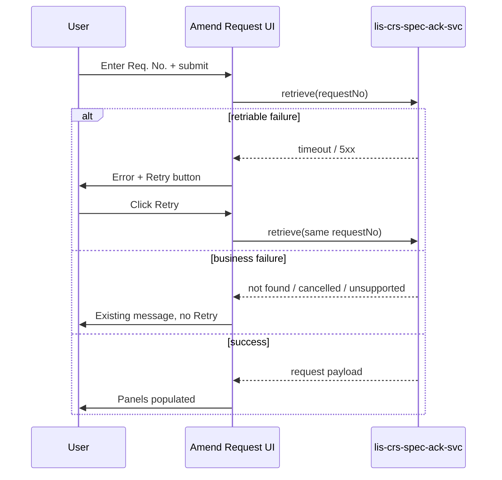

# 02 System Design — Amend Request retrieve retry

Traces to: [[01 Requirement Confirmation]] R1–R5.

**Review type:** incremental  
Frontend-only change on `lis-request-app`. Reuses existing Amend retrieve API on `lis-crs-spec-ack-svc`. No new backend endpoint.

**Gate:** `requirement` in `gates_passed` (2026-09-08, Ka).

## Context and problem

Traces to: R1, R2

Amend Request retrieve can fail on transient errors. Staff must re-submit from **Req. No.** even though the number is already known. A Retry control repeats the last attempt without re-entry.

## Existing design

Traces to: R1, R4

| Piece | Role today |
|---|---|
| Amend retrieve handler | Calls backend retrieve-by-request-no; maps response to panels on success |
| Error handling | Business errors → message, no retry. Transport errors → message, editable **Req. No.** |
| Backend | `lis-crs-spec-ack-svc` Amend retrieve API (unchanged) |

Business-rule failure codes/responses are classified in the existing retrieve result handler and must **not** surface Retry (R1).

## Proposed change — overview

Traces to: R1–R5

1. After a **retriable** failure, show **Retry** in the error message area.
2. Store `lastRetrieveRequestNo` (and lab context if already resolved) in component state at attempt start.
3. **Retry** click → same retrieve function as initial submit, with stored values.
4. Disable Retry while `retrieveInFlight`; re-enable on next retriable failure.
5. ALS `error` on each retriable failure after the first (R5).

No API or DTO change.

## Component design

Traces to: R2, R3

| Piece | Change |
|---|---|
| Amend retrieve hook / service call | Export `isRetriableError(error)` — true for network, timeout, HTTP 5xx; false for mapped business responses |
| Amend Request screen state | `lastRetrieveRequestNo`, `lastRetrieveLabContext` (if applicable), `retrieveInFlight`, `showRetry` |
| Error message component | Optional `onRetry` prop; renders **Retry** button when set |
| ALS | On retriable failure when `retryCount > 0`, log error with masked request no. |

**Classification (D1):** Reuse the same retriable check as other CRS plugin apps if a shared helper exists in `@lis/lis-hub-lib`; otherwise local helper mirroring Cancel Request transport handling.

## Interface / API contract

No change. Retry calls the existing retrieve endpoint with the same parameters as the initial call.

## Configuration

None.

## Error handling, logging, audit

- First retriable failure: user message only (no extra ALS beyond existing retrieve error logging if any).
- Subsequent retriable failures on the same session: ALS error per R5.
- Success after Retry: clear `showRetry`; normal ready state.

## Non-functional

- No automatic retry loop.
- Retry button hidden on success and on business-rule failures.

## Rejected alternatives

| Alternative | Why rejected |
|---|---|
| New backend `/retry` endpoint | Unnecessary; idempotent re-GET/POST of retrieve |
| Auto-retry with backoff | Out of scope; SM asked for a button |
| Retry on all screens at once | v1 Amend Request only (Ka 2026-09-08) |
| Retry on not-found | Misleading; number or lab is wrong, not transient |

## Promotion impact and fallback

**Promotion:** Deploy `lis-request-app` only.  
**Fallback:** Redeploy previous frontend bundle; backend unchanged.

## Open design questions

| # | Question | Owner | Answer |
|---|---|---|---|
| D1 | Shared retriable-error helper vs local? | Ka | **Prefer shared helper in hub-lib if present; else local mirror.** |
| D2 | Retry placement — inline in message box vs toolbar? | Ka | **Inline with error message (R1 UX).** |
| D3 | Clear Retry when user edits Req. No.? | Ka | **Yes.** Hide Retry and clear stored last number when **Req. No.** changes. |
| D4 | Max retries? | Ka | **No cap.** User-driven only; ALS on repeated failure. |

## Design

**Review type:** incremental  
**JIRA key:** (not assigned)  
**Service:** lis-request-app  
**Review forum:** CP3  
**Review date:** 2026-09-09  
**Prior review:** none

### Agenda
Background  
Existing Design  
Proposed Change  
Promotion  
Fallback  
Q&A

### Slide: Background
Amend Request retrieve can fail on transient errors. Staff re-enter the same request number today. SM wants a Retry button.

### Slide: Existing Design
Retrieve calls existing Spec Ack Amend API. Business failures show fixed messages. Transport failures show error only.

### Slide: Proposed Change
Store last request number. Show Retry on retriable failure only. Re-call same API. Disable while in flight. Hide when Req. No. changes.

### Slide: Promotion
Frontend deploy only. No backend or database change.

### Slide: Fallback
Revert frontend bundle.

### Slide: Q&A
