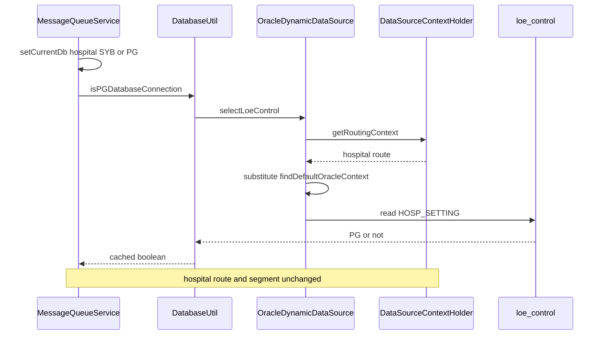

# 02 System Design — Failure in removing chinese character in lis-patient-pmi-sync-svc

Incremental change to `data-source` in `lis-svc-lib`. No new API, table, or configuration key.

## Context and problem

Traces to: R1 (assumed), R2 (assumed), R3 (assumed), R4.

`lis-patient-pmi-sync-svc` calls `DataSourceContextHolder.setCurrentDb` and then `DatabaseUtil.isPGDatabaseConnection`. The second call reads Oracle `loe_control` through `OracleLoeControlRepository` while the thread route is still the hospital `ServerInfo` (for example `NDH` / lab `9` / `LAB_DB` / `SYB`).

`DynamicDataSource.determineCurrentLookupKey` returns that thread route for every router. The Oracle router (`dbType` `ORACLE`) throws `IllegalStateException`. Spring translates it to `InvalidDataAccessApiUsageException`. `isPGDatabaseConnection` catches it, stores the server-lab as PostgreSQL, and later calls skip Oracle. A Sybase hospital then skips the non-ASCII strip.

## Existing design

- One `DynamicDataSource` per database type, built in `OracleDataSourceConfig`, `SybaseDataSourceConfig`, and `PostgreSqlDataSourceConfig`. Oracle repositories are bound only to `oracleEntityManagerFactoryBean` and `oracleTransactionManager` (`OracleDataSourceConfig`).
- The shared lookup key is `DataSourceContextHolder.getRoutingContext()`. An active `RoutingTransactionManager` segment wins over the thread route.
- `setCurrentDb` decides Sybase versus PostgreSQL in `determineServerInfo`. When both pools exist, `determinePostgreSqlPreference` calls `RoutingTransactionManager.ensureTransactionTarget` for `LOE` / `1` / `LOE_DB` / `ORACLE` and then `withEffectiveContext` before `isPGDatabaseConnection`. `ensureTarget` commits the active segment and starts the next one.
- `DataSourceContextHolder.findDefaultOracleContext()` is that same `LOE` / `1` / `LOE_DB` / `ORACLE` key. A three-part Oracle environment variable (`ORACLE_<server>_URL`) is registered as lab `1` and database `LOE_DB` (`BaseDataSourceConfig.parseEnvironmentVariable`).
- `DatabaseUtil.isPGDatabaseConnection` caches the boolean in `cachedDatabaseConnection`. On any `RuntimeException` it sets PostgreSQL and still caches that value. The warning text is `defaulting to PostgreSQL`.
- DH and private-hospital servers return Sybase before any Oracle read (`HospitalUtil.isDhServer`, `HospitalUtil.isPrivateHospitalServer`).

## Proposed change — overview

The hospital thread route and the hospital transaction segment stay as they are. Only the Oracle router's lookup key changes. `MessageQueueService` is not modified (A2).

## Component / class design

### `DynamicDataSource.determineCurrentLookupKey` — R1 (assumed), R2 (assumed), R3 (assumed)

When this router's `dbType` is `DatabaseConstants.DB_ORACLE`:

1. Read `DataSourceContextHolder.getRoutingContext()`.
2. If that route is already `ORACLE`, return it. An explicit `setOracle()` key is unchanged.
3. Otherwise return `DataSourceContextHolder.findDefaultOracleContext()` (`LOE`, lab `1`, `LOE_DB`, `ORACLE`). This covers a missing route and a Sybase or PostgreSQL route (A1).
4. If that Oracle route is not registered, throw `IllegalStateException`. Do not return the hospital key.

When `dbType` is Sybase or PostgreSQL, keep the current method: a null route throws, and a mismatched `dbType` throws `IllegalStateException` (R3 assumed).

This method does not call `setCurrentDb`, `setOracle`, `withEffectiveContext`, or `RoutingTransactionManager.ensureTransactionTarget`. The thread route and the active hospital segment stay in place (R2 assumed).

### `DatabaseUtil.isPGDatabaseConnection` — R4

Leave the DH / private-hospital short-circuit and the cache hit as they are.

On a completed read, including a null `OracleLoeControl`, cache `isPG` and return it. A missing row stays Sybase (`false`).

On `RuntimeException`, log a warning that the lookup is defaulting to Sybase for that server and lab, return `false`, and do not call `cachedDatabaseConnection.put`. Replace the current warning text `defaulting to PostgreSQL`.

### Tests

Extend `DynamicDataSourceTest`:

- Oracle router, thread on the existing TKO Sybase route, returns the LOE Oracle key and the Oracle pool.
- Oracle router, no thread route, returns the LOE Oracle key.
- The existing Sybase test still rejects a PostgreSQL key.

Add a `DatabaseUtil` test: when `OracleControlService` throws, `isPGDatabaseConnection` returns `false` and `getCachedDatabaseConnection` for that server and lab is null.

## Data model

Untouched. The read is still `loe_control` group `HOSP_SETTING`, name `{lab}_DATABASE_CONNECTION` (or the CORP control name). No DDL, index, or migration.

## Interface / API contract

No new endpoint. `DatabaseUtil.isPGDatabaseConnection` keeps the same signature. The failure return changes from `true` to `false` and is no longer cached.

Existing cache flush stays available for a bad successful answer: `DELETE /api/clearCachedDBConn/{hospital}/{lab}` on `ConnectionController`.

## Configuration

| Key | DEVQA | SIT | PROD | Type |
|---|---|---|---|---|
| Oracle / Sybase / PostgreSQL JDBC settings | unchanged | unchanged | unchanged | existing env / Secret |
| `database-config.*` | unchanged | unchanged | unchanged | property |

The fix ships as a `data-source` library build consumed by each service. No ConfigMap or Secret change.

## Error handling, logging, audit

- Oracle route missing: `IllegalStateException` from the Oracle router. `isPGDatabaseConnection` treats it as Oracle unavailable (R4): return Sybase, do not cache.
- Oracle down or repository error: same catch. Warning includes server and lab only, not patient identifiers.
- Sybase or PostgreSQL mismatch: unchanged `IllegalStateException` from that router.
- No new audit event. The existing warning is the operational signal.

## Non-functional

- Volume and latency: one `loe_control` read per server-lab until a real answer is cached. A failed lookup does not create a cache entry, so the next call tries Oracle again.
- Concurrency: `cachedDatabaseConnection` stays a `ConcurrentHashMap`. The Oracle key substitution is a read of the registered route, not a write to the thread route.
- Retention: in-memory for the process, same as today.

## Rejected alternatives

Call `setOracle()` or `withEffectiveContext` around `selectLoeControl`, which is what `determinePostgreSqlPreference` already does. Rejected because `RoutingTransactionManager.ensureTarget` commits the active hospital segment before the Oracle read. That breaks R2 (assumed) for `queueMessage`, which has already written on the hospital route.

Keep the current catch and default to PostgreSQL. Rejected by Q1. It also caches the failure, so a Sybase hospital skips non-ASCII stripping until the cache is cleared.

## Promotion impact and fallback

Consumers pick this up by depending on the new `data-source` build. No schema or config rollout. `lis-patient-pmi-sync-svc` needs a rebuild only to take the library; its own source stays the same (A2).

Fallback:

1. Redeploy the previous `data-source` artifact to the affected service and restart it.
2. Confirm the rollback: with a hospital route of `SYB`, `isPGDatabaseConnection` again logs `defaulting to PostgreSQL`, and the Oracle router again reports that it cannot route `dbType='SYB'`.
3. If a successful `loe_control` answer was cached and is wrong, call `DELETE /api/clearCachedDBConn/{hospital}/{lab}` and confirm `GET /api/getCachedDatabaseConnection` no longer lists that server-lab. The next call reads `loe_control` again.

## Open design questions

| # | Question | Owner | Answer |
|---|---|---|---|
| D1 | A1 — if a five-part `ORACLE_*` variable registers a second Oracle `ServerInfo`, `findDefaultOracleContext` still returns only `LOE` / `1` / `LOE_DB`. Is that the only Oracle target? | Ka | Open. Design uses `findDefaultOracleContext` unless the thread route is already `ORACLE`. |
| D2 | R2 (assumed) — an Oracle repository call uses `oracleTransactionManager`. If a JTA transaction is already open, acquiring the Oracle connection may still enlist Oracle. Segment commit is avoided because this design does not switch the route. Is JTA enlistment acceptable? | Ka | Open. JTA redesign is out of scope. |

Slides are not this note. After `reviewed_by` is set, `/design-review-pptx` writes [[03 Slide Brief]].
