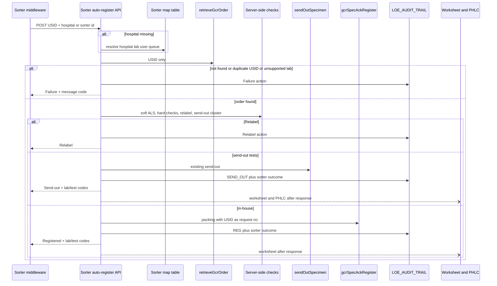
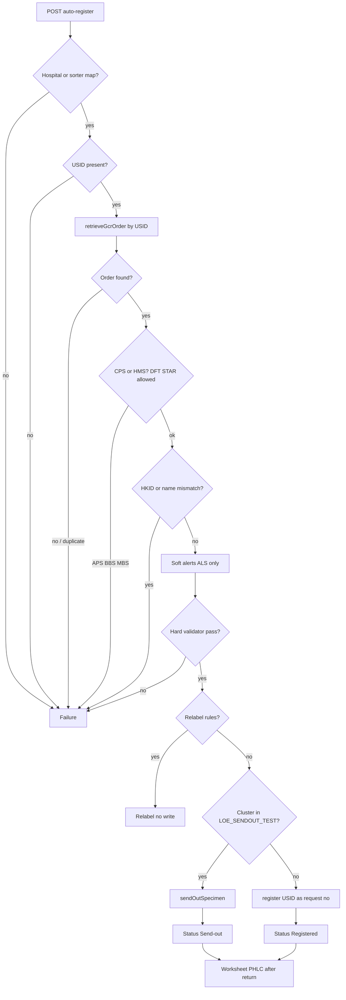
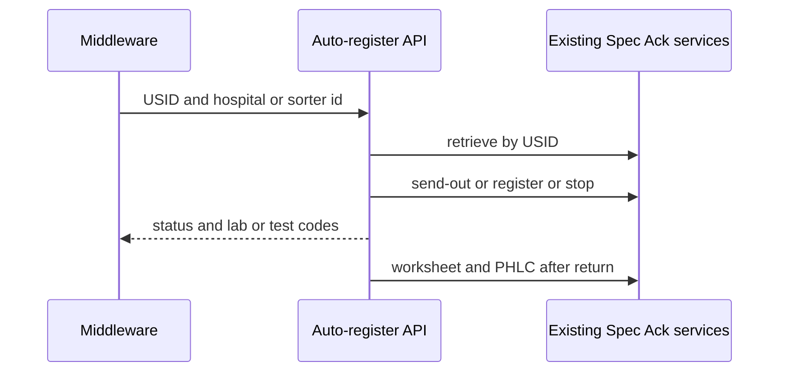

# 02 System Design — Specimen Sorter API

Traces to: [[01 Requirement Confirmation]] R1–R14.

**Review type:** incremental  
New endpoint and orchestrator on existing `lis-crs-spec-ack-svc`. Does not create a new service.

**Gate:** `requirement` was confirmed in writing but is not in `gates_passed`. Design proceeds under a recorded exception (requester invoked `/system-design`).

## Context and problem

Traces to: R1, R8, R17 volume/latency

Staff on Specimen Acknowledgement scan a USID and click Send-out or Register. Labs will load tubes onto a sorter. The sorter must call LIS once per tube, get a status it can bin on, and move the tube within about four seconds.

Today that click path is split:

- Order lookup and register/send-out writes are already in `lis-crs-spec-ack-svc`.
- Soft alerts, hard validations, relabel, worksheet choice, and PHLC trigger still live in the **Flex screen** (and the revamp React screen). Java `register()` assumes a fully built packing.

There is no sorter-facing contract. Middleware cannot call `/gcrSpecAckRegister` without assembling the same packing the UI builds.

## Existing design

Traces to: R2, R5, R6, R7, R11, R13, R14

All of this already runs in `lis-crs-spec-ack-svc` (port 8118, root `/api/specack`). Security starter is commented out; isolation is NetworkPolicy. Hub BFF (`lis-hub-svc`) is the JWT front for CMS. Dynamic DB routing uses `ServiceParameterVo` (`serverName`, hospital, lab).

| Step | Who owns it today | What it does |
|---|---|---|
| Retrieve | `GcrUIAppServiceImpl.retrieveGcrOrder` (legacy and revamp) | USID → specimen ids via `selectSpecimen`; then request sequence → order. Duplicate USID is a retrieve error and writes `LOE_AUDIT_TRAIL`. Order-no / request-no branches exist; sorter will not use them (R2, Q4). Revamp GET `/retrieveGcrOrder` currently hard-codes user `ltc611` — not for production sorter use. |
| Soft alerts | Flex `GcrSpecAckUIComponents.promptAlert` | Collection date, overnight, valid period, validity, patient tag, duplicate, ward-printed request-no, DFT specimen, USID, private patient, not unboxed (LIS-7736), mixed local + send-out (LIS-8448). Staff click through. |
| Hard checks | Flex `GcrSpecAckDataValidator` | Unmapped doctor `0001162`, location `0001165`, specialty `0001167`, report destination `0001170`, report copy `0001090`; datetime `0001074`–`0001078`, `0002584`, `0004415`; missing test-dict `0004122`. |
| Relabel | Flex `GcrSpecAckDataConvertor` Assign USID | Multi test-group; DFT same time-flag other specimen; `specimens.length > 1`; suffix ≠ `0`; `gcrTest.relabel`; plus a **user checkbox** the API will not have. If none fire, request no. = USID. |
| Send-out write | `GcrSpecAckAppServiceImpl.sendOutSpecimen` | If status Printed or Collected, acknowledge first; tracking log; `LOE_AUDIT_TRAIL` action `SEND_OUT`. |
| Register write | `GcrSpecAckAppServiceImpl.register` | Patient create/update, age check, order-no match, per test-group register, `REG` audit, GCRS message queue `RR1` / DFT `RR3`. STAR unbox action is posted from the UI path. |
| Worksheets | Flex `GcrSpecAckPm.printWorksheet` + POST `/workSheet` | SH form, DH/send-out form (needs print queue keyed by **workbench id**), BBS jobsheet (out of v1), general GCRS worksheet. Staff pick when more than one worksheet. |
| PHLC | Flex `createPhlcLabOrder` after send-out form Ro is set; POST `/createPhlcLabOrder` | `LisPhlcLabOrderAppServiceImpl.createPhlcLabOrder` builds PO1 when destination is PHLC. |

Send-out **detection** (R7) is not the send-out write. Spec Ack search already inner-joins `loe_request_test.loereqtst_test_code` to `loe_sendout_test.loesend_cluster_code` and `loesend_hosp`, filtered by `loesend_labno`.

Labs: CPS = 1, HMS = 3, APS = 5, BBS = 6, MBS = 7, VRS = 8.

`LOE_AUDIT_TRAIL` columns used by Specimen Audit Trail: function `SPEC_ACK`, action (`REG`, `SEND_OUT`, `ACK`, …), specimen no, datetime, description, user, workstation.

## Proposed change — overview

Traces to: R1–R14

Add **one** new POST on `lis-crs-spec-ack-svc`. Middleware calls it once per tube. The new orchestrator, in-process, reuses retrieve / send-out / register / worksheet / PHLC. It does **not** go through Hub, and it does **not** change the staff Spec Ack screen except that new audit actions become searchable on Specimen Audit Trail (R9).

Numbered work items:

1. **Sorter auto-register API** — new URL under `/api/specack`. Slim body: USID required; hospital and sorter id required-or-mappable; HKID/name optional (R1, R10).
2. **Orchestrator service** — resolve lab context, load dictionary, retrieve by USID only, run server-side copies of Flex alerts/validations/relabel, branch send-out vs in-house, call existing app services, write sorter outcome audit, then print/PHLC off the sorter wait path (R3–R8, R11–R14).
3. **Sorter map table** — sorter identifier → hospital, lab no, `serverName`, technical user, workstation, print queue (R10, R13).
4. **New audit actions** so Relabel and Failure are visible on Specimen Audit Trail without a new screen (R9).

Staff `/retrieveGcrOrder`, `/gcrSpecAckRegister`, `/sendOutSpecimen`, `/v1/ecpath5-register` stay unchanged.



## Component / class design

Traces to: R1, R5, R6, R11, R14

New types live in `lis-crs-spec-ack-svc` next to `CrsSpecAckController`. Names below are design names, not generated code.

| Piece | Role |
|---|---|
| `SpecimenSorterController` | POST only. Does not reuse GET `/retrieveGcrOrder` (hard-coded user). Extends `AbstractService` for ALS. |
| `SpecimenSorterAutoRegisterService` | Orchestrator. Builds `ServiceParameterVo` + dictionary packing, then calls existing app services. |
| `SpecimenSorterValidationService` | Java port of Flex `promptAlert` (ALS only, R6) and `GcrSpecAckDataValidator` (hard Failure, R5). STAR unbox: same rule as `useUnboxChecking` — no workbench location → Failure `4422`; otherwise ALS and continue (R14). |
| `SpecimenSorterRelabelService` | Java port of Assign USID block in `GcrSpecAckDataConvertor` **without** the user checkbox (R4, R11). |
| `SpecimenSorterSendOutResolver` | Test is send-out when cluster code is in `LOE_SENDOUT_TEST` for performing lab + hospital (R7). Same join as `LoeSpecimenDetailDao`. |
| `SpecimenSorterMapService` | Read sorter map. No hospital and no row → Failure (R10). |
| `SpecimenSorterPostProcessService` | After status is committed: worksheets via existing print services; PHLC via `LisPhlcLabOrderAppServiceInterface`. Must not hold the HTTP response (latency R17). |

Reuse, do not copy:

- `GcrUIAppServiceInterface.retrieveGcrOrder`
- `GcrSpecAckAppServiceInterface.sendOutSpecimen` and `register`
- `GcrPrintReportAppServiceInterface` / `WorksheetPrintService` / send-out form / SH worksheet
- `LisPhlcLabOrderAppServiceInterface.createPhlcLabOrder`
- `GcrAuditService.insertAudit`

DFT (R14): retrieve-by-USID already returns DFT specimens. Relabel uses the DFT time-flag loop from the convertor. Register packing uses the same `register()` path (message queue `RR3` / `PR3` already exist). Do **not** call `/api/dftreg/register` as a second contract unless DFT packing cannot be built — that is D8.

APS/BBS/MBS (lab 5/6/7): after retrieve, if the only target lab is one of those → Failure unsupported (R5). Do not enter APS/BBS input packing.

HKID/name (R1): after retrieve, if caller sent HKID or name and it does not match GCRS patient → Failure. If omitted, skip.

AAR and urgent workstation: leave off (no UI). Do not set `userLastChoseToEnableAar` / urgent WS flags.



## Data model

Traces to: R9, R10

### New table — sorter map (LOE / Oracle)

Forward:

```sql
CREATE TABLE loe_sorter_map (
  loesort_key           NUMBER        NOT NULL,
  loesort_sorter_id     VARCHAR2(64)  NOT NULL,
  loesort_hosp          VARCHAR2(8)   NOT NULL,
  loesort_labno         NUMBER        NOT NULL,
  loesort_server_name   VARCHAR2(64)  NOT NULL,
  loesort_usercode      VARCHAR2(32)  NOT NULL,
  loesort_wktstation    VARCHAR2(64),
  loesort_print_queue   VARCHAR2(128),
  created_at            TIMESTAMP,
  updated_at            TIMESTAMP,
  CONSTRAINT pk_loe_sorter_map PRIMARY KEY (loesort_key)
);

CREATE UNIQUE INDEX uk_loe_sorter_map_id ON loe_sorter_map (loesort_sorter_id);
```

`loesort_labno` is 1 (CPS) or 3 (HMS) for v1. Print queue replaces workbench-keyed `sendOutDefaultPrintQueue` (R13). Technical user and workstation populate `ServiceParameterVo` / `LOE_AUDIT_TRAIL` (today retrieve hard-codes a person — D2).

Rollback:

```sql
DROP TABLE loe_sorter_map;
```

Sequence/trigger for `loesort_key` follows the usual LOE pattern used by sibling tables; exact sequence name confirmed in D7 if the site uses a shared LOE key generator.

### `LOE_AUDIT_TRAIL` — no DDL

Reuse table. Add **action codes** (constants only, not a new column):

| Action | When |
|---|---|
| `SORT_REG` | In-house Registered from sorter (in addition to existing `REG` from `register()`) |
| `SORT_SO` | Send-out from sorter (in addition to `SEND_OUT`) |
| `SORT_RELABEL` | Relabel — no lab request |
| `SORT_FAIL` | Failure — description holds message code + text |

Function stays `SPEC_ACK` so Specimen Audit Trail finds them (R9). Existing `REG` / `SEND_OUT` rows from `register()` / `sendOutSpecimen()` remain. Sorter-prefixed rows are what staff filter on for auto-registration. Confirm action strings with SM (D6) before coding — Audit Trail screens may need the new codes in an action dropdown.

No change to `LOE_SENDOUT_TEST`, GCRS order tables, or USID tables.

## Interface / API contract

Traces to: R1, R2, R3, R7, R8, R10, R11

**Method / path:** `POST /api/specack/sorter/auto-register`  
**Content-Type:** `application/json`  
**Caller:** sorter middleware. Not the staff UI. Not ECPath5 GET retrieve.

Request (proposed):

```json
{
  "usid": "QHSP2500000012",
  "hospital": "QEH",
  "sorterId": "KTH-SORTER-01",
  "hkid": null,
  "patientName": null
}
```

| Field | Required | Rule |
|---|---|---|
| `usid` | Yes | R1. Absence → Failure, no DB write. |
| `hospital` | If no map hit | Performing / receiving hospital (R10). |
| `sorterId` | If hospital omitted | Lookup `loe_sorter_map`. |
| `hkid`, `patientName` | No | If present, must match retrieved GCRS patient. |

`serverName`, lab, user, workstation, print queue come from the map row (and hospital), not from the sorter. Encounter and tube colour are ignored for routing (Q18).

Response (proposed):

```json
{
  "status": "REGISTERED",
  "usid": "QHSP2500000012",
  "labCode": "CPS",
  "labNo": 1,
  "gcrsTestCode": "C415D",
  "requestNo": "QHSP2500000012",
  "messageCode": null,
  "message": null
}
```

| `status` | HTTP | Writes |
|---|---|---|
| `REGISTERED` | 200 | Lab request + `REG` + `SORT_REG` |
| `SEND_OUT` | 200 | Send-out ack/tracking + `SEND_OUT` + `SORT_SO` |
| `RELABEL` | 200 | `SORT_RELABEL` only |
| `FAILURE` | 200 | `SORT_FAIL` only (business fail). Transport/5xx stays 500. |

One Failure status + existing LIS message code (R7). Examples: retrieve 1336/1337/1338/1377 or `GCR_UI_NOT_FOUND_*` / `GCR_UI_USID_DUPLICATE`; validator `0001162` … `0004415`; `4422`; `INVALID_PATIENT_DATA`; unsupported lab.

Do not expose soft-alert text (R6).

Existing UI endpoints are not part of the sorter contract:

- `GET /api/specack/retrieveGcrOrder`
- `POST /api/specack/gcrSpecAckRegister`
- `POST /api/specack/sendOutSpecimen`
- `PATCH /v1/ecpath5-register`

## Configuration

| Key | DEVQA | SIT | PROD | Type |
|---|---|---|---|---|
| `loe_sorter_map` rows (sorter id, hosp, lab, serverName, user, workstation, print queue) | seed KTH/QEH + UCH CPS/HMS test sorters | same shape, SIT ids | real sorter ids | Oracle data, not ConfigMap |
| `crs.sorter.api-key` (D1) | non-prod secret | SIT secret | Conjur | Secret — only if API-key auth is chosen |
| NetworkPolicy allow-list for middleware → port 8118 | DEV CIDRs | SIT | PROD | OpenShift |
| No new `application.yml` feature flag required for v1 | — | — | — | Print/PHLC follow existing `CREATE_PHLC_LAB_ORDER_REG` / worksheet options already read by Spec Ack |

Existing `httpClient.readTimeOut: 5000` is 5 s; sorter p95 is 4 s (R17) — client timeout on middleware should be ≥ 5 s, server work for retrieve+register must stay under 4 s excluding print.

## Error handling, logging, audit

Traces to: R6, R9

- Orchestrator extends `AbstractService`. Soft alerts: `warn("SPEC_ACK", …)` ALS only (R6). Hard fail: `warn` + `SORT_FAIL` row. Unexpected: `logExceptionWithWarn` / `logExceptionWithCritical`, HTTP 500, `SORT_FAIL` if a specimen id is known.
- Do not log full HKID in description; follow existing mask helpers where register already masks.
- Correlation: same `ServiceParameterVo` thread context as other Spec Ack calls (`DataSourceContextHolder`).
- Print/PHLC failure after a successful REGISTERED/SEND_OUT: ALS warn; **do not** change the status already returned (D4). Staff see register success and a missing worksheet.

## Non-functional

Traces to: requirement NFR / Q17

- Sync one HTTP call per tube. p95 < 4 s for retrieve + branch + register/send-out + audit.
- ~20/min per lab v1. PWH 4000/hour not a v1 criterion.
- Worksheet XML + printer + PHLC outbound run **after** the response is committed (async in-process). If print must be synchronous, p95 < 4 s is likely missed — D4.
- Retention = existing `LOE_AUDIT_TRAIL`.

## Rejected alternatives

| Alternative | Why rejected |
|---|---|
| Middleware calls GET retrieve then POST register | Two hops, packing still built outside LIS, misses 4 s budget, duplicates Flex logic in middleware. |
| Overload `/gcrSpecAckRegister` | Requires full `GcrsSpecAckPackingDto` from UI. Breaks staff contract if we loosen it. |
| Overload `/v1/ecpath5-register` | Different machine caller, hardcoded retrieve user, not a sorter contract (out of scope). |
| New microservice | Same Oracle/LOE/session as Spec Ack; extra hop. |
| Async register queue | Rejected in R11/Q17 — sorter needs status to bin the tube. |
| New frontend list | Rejected in R9. |
| Print labels on this path | Rejected in R13. |
| Hub BFF as the only entry | CMS JWT does not match middleware. Possible later; v1 hits domain service (D1). |

## Promotion impact and fallback

**Promotion (ordered)**

1. Oracle: `loe_sorter_map` + seed rows for the pilot hospital/lab.
2. Deploy `lis-crs-spec-ack-svc` with new endpoint (staff APIs unchanged).
3. NetworkPolicy / secret for middleware.
4. Confirm Specimen Audit Trail shows `SORT_*` actions (dropdown if required).
5. Pilot one sorter on CPS or HMS; staff Spec Ack remains the fallback for Relabel/Failure bins.

**Fallback**

1. Stop middleware calls (or NetworkPolicy deny). Staff Spec Ack unchanged.
2. Leave `loe_sorter_map` in place (harmless if unused) or `DROP TABLE` on full rollback.
3. New audit actions unused is safe; existing `REG` / `SEND_OUT` behaviour unchanged.
4. No data conversion of historical requests.

## Open design questions

| # | Question | Owner | Answer |
|---|---|---|---|
| D1 | How does middleware authenticate to `lis-crs-spec-ack-svc`? Service has no JWT. Propose NetworkPolicy + API key header. | Requester / infra | |
| D2 | Technical user and workstation on the map row — who is the LIS user on audit rows? Must not keep retrieve’s hard-coded `ltc611`. | Requester | |
| D3 | Mixed local + send-out on one USID: send-out tests only, Relabel, or Failure? | Requester | |
| D4 | Confirm worksheet + PHLC **after** HTTP return (print fail does not change status). Sync print likely breaks p95 < 4 s. | Requester | |
| D5 | Multiple worksheets: print **all** without the staff picker? Propose yes. | Requester | |
| D6 | New `SORT_*` audit actions vs reuse `REG` / `SEND_OUT` only? Propose `SORT_*` plus existing writes so Relabel/Failure appear. Does Audit Trail action filter need a setup row? | Requester | |
| D7 | Sorter map as `loe_sorter_map` vs `LOE_CONTROL` option rows? Propose dedicated table (print queue + user + lab). | Requester | |
| D8 | DFT register via Spec Ack `register()` packing vs `/api/dftreg/register`? Propose same `register()` if USID retrieve already returns DFT specimens. | Implementer, confirm with requester | |
| D9 | Default workbench location for STAR `4422` when the sorter has no CMS workbench? Map row workstation/location vs Failure every STAR tube. | Requester | |
| D10 | Lab on the request vs from USID/test map: sorter map has `loesort_labno`. If the order’s tests belong to the other v1 lab (CPS vs HMS), Failure or switch lab? Propose Failure. | Requester | |

## Design

**Review type:** incremental
**JIRA key:** (not assigned)
**Service:** lis-crs-spec-ack-svc
**Review forum:** CP3
**Review date:**
**Prior review:** none

### Agenda
Background
Existing Design
Proposed Change
Promotion
Fallback
Open Questions
Q&A

### Slide: Background
Staff scan a USID and click Send-out or Register. The sorter must do that in one LIS call, then bin the tube.
Lookup and the database writes already exist in the Specimen Acknowledgement service.
Alerts, hard checks, relabel, worksheet choice, and PHLC still sit in the desktop screen.
There is no slim contract for sorter middleware. The staff register API expects a full screen packing.

### Slide: Existing Design - Spec Ack split
**Archetype:** compare
As-is: screen owns Yes/No alerts, datetime/location checks, and USID-as-request-no rules; service owns retrieve, send-out, register, print, PHLC.
Send-out tests are those whose GCRS cluster code is in `LOE_SENDOUT_TEST` for that lab and hospital.
Audit already lands on `LOE_AUDIT_TRAIL` (actions `REG`, `SEND_OUT`, `ACK`). Staff already search Specimen Audit Trail.

### Slide: Proposed Change - Overview
**Archetype:** decision-flow
1. New POST auto-register on the existing Specimen Acknowledgement service.
2. Orchestrator reuses retrieve, send-out, register, worksheet, and PHLC in-process.
3. Flex alert/validator/relabel rules run on the server: soft → ALS only; hard → Failure; relabel → no write.
4. Sorter map table supplies hospital/lab/user/print queue when needed.
5. Status Registered / Relabel / Failure / Send-out on the same response. Print after return.

### Diagram: sorter sequence


### Slide: Proposed Change - API
**Archetype:** code-findings
One POST. USID required. Hospital from the sorter, or from the sorter-id map.
HTTP 200 for business outcomes. Message code on Failure. No soft-alert text.
Do not use the staff retrieve GET (hard-coded user) or the ECPath5 register patch.

### Slide: Proposed Change - outcomes
**Archetype:** matrix
Registered — write lab request, request no. = USID when eligible, return lab and GCRS code.
Send-out — existing send-out write, return send-out status.
Relabel — no lab request; multi-group, multi-specimen, suffix, DFT same time-flag, force relabel.
Failure — not found, already used, hard check, unsupported APS/BBS/MBS, STAR with no location.

### Slide: Promotion
**Archetype:** cards
Create sorter map and seed the pilot sorter.
Deploy Specimen Acknowledgement service only.
Open NetworkPolicy (and API key if agreed).
Pilot CPS/HMS. Staff screen remains the manual path.

### Slide: Fallback
**Archetype:** cards
Stop middleware. Staff Spec Ack unchanged.
Drop or ignore the map table.
No conversion of old requests.

### Slide: Open Questions
**Archetype:** asks
1. Middleware auth: NetworkPolicy plus API key, or something else?
2. Which LIS user and workstation appear on the audit row?
3. Mixed local and send-out on one USID: send-out only, Relabel, or Failure?
4. Print and PHLC after the HTTP return — acceptable if a worksheet is late?
5. STAR with no CMS workbench: map a location, or always Failure 4422?

### Slide: Q&A
