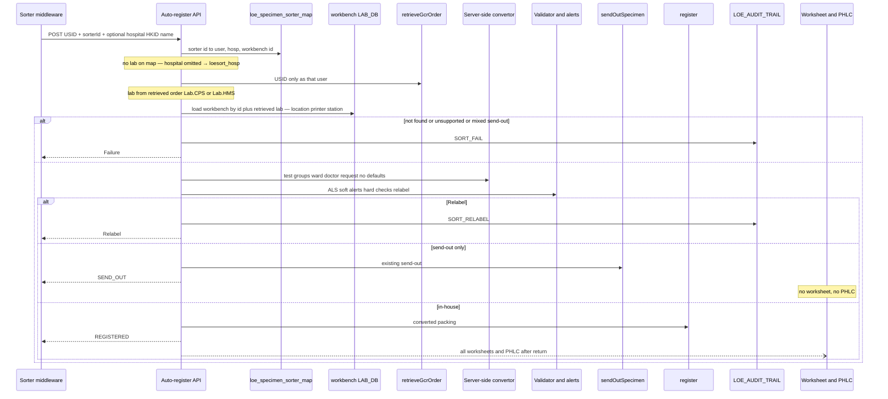
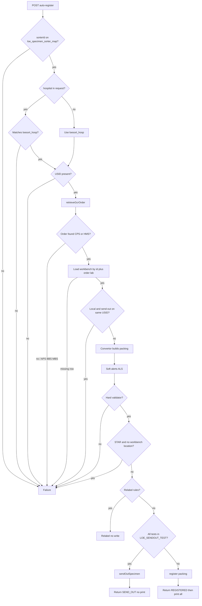

# 02 System Design — Specimen Sorter API

Traces to: [[01 Requirement Confirmation]] R1–R14.

**Review type:** incremental  
New endpoint and orchestrator on existing `lis-crs-spec-ack-svc`. Does not create a new service.

**Gate:** `requirement` was confirmed in writing but is not in `gates_passed`. Design proceeds under a recorded exception (requester invoked `/system-design`).

Design answers D1–D12 stand. 2026-09-10: Existing / Proposed restated as the Specimen Acknowledgement screen vs one new API. Map table name is `loe_specimen_sorter_map` (was `loe_sorter_map` on D7). Hospital is derived from that map when the request omits it.

2026-09-14: **No `loesort_labno`** on `loe_specimen_sorter_map`. One physical sorter can process more than one lab (R1). Lab allow-list stays on the retrieved order (`Lab.CPS` / `Lab.HMS`).

2026-09-21: Map PK is `loesort_sorter_id` (D14). No `loesort_key`. No `loesort_server_name`. `loesort_usercode` VARCHAR2(12) after `loesort_hosp`. `loesort_workbench_id` VARCHAR2(8).

2026-09-21: Sorter `data` includes `labCode` and `testCode` (R3, R8). Do not return `labNo`. Numeric lab stays internal (`Lab.CPS` = 1, `Lab.HMS` = 3 in `lis-common`).

Slides are not this note. After you confirm this delta, `/design-review-pptx` refreshes [[03 Slide Brief]].

## Context and problem

Traces to: R1, R8

Staff currently scan the specimen label and press buttons to perform send-out and registration on Specimen Acknowledgement. Labs will use a specimen sorter to scan the tube, sort it, and move it. Middleware calls a LIS API for the send-out and registration actions so the sorter can bin from the result.

Today those actions are a staff click path. Retrieve, validation, packing (test groups, request no., ward/doctor), worksheet conversion, and PHLC sit in the Flex / revamp **screen**. The service only runs the writes. Middleware cannot call `/gcrSpecAckRegister` without that packing.

## Existing design

Traces to: R2, R5, R6, R7, R11, R13, R14

`lis-crs-spec-ack-svc` port 8118. Staff Spec Ack root `/api/specack`. Sorter API root `/api/sorter`. Security starter commented out; isolation is NetworkPolicy. Dynamic DB routing uses `ServiceParameterVo`. Staff workbench is `LAB_DB.dbo.workbench` (PK `wkbh_id` + `wkbh_labno`). Login today: `WorkbenchEvent.selectWorkbench` by PC name / IP.

### Specimen Acknowledgement screen

| Action | Front-end | Back-end |
|---|---|---|
| **Retrieve GCRS order** | Screen scans / enters USID and calls retrieve | `GcrUIAppServiceImpl.retrieveGcrOrder`. GET `/retrieveGcrOrder` hard-codes user `ltc611` — sorter must not use that GET. Duplicate USID writes audit. |
| **Send-out** | Staff click; screen calls send-out | `sendOutSpecimen`: ack if Printed/Collected; tracking; action `SEND_OUT`. Send-out detection: join `loe_request_test.loereqtst_test_code` to `loe_sendout_test.loesend_cluster_code` + hosp, filter lab no. |
| **Registration — validation** | Flex `promptAlert` (soft) and `GcrSpecAckDataValidator` (hard) | Writes assume validation already passed. Soft: collection date, overnight, valid period, patient tag, duplicate, mixed local + send-out, and the rest of today's list. Hard: unmapped doctor/location/specialty/report dest/copy; datetime; missing test-dict. |
| **Registration — data conversion** | Flex `GcrSpecAckDataConvertor` | `register()` expects already-built `GcrSpecAckPackingVo`. Convertor: group tests and assign request no. (`convertRequestTestGroupDataFromGcrTest` / `ToParam`, `convertRequestNoDataToParam`); map ward and doctor setups (`convertWardDataToParam` / `convertDoctorDataToParam`); checkbox defaults (`convertUserInputDataToParam`). |
| **Registration — write** | Screen calls register | `register`. Relabel stays on the convertor / Assign USID path (multi-group, DFT time-flag, multi-specimen, suffix ≠ `0`, force relabel, user checkbox). |
| **Worksheet printing** | Convertor builds worksheet / send-out / SH Ro; staff pick when more than one | `CrsSpecAckController.gcrWorksheetPrinting`, `gcrShWorksheetPrinting`, `gcrSendOutWorksheetPrinting` → `WorksheetPrintService`. **Registration only** (D11). |
| **PHLC electronic order** | Screen calls PHLC after register | `LisPhlcLabOrderAppServiceImpl.createPhlcLabOrder`. **Registration only** (D11). |

Labs: CPS = 1, HMS = 3, APS = 5, BBS = 6, MBS = 7, VRS = 8. v1 sorter path is CPS / HMS only.

## Proposed change — overview

Traces to: R1–R14

One new POST on Spec Ack. Move the screen logics above onto that API. Staff click path stays.

1. **New API** — path, body, and response below.
2. **Move front-end logics to the API** — retrieve (as the mapped user), validation, packing convertor, then existing send-out / register / print / PHLC in-process.
3. **`LOE_AUDIT_TRAIL` insert** — `SORT_*` plus today's `REG` / `SEND_OUT` (D6).
4. **New table `loe_specimen_sorter_map`** — sorter id (PK) → LIS user + hospital + workbench. If the request has no hospital, take hospital from the map. Workstation and user come from the same row. **No lab column** (D12). **No surrogate key, no server name column** (D14).

No Hub JWT. Sorter **consumer** uses HA APIM (`x-gateway-apikey`), same pattern as GCRS-LIS API specification v1.0. See [[API Specification]].



## Component / class design

Traces to: R1, R4, R5, R6, R11, R14

| Piece | Role |
|---|---|
| `SpecimenSorterController` | `POST /api/sorter/auto-register`. Extends `AbstractService`. Does not call GET `/retrieveGcrOrder`. |
| `SpecimenSorterAutoRegisterService` | Orchestrator. Sets `ServiceParameterVo` from map user + `loesort_hosp`. Server name from existing `HospitalService` / `LisLabServer` (hospital + lab), not a map column (D14). After retrieve, set lab from the order (`hk.org.ha.lis.enums.Lab`). If request `hospital` is empty, use `loesort_hosp`. |
| `SpecimenSorterMapService` | `loe_specimen_sorter_map` keyed by `loesort_sorter_id` → user + hosp + workbench id. **No lab and no server name on the map.** Then `workbench` by `wkbh_id` + retrieved `wkbh_labno` for location, station name, default printer. Missing map or workbench row for that lab → Failure. |
| `SpecimenSorterPackingService` | Java port of `GcrSpecAckDataConvertor` (group tests, request no., ward/doctor, worksheet Ro). `convertUserInputDataToParam` becomes defaults: ack/register datetime = server now (R12); collection date from specimen; AAR off; urgent workstation off; label flags off; no user relabel checkbox. |
| `SpecimenSorterValidationService` | Port of `promptAlert` (ALS only) and `GcrSpecAckDataValidator`. Mixed local + send-out → **Failure**. STAR: no `wkbh_location` → Failure `4422`. |
| `SpecimenSorterRelabelService` | Assign-USID rules **without** `userCheckedRelabel`. |
| `SpecimenSorterSendOutResolver` | `LOE_SENDOUT_TEST` cluster join. Both send-out and in-house on the USID → Failure (D3). |
| `SpecimenSorterPostProcessService` | After HTTP return, **Registered only** (D11): same in-process path as the three staff print methods, every worksheet Ro (no picker), then PHLC via `LisPhlcLabOrderAppServiceImpl.createPhlcLabOrder` when `isSendToPHLC`. No HTTP loopback. Send-out / Relabel / Failure skip this. Print fail → ALS warn only (D4). |

Reuse: `retrieveGcrOrder`, `sendOutSpecimen`, `register`, `GcrPrintReportAppService`, `GcrShWorksheetPrintingAppService`, `GcrSendOutTestFormAppService`, `WorksheetPrintService`, `LisPhlcLabOrderAppServiceImpl.createPhlcLabOrder`, `GcrAuditService`.

DFT: Spec Ack `register()` packing. Do **not** call `/api/dftreg/register` (D8).

APS/BBS/MBS → Failure unsupported.

Do **not** compare workbench lab to the retrieved test lab (D10).

HKID/name: if supplied and mismatch GCRS patient → Failure.



## Data model

Traces to: R1, R9, R10, D2, D7, D12, D14

### New table — `loe_specimen_sorter_map` (Oracle / LOE)

Maps **sorter identifier → LIS user + hospital + workbench**. From that row the API derives:

- **Hospital** — if the request omits `hospital`, use `loesort_hosp`
- **User** — `loesort_usercode` (dedicated sorter LIS user, not `ltc611`; length 12)
- **Workstation** — `loesort_workbench_id` (length 8), then `workbench` loaded with the **retrieved** lab (`wkbh_id` + `wkbh_labno`) for station name / printer / STAR location

`loesort_sorter_id` is unique and is the **primary key**. There is no `loesort_key`.

There is **no `loesort_server_name`**. Staff retrieve today takes `serverName` as a query param; `HospitalService.resetServiceParameter` already fills `ServiceParameterVo.serverName` from `LisLabServer` given hospital + lab. Sorter path uses that mapping, not a column on this table (D14). Couples to D13: if retrieve needs a server before lab is known, resolve from hospital (and lab map) — do not put server name back on the sorter map.

There is **no `loesort_labno`**. A specimen sorter can process more than one lab; lab is not an attribute of the sorter (D12). v1 allow-list is still CPS / HMS on the **order**, via `hk.org.ha.lis.enums.Lab`.

Location, station name, and printer stay on `workbench`. Seed **one workbench row per lab** that the physical sorter will handle, same `wkbh_id` if the station is shared. Missing row for the retrieved lab → Failure (config), not a lab-mismatch check (D10).

Forward:

```sql
CREATE TABLE loe_specimen_sorter_map (
  loesort_sorter_id     VARCHAR2(64)  NOT NULL,
  loesort_hosp          VARCHAR2(8)   NOT NULL,
  loesort_usercode      VARCHAR2(12)  NOT NULL,
  loesort_workbench_id  VARCHAR2(8)   NOT NULL,
  created_at            TIMESTAMP,
  updated_at            TIMESTAMP,
  CONSTRAINT pk_loe_specimen_sorter_map PRIMARY KEY (loesort_sorter_id)
);
```

Rollback:

```sql
DROP TABLE loe_specimen_sorter_map;
```

No DDL on `workbench`. Seed a workbench row per lab the sorter will process (same station/printer if they share a machine) plus one LIS user account.

### `LOE_AUDIT_TRAIL` — no DDL

| Action | When |
|---|---|
| `SORT_REG` | Registered from sorter (plus existing `REG`) |
| `SORT_SO` | Send-out from sorter (plus `SEND_OUT`) |
| `SORT_RELABEL` | Relabel |
| `SORT_FAIL` | Failure; description = message code + text |

Function `SPEC_ACK`. Add `SORT_*` to the Specimen Audit Trail action filter (D6).

## Interface / API contract

Consumer spec: [[API Specification]] · OpenAPI [[assets/specimen-sorter-auto-register.openapi.yaml]]

Traces to: R1, R3, R8, R10

### Path

`POST /api/sorter/auto-register`

Consumer: HA APIM with `x-gateway-apikey` and `x-ha-hospcode` (D1). Internal service has no Hub JWT.

### Request body

```json
{
  "usid": "QECAA0032R",
  "sorterId": "QEH-SORTER-01",
  "hospital": "QEH",
  "hkid": null,
  "patientName": null
}
```

| Field                 | Required | Rule                                                                                                                                                                                                          |
| --------------------- | -------- | ------------------------------------------------------------------------------------------------------------------------------------------------------------------------------------------------------------- |
| `usid`                | Yes      | Else Failure, no write.                                                                                                                                                                                       |
| `sorterId`            | Yes      | Lookup `loe_specimen_sorter_map` by `loesort_sorter_id`. Unknown → Failure. Derives user, hosp, workbench id. Lab from the retrieved order. Server name from `HospitalService` / `LisLabServer`, not the map. |
| `hospital`            | No       | If omitted, derive from map / workbench. If sent, must match `loesort_hosp` / `wkbh_hosp` or Failure.                                                                                                         |
| `hkid`, `patientName` | No       | Present + mismatch → Failure.                                                                                                                                                                                 |

### Response

HTTP 200 with `data.status` `REGISTERED` / `SEND_OUT` / `RELABEL` / `FAILURE`. Transport errors 500. Soft alerts never in the body.

Envelope is existing `ResultDataResponse`. Middleware bins on `data.status`, not HTTP 200.

```json
{
  "status": "REGISTERED",
  "code": null,
  "message": null,
  "usid": "QECAA0032R",
  "hospital": "QEH",
  "labCode": "CPS",
  "testCode": "LFT"
}
```

| Field | When | Rule |
|---|---|---|
| `status` | Always on HTTP 200 with `data` | Sorter bin (R3, R8). |
| `code`, `message` | Failure (and Relabel when a message id applies) | Spec Ack / sorter-internal code + text. Null on success. |
| `usid`, `hospital` | When known | Echo / retrieved performing hospital. |
| `labCode` | When the GCRS order is retrieved | `Lab.getCode()` — `CPS` or `HMS` (R3, R8). Not `Lab.getShortForm()` (`CHEM` / `HAET`). Not integer `labNo`. |
| `testCode` | When a GCRS test / cluster code is known | GCRS test code; send-out uses the cluster code matched on `LOE_SENDOUT_TEST` (R7, R8). Relabel after retrieve still returns both when known. Early Failure (missing USID, unknown sorter) may omit them. |

Do not put `labNo` on this payload. Allow-list and workbench lookup still use `Lab.getLabNo()` inside the service.

## Configuration

| Key | DEVQA | SIT | PROD | Type |
|---|---|---|---|
| `loe_specimen_sorter_map` rows | test sorter ids | SIT ids | real sorter ids | Oracle data |
| `workbench` row per lab the sorter handles (`wkbh_id` + `wkbh_labno`, hosp, station_name, location, default_printer) | seed | seed | real | `LAB_DB` data |
| LIS user account for sorter | non-prod user | SIT user | prod user | LIS user admin, not ConfigMap |
| NetworkPolicy APIM → 8118 | DEV | SIT | PROD | OpenShift |
| `x-gateway-apikey` | local unused | SIT APIM key | prod APIM key | APIM secret, not ConfigMap |

Print/PHLC still follow the staff print methods and `LisPhlcLabOrderAppServiceImpl.createPhlcLabOrder`. `httpClient.readTimeOut` 5 s; sorter p95 4 s excluding print.

## Error handling, logging, audit

- Soft alerts: `warn("SPEC_ACK", …)` only.
- Mixed send-out, STAR no location, hard validator, convertor cannot map ward/doctor: `SORT_FAIL` + message code (`0001162` … `4422`).
- Print/PHLC after **Registered** only (D11): ALS warn; status already returned stays (D4).
- Mask HKID in logs as register already does.
- Audit user = map `loesort_usercode`; workstation = `wkbh_station_name`.

## Non-functional

- Sync one call; p95 < 4 s through audit commit.
- ~20/min per lab v1.
- Worksheets + PHLC after return, **Registered only** (D11); print all (D4, D5).

## Rejected alternatives

| Alternative | Why rejected |
|---|---|
| Middleware retrieve then register | Packing still in the caller; convertor would not move. |
| Overload `/gcrSpecAckRegister` | Staff packing contract. |
| Overload ECPath5 register | Different caller; hard-coded user. |
| Skip convertor, only validator | `register()` will not get test groups / USID request no. / mapped locations. |
| `LOE_CONTROL` instead of map table | Requester chose a sorter map table (D7). |
| Keep table name `loe_sorter_map` | Requester 2026-09-10: `loe_specimen_sorter_map`. |
| Duplicate hosp/printer on the map only | Workbench already holds them; map points at workbench (D2). |
| Require hospital on every request | Requirement: derive from sorter id when omitted. |
| Hub JWT as sorter credential | APIM `x-gateway-apikey` instead (D1, GCRS-LIS pattern). |
| Staff worksheet picker | Print all (D5). |
| Sync print in the HTTP call | Breaks 4 s; late worksheet accepted on Registered (D4). |
| Print worksheet after send-out / ack | Registration only (D11). |
| Invent STAR location when workbench has none | Failure (D9). |
| Mixed: send-out subset only | Failure (D3). |
| Fail when workbench lab ≠ test lab | Requester: no check (D10). |
| `loesort_labno` on the map (one lab per sorter id) | Requester 2026-09-14: one sorter processes more than one lab (D12). |
| Surrogate `loesort_key` as PK | Requester 2026-09-21: `loesort_sorter_id` is unique; it is the PK (D14). |
| `loesort_server_name` on the map | Requester 2026-09-21: not needed. Open `LAB_DB` via existing hospital/lab → `LisLabServer` (`HospitalService.resetServiceParameter`) (D14). |
| Return `labNo` on the sorter `data` payload | Requester 2026-09-21: routing is `labCode` + `testCode` (R3, R8). Numeric lab is internal only. |

## Promotion impact and fallback

**Promotion**

1. Create sorter LIS user.
2. Seed `workbench` for each lab the physical sorter will process (hosp, station name, location, printer; same `wkbh_id` if shared).
3. `loe_specimen_sorter_map` row: sorter id (PK), hosp, user (12), workbench id (8) — **no lab, no server name**.
4. Deploy `lis-crs-spec-ack-svc`.
5. NetworkPolicy for middleware (no new auth).
6. Pilot CPS/HMS. Relabel/Failure bins → staff Spec Ack. Confirm Specimen Audit Trail action filter includes `SORT_*` (D6).

**Fallback**

1. Stop middleware. Staff Spec Ack unchanged.
2. `DROP TABLE loe_specimen_sorter_map` if full rollback; leave workbench/user or inactivate.
3. No conversion of historical requests.

## Open design questions

| #   | Question                                                                               | Owner     | Answer                                                                                                                                                                                                                                                          |
| --- | -------------------------------------------------------------------------------------- | --------- | --------------------------------------------------------------------------------------------------------------------------------------------------------------------------------------------------------------------------------------------------------------- |
| D1  | Middleware auth?                                                                       | Requester | **2026-09-15:** sorter calls **HA APIM**. Headers `x-gateway-apikey` + `x-ha-hospcode` (GCRS-LIS v1.0). No Hub JWT. NetworkPolicy is gateway → `lis-crs-spec-ack-svc`. Direct 8118 is local/DEVQA only.                                                         |
| D2  | LIS user and workstation?                                                              | Requester | **Dedicated sorter User.** Sorter identifier maps to **workbench**. Station name / printer / location from that row.                                                                                                                                            |
| D3  | Mixed local + send-out?                                                                | Requester | **Failure.**                                                                                                                                                                                                                                                    |
| D4  | Print after HTTP return?                                                               | Requester | **OK** if worksheet is late; status already Registered. Does not apply to Send-out (no print).                                                                                                                                                                  |
| D5  | Multiple worksheets?                                                                   | Requester | **Print all** (registration path only).                                                                                                                                                                                                                         |
| D11 | When does the sorter print a worksheet?                                                | Requester | **Registration only.**                                                                                                                                                                                                                                          |
| D6  | `SORT_*` audit codes vs reuse `REG`/`SEND_OUT` only?                                   | Requester | **Agree.** Keep `SORT_*` plus existing writes. Add `SORT_*` to the Audit Trail action filter.                                                                                                                                                                   |
| D7  | Map table name and vs `LOE_CONTROL`?                                                   | Requester | **Sorter map table** `loe_specimen_sorter_map` (2026-09-10; was `loe_sorter_map`).                                                                                                                                                                              |
| D8  | DFT via Spec Ack `register()` vs `/api/dftreg`?                                        | Requester | **Agree.** Same Spec Ack `register()` packing.                                                                                                                                                                                                                  |
| D9  | STAR with no workbench location?                                                       | Requester | **Failure** (`4422`).                                                                                                                                                                                                                                           |
| D10 | Map / workbench lab vs order test lab?                                                 | Requester | **No check.** Do not fail because they differ.                                                                                                                                                                                                                  |
| D12 | Lab column on `loe_specimen_sorter_map`?                                               | Requester | **No `loesort_labno`.** Sorter can process more than one lab. Lab from retrieved order (`Lab.CPS` / `Lab.HMS`). Workbench loaded by map `wkbh_id` + order lab.                                                                                                  |
| D13 | Does in-process `retrieveGcrOrder` need `ServiceParameter` lab before the USID lookup? | Implement | **Open.** Staff GET always sends lab from the screen. Confirm on `GcrUIAppServiceImpl.retrieveGcrOrder`. If lab is required first, hosp alone may not be enough to pick a `LisLabServer` row — do not put lab or server name on the map to solve it (D12, D14). |
| D14 | Map PK, server column, usercode / workbench lengths?                                   | Requester | **2026-09-21:** no `loesort_key` — PK is `loesort_sorter_id`. No `loesort_server_name`. `loesort_usercode` VARCHAR2(12) after `loesort_hosp`. `loesort_workbench_id` VARCHAR2(8).                                                                               |
