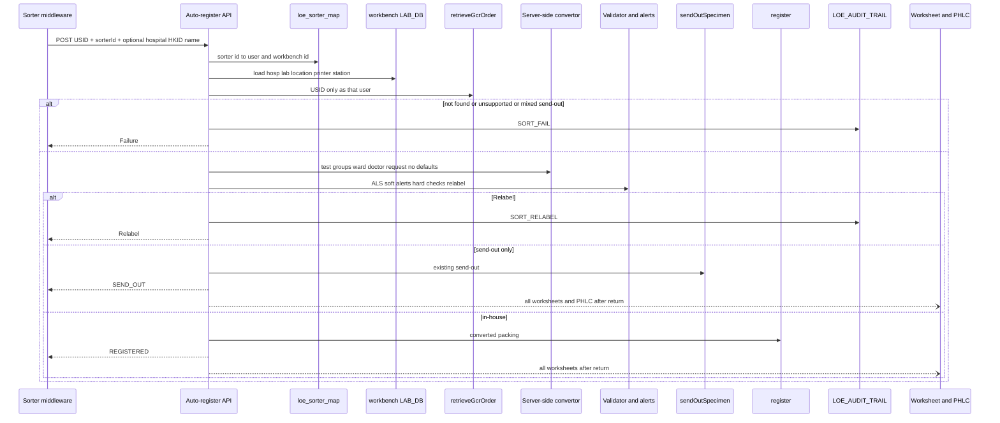
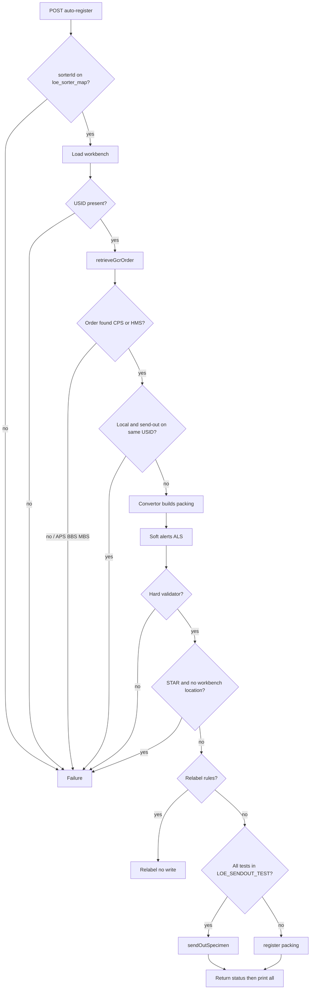

# 02 System Design — Specimen Sorter API

Traces to: [[01 Requirement Confirmation]] R1–R14.

**Review type:** incremental  
New endpoint and orchestrator on existing `lis-crs-spec-ack-svc`. Does not create a new service.

**Gate:** `requirement` was confirmed in writing but is not in `gates_passed`. Design proceeds under a recorded exception (requester invoked `/system-design`).

Design answers recorded 2026-09-07 (second pass): D1–D7, D9. Packing convertor moved server-side.

## Context and problem

Traces to: R1, R8, Q17 volume/latency

Staff on Specimen Acknowledgement scan a USID and click Send-out or Register. The sorter must do that in one LIS call and bin the tube within about four seconds.

Today the click path is split three ways, not two:

- Order lookup and register/send-out **writes** are in `lis-crs-spec-ack-svc`.
- Soft alerts and hard validations sit in the Flex (and revamp) **screen**.
- **Packing convertor** in Flex `GcrSpecAckDataConvertor` builds the `GcrSpecAckPackingVo` Java `register()` expects: test groups, USID as request no., ward/doctor mapping, user-input defaults, worksheet/send-out form Ro.

Middleware cannot call `/gcrSpecAckRegister` without that packing. The orchestrator must port convertor + validator + alerts, not only the write APIs.

## Existing design

Traces to: R2, R5, R6, R7, R11, R13, R14

`lis-crs-spec-ack-svc` port 8118, root `/api/specack`. Security starter commented out; isolation is NetworkPolicy. **v1 sorter API stays the same: no application authentication (D1).** Dynamic DB routing uses `ServiceParameterVo`.

Staff workbench is `LAB_DB.dbo.workbench` (PK `wkbh_id` + `wkbh_labno`). Columns used here: `wkbh_hosp`, `wkbh_location`, `wkbh_station_name`, `wkbh_default_printer`, `wkbh_wf1`–`wf12`. Login today: `WorkbenchEvent.selectWorkbench` by PC name / IP. Print queue for send-out form is keyed by **workbench id**.

| Step | Who owns it today | What it does |
|---|---|---|
| Retrieve | `GcrUIAppServiceImpl.retrieveGcrOrder` | USID → specimen → order. Duplicate USID writes audit. GET `/retrieveGcrOrder` hard-codes user `ltc611` — sorter must not use that GET. |
| Soft alerts | Flex `promptAlert` | Collection date, overnight, valid period, validity, patient tag, duplicate, ward-printed request-no, DFT, USID, private patient, not unboxed, **mixed local + send-out**. |
| Hard checks | Flex `GcrSpecAckDataValidator` | Unmapped doctor/location/specialty/report dest/copy; datetime; missing test-dict. |
| Packing | Flex `GcrSpecAckDataConvertor` | `convertRequestTestGroupDataFromGcrTest` / `convertRequestTestGroupDataToParam` group tests for the current specimen and assign USID; `convertWardDataToParam` / `convertDoctorDataToParam` map office dictionary; `convertRequestNoDataToParam`; `convertUserInputDataToParam` reads screen checkboxes; `convertToWorksheetRo` / `convertToSendOutTestFormRo` / `convertToShWorksheetRo` for print. |
| Relabel | Same convertor, Assign USID | Multi-group; DFT same time-flag; multi-specimen; suffix ≠ `0`; force relabel; **user checkbox** (API will not have it). |
| Send-out write | `sendOutSpecimen` | Ack if Printed/Collected; tracking; action `SEND_OUT`. |
| Register write | `register` | Assumes packing already converted. |
| Worksheets / PHLC | Flex `printWorksheet` + `/workSheet` / `/createPhlcLabOrder` | Staff picker when more than one worksheet. |

Send-out **detection**: join `loe_request_test.loereqtst_test_code` to `loe_sendout_test.loesend_cluster_code` + hosp, filter lab no.

Labs: CPS = 1, HMS = 3, APS = 5, BBS = 6, MBS = 7, VRS = 8.

## Proposed change — overview

Traces to: R1–R14

One new POST. Orchestrator, in-process:

1. Resolve **sorter user** and **workbench** from `loe_sorter_map` (sorter id → LIS user + `workbench` row). Hospital/lab/printer/location come from that workbench (D2, D7).
2. Retrieve by USID only.
3. Port Flex convertor **and** validator **and** alerts on the server; build packing (no screen).
4. Mixed local + send-out → **Failure** (D3).
5. Relabel / send-out / register using existing app services.
6. Return status; **then** print **all** worksheets and PHLC. Late print does not change status (D4, D5).
7. STAR with no workbench location → **Failure** `4422` (D9).

No Hub JWT. No API key in v1 (D1). Staff APIs unchanged.



## Component / class design

Traces to: R1, R4, R5, R6, R11, R14

| Piece | Role |
|---|---|
| `SpecimenSorterController` | `POST /api/specack/sorter/auto-register`. Extends `AbstractService`. Does not call GET `/retrieveGcrOrder`. |
| `SpecimenSorterAutoRegisterService` | Orchestrator. Sets `ServiceParameterVo` from map user + workbench hospital/lab/`serverName`. |
| `SpecimenSorterMapService` | `loe_sorter_map` → user + workbench id/lab. Then `workbench` for hosp, location, station name, default printer. Missing map or workbench → Failure. |
| `SpecimenSorterPackingService` | **Java port of `GcrSpecAckDataConvertor`.** Must include: `convertRequestTestGroupDataFromGcrTest`, `convertRequestTestGroupDataToParam`, `convertRequestNoDataToParam`, `convertWardDataToParam`, `convertDoctorDataToParam`, worksheet/send-out/SH Ro builders. `convertUserInputDataToParam` becomes **defaults**, not screen: ack/register datetime = server now (R12); collection date from specimen (do not invent); AAR off; urgent workstation off; label flags off; no user relabel checkbox. |
| `SpecimenSorterValidationService` | Port of `promptAlert` (ALS only) and `GcrSpecAckDataValidator`. Mixed local + send-out → **Failure** (not ALS). STAR: no `wkbh_location` on mapped workbench → Failure `4422`. |
| `SpecimenSorterRelabelService` | Assign-USID rules from the convertor **without** `userCheckedRelabel`. |
| `SpecimenSorterSendOutResolver` | `LOE_SENDOUT_TEST` cluster join. If **both** send-out and in-house tests on the USID → Failure (D3). |
| `SpecimenSorterPostProcessService` | After HTTP return: print **every** worksheet Ro the convertor produced (no picker); PHLC when send-out form Ro exists and lab option is on. Failure to print → ALS warn only (D4). |

Reuse: `retrieveGcrOrder`, `sendOutSpecimen`, `register`, print/PHLC app services, `GcrAuditService`.

DFT: same `register()` packing if USID retrieve returns DFT specimens (D8 still the implementer check).

APS/BBS/MBS → Failure unsupported. Do not run APS/BBS convertor branches.

HKID/name: if supplied and mismatch GCRS patient → Failure.



## Data model

Traces to: R9, R10, D2, D7

### New table — `loe_sorter_map` (Oracle / LOE)

Maps **sorter identifier → LIS user + workbench**. Hospital, lab, location, station name, and printer are **not** copied here; they are read from existing `workbench` (`LAB_DB`) after the map hit.

Forward:

```sql
CREATE TABLE loe_sorter_map (
  loesort_key           NUMBER        NOT NULL,
  loesort_sorter_id     VARCHAR2(64)  NOT NULL,
  loesort_usercode      VARCHAR2(32)  NOT NULL,
  loesort_hosp          VARCHAR2(8)   NOT NULL,
  loesort_labno         NUMBER        NOT NULL,
  loesort_server_name   VARCHAR2(64)  NOT NULL,
  loesort_workbench_id  VARCHAR2(16)  NOT NULL,
  created_at            TIMESTAMP,
  updated_at            TIMESTAMP,
  CONSTRAINT pk_loe_sorter_map PRIMARY KEY (loesort_key)
);

CREATE UNIQUE INDEX uk_loe_sorter_map_id ON loe_sorter_map (loesort_sorter_id);
```

- `loesort_usercode` — dedicated specimen-sorter LIS user (not `ltc611`). Appears on `LOE_AUDIT_TRAIL.loeaud_usercode` (D2).
- `loesort_workbench_id` + `loesort_labno` — `workbench` PK (`wkbh_id`, `wkbh_labno`). Audit workstation = `wkbh_station_name`. Print queue = `wkbh_default_printer` (and send-out queue keyed by workbench id, same as Spec Ack). STAR location = `wkbh_location` (null/0 → Failure `4422`).
- `loesort_hosp` / `loesort_server_name` — needed to open `LAB_DB` before the workbench row can be read.

`loesort_labno` is 1 or 3 in v1. If retrieved tests belong to the other v1 lab → Failure (D10, still proposed).

Rollback:

```sql
DROP TABLE loe_sorter_map;
```

No DDL on `workbench`. Seed a workbench row per physical sorter (station name = sorter identity as used on the floor) plus one LIS user account.

### `LOE_AUDIT_TRAIL` — no DDL

| Action | When |
|---|---|
| `SORT_REG` | Registered from sorter (plus existing `REG`) |
| `SORT_SO` | Send-out from sorter (plus `SEND_OUT`) |
| `SORT_RELABEL` | Relabel |
| `SORT_FAIL` | Failure; description = message code + text |

Function `SPEC_ACK`. D6 (whether Audit Trail dropdown needs a setup row for `SORT_*`) remains for SM/implementer.

## Interface / API contract

Traces to: R1, R8, R10

`POST /api/specack/sorter/auto-register`

```json
{
  "usid": "QHSP2500000012",
  "sorterId": "KTH-SORTER-01",
  "hospital": "QEH",
  "hkid": null,
  "patientName": null
}
```

| Field | Required | Rule |
|---|---|---|
| `usid` | Yes | Else Failure, no write. |
| `sorterId` | Yes | Lookup map + workbench. Unknown → Failure. |
| `hospital` | No if map has hosp | If sent, must match `loesort_hosp` / `wkbh_hosp` or Failure. |
| `hkid`, `patientName` | No | Present + mismatch → Failure. |

No auth header in v1 (D1).

Response status: `REGISTERED` / `SEND_OUT` / `RELABEL` / `FAILURE` (HTTP 200 for those). Transport errors 500. Soft alerts never in the body.

## Configuration

| Key | DEVQA | SIT | PROD | Type |
|---|---|---|---|
| `loe_sorter_map` rows | test sorter ids | SIT ids | real sorter ids | Oracle data |
| `workbench` row per sorter (`wkbh_id`, lab, hosp, station_name, location, default_printer) | seed | seed | real | `LAB_DB` data |
| LIS user account for sorter | non-prod user | SIT user | prod user | LIS user admin, not ConfigMap |
| NetworkPolicy middleware → 8118 | DEV | SIT | PROD | OpenShift |
| API key | **not used v1** | — | — | D1 |

Print/PHLC still follow existing lab options (`CREATE_PHLC_LAB_ORDER_REG`, worksheet setup). `httpClient.readTimeOut` 5 s; sorter p95 4 s excluding print.

## Error handling, logging, audit

- Soft alerts: `warn("SPEC_ACK", …)` only.
- Mixed send-out, STAR no location, hard validator, convertor cannot map ward/doctor: `SORT_FAIL` + message code (`0001162` … `4422`).
- Print/PHLC after success: ALS warn; status already returned stays (D4).
- Mask HKID in logs as register already does.
- Audit user = map `loesort_usercode`; workstation = `wkbh_station_name`.

## Non-functional

- Sync one call; p95 < 4 s through audit commit.
- ~20/min per lab v1.
- Worksheets + PHLC after return; print all (D4, D5).

## Rejected alternatives

| Alternative | Why rejected |
|---|---|
| Middleware retrieve then register | Packing still in the caller; convertor would not move. |
| Overload `/gcrSpecAckRegister` | Staff packing contract. |
| Overload ECPath5 register | Different caller; hard-coded user. |
| Skip convertor, only validator | `register()` will not get test groups / USID request no. / mapped locations. |
| `LOE_CONTROL` instead of map table | Requester chose sorter map table (D7). |
| Duplicate hosp/printer on the map only | Workbench already holds them; map points at workbench (D2). |
| API key / Hub JWT in v1 | No authentication currently (D1). |
| Staff worksheet picker | Print all (D5). |
| Sync print in the HTTP call | Breaks 4 s; late worksheet accepted (D4). |
| Invent STAR location when workbench has none | Failure (D9). |
| Mixed: send-out subset only | Failure (D3). |

## Promotion impact and fallback

**Promotion**

1. Create sorter LIS user.
2. Seed `workbench` for the physical sorter (lab, hosp, station name, location, printer).
3. `loe_sorter_map` row: sorter id, user, workbench id, lab, hosp, server name.
4. Deploy `lis-crs-spec-ack-svc`.
5. NetworkPolicy for middleware (no new auth).
6. Pilot CPS/HMS. Relabel/Failure bins → staff Spec Ack.

**Fallback**

1. Stop middleware. Staff Spec Ack unchanged.
2. `DROP TABLE loe_sorter_map` if full rollback; leave workbench/user or inactivate.
3. No conversion of historical requests.

## Open design questions

| # | Question | Owner | Answer |
|---|---|---|---|
| D1 | Middleware auth? | Requester | **No authentication currently.** NetworkPolicy only. No API key / JWT in v1. |
| D2 | LIS user and workstation? | Requester | **Dedicated sorter User.** Sorter identifier maps to **workbench** (`wkbh_id` + lab). Station name / printer / location from that row. |
| D3 | Mixed local + send-out? | Requester | **Failure.** |
| D4 | Print after HTTP return? | Requester | **OK** if worksheet is late; status already Registered/Send-out. |
| D5 | Multiple worksheets? | Requester | **Print all.** |
| D6 | `SORT_*` audit codes vs reuse `REG`/`SEND_OUT` only? Audit Trail dropdown setup? | Implementer / SM | Proposed: keep `SORT_*` plus existing writes. |
| D7 | Map table vs `LOE_CONTROL`? | Requester | **Sorter map table** `loe_sorter_map`. |
| D8 | DFT via Spec Ack `register()` vs `/api/dftreg`? | Implementer | Proposed: same `register()` if USID retrieve returns DFT specimens. |
| D9 | STAR with no workbench location? | Requester | **Failure** (`4422`). |
| D10 | Map lab vs order’s other v1 lab? | Requester | Proposed **Failure** (unchanged). |

## Design

**Review type:** incremental
**JIRA key:** (not assigned)
**Service:** lis-crs-spec-ack-svc
**Review forum:** CP3
**Review date:**
**Prior review:** none

### Agenda
Background
Existing Design
Proposed Change
Promotion
Fallback
Open Questions
Q&A

### Slide: Background
Staff scan a USID and click Send-out or Register. The sorter needs one LIS call, then a bin.
Writes already exist in the Specimen Acknowledgement service.
The screen still owns alerts, hard checks, **and the packing convertor** that builds test groups, request number, and ward mapping.
Without that convertor on the server, the staff register API cannot be reused.

### Slide: Existing Design - three layers
**Archetype:** compare
Screen: alerts, validator, `GcrSpecAckDataConvertor` (test groups, USID as request no., ward/doctor, worksheet Ro).
Service: retrieve, send-out, register, print, PHLC.
Workbench in the lab database already has hospital, lab, station name, location, and printer. Login today binds a PC to that row.

### Slide: Proposed Change - Overview
**Archetype:** decision-flow
1. New POST. Sorter id → map table → dedicated user + workbench row.
2. Server-side convertor ports the Flex packing methods, with screen checkboxes replaced by defaults.
3. Mixed local and send-out is Failure. STAR with no workbench location is Failure.
4. Print every worksheet after the status is returned. Late print is allowed.
5. No new authentication in v1.

### Slide: Proposed Change - packing convertor
**Archetype:** code-findings
Port grouping from GCRS tests, request-no assignment, ward and doctor mapping, and worksheet/send-out form builders.
Do not port checkbox reading. Ack time is server now. Labels stay off. Relabel checkbox is ignored.

### Slide: Proposed Change - outcomes
**Archetype:** matrix
Registered — converted packing, request no. = USID when eligible.
Send-out — only when every test on the USID is a send-out cluster code.
Relabel — multi-group, multi-specimen, suffix, DFT time-flag, force relabel.
Failure — not found, mixed tests, hard check, APS/BBS/MBS, STAR with no location, unknown sorter id.

### Slide: Promotion
**Archetype:** cards
Create sorter LIS user and workbench row.
Insert sorter map row.
Deploy Specimen Acknowledgement service.
NetworkPolicy only.

### Slide: Fallback
**Archetype:** cards
Stop middleware. Staff screen unchanged.
Drop the map table. Leave or disable the workbench/user.

### Slide: Open Questions
**Archetype:** asks
1. Confirm Audit Trail should list new sorter actions (`SORT_REG` / `SORT_FAIL` / …) in the action filter.
2. If retrieved tests are HMS while the sorter workbench is CPS, confirm Failure.
3. Confirm DFT uses the same register packing as ordinary Spec Ack.

### Slide: Q&A
