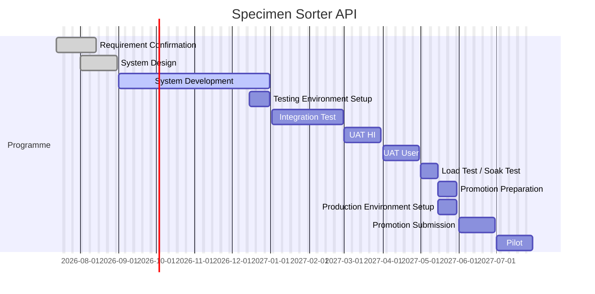

# 05 Project Plan — Specimen Sorter API

Schedules backwards from **Promotion submission** (Jun 2027). Programme dates are the attached 12-row schedule. Re-run when a gate slips.

Estimates are a draft. A person must accept them before the `plan` gate can close.

## Constraints

| Item | Value |
|---|---|
| Target completion | 30 May 2027 (dossier / JIRA log — Promotion Preparation end) |
| Promotion window | **Not named.** [[Promotion Windows]] ends at **2026-24** (submission 31 Dec 2026, pilot 21 Jan 2027). Jun 2027 submission and Jul 2027 pilot are **after** the published calendar. |
| Submission date | 01 Jun 2027 – 30 Jun 2027 (programme row 11) |
| Pilot date | 01 Jul 2027 – 30 Jul 2027 (programme row 12) |
| Cut-off | Not on the 2027 calendar. Nearest analogue on the programme: Promotion Preparation / Production Environment Setup **15–30 May 2027** |
| CP3 | Not held. `design-review` exception 2026-09-10. Not a row on the programme table. |

## Work packages

From [[02 System Design]]. Sizes are working days (weekends excluded). They sit inside System Development (01 Sep 2026 – 31 Dec 2026).

| ID | Package | From design | Size | Days | Owner |
|---|---|---|---|---|---|
| WP1 | New auto-register POST and orchestrator | `POST /api/specack/sorter/auto-register` on `lis-crs-spec-ack-svc` | XL | 10 | LIS Product Team |
| WP2 | Map table and lookup | `loe_specimen_sorter_map` DDL + rollback; sorter id → user and workbench | M | 3 | LIS Product Team, Vendor |
| WP3 | Move packing to the API | Group tests, request no., ward/doctor convert (today on the screen) | XL | 10 | LIS Product Team |
| WP4 | Checks, relabel, send-out | Hard/soft checks; Relabel; `LOE_SENDOUT_TEST`; mixed → Failure | XL | 10 | LIS Product Team |
| WP5 | Worksheet and PHLC after Registered | Same print and PHLC as Spec Ack, after HTTP return | L | 5 | LIS Product Team |
| WP6 | Audit trail | `LOE_AUDIT_TRAIL` `SORT_*` plus `REG` / `SEND_OUT`; Audit Trail filter in `lab-crs-app` | M | 3 | LIS Product Team |
| WP7 | Seed and path | Sorter LIS user, `workbench` row, map row, NetworkPolicy to port 8118 | M | 3 | Vendor, Local IT |
| WP8 | Latency and volume | p95 &lt; 4 s; ~20 specimens/min per lab (CPS / HMS) | L | 5 | LIS Product Team, Vendor |

Sequential product build (WP1–WP6) is **41 working days**. The development window still has about **81 weekdays** from 10 Sep 2026 to 31 Dec 2026, so package slack is positive if WP2 lands first and WP3–WP5 overlap after the POST skeleton exists.

## Gantt

## Milestones

| Stage | Start | End | Owner | Gate | Slack |
|---|---|---|---|---|---|
| Requirement Confirmation | 13 Jul 2026 | 14 Aug 2026 | LIS Product Team, LIS Support Team, HI | requirement (exception 2026-09-07) | Closed late vs 14 Aug; 01 confirmed 07 Sep |
| System Design | 01 Aug 2026 | 31 Aug 2026 | LIS Support Team, Vendor | design (pass 2026-09-10) | **~7 working days late** (closed 10 Sep) |
| System Development | 01 Sep 2026 | 31 Dec 2026 | LIS Product Team, Vendor | implement | Positive vs 41d packages; **JIRA key still missing** |
| Testing Environment Setup | 15 Dec 2026 | 31 Dec 2026 | Vendor, Local IT | — | Overlaps last two weeks of development |
| Integration Test | 02 Jan 2027 | 28 Feb 2027 | LIS Product Team, Vendor | sit | — |
| UAT (HI) | 01 Mar 2027 | 30 Mar 2027 | HI | uat | Other-team |
| UAT (User) | 01 Apr 2027 | 30 Apr 2027 | User | uat | Other-team |
| Load Test / Soak Test | 01 May 2027 | 15 May 2027 | LIS Product Team, Vendor | load | 01 May 2027 is Saturday; first weekday is 03 May |
| Promotion Preparation | 15 May 2027 | 30 May 2027 | LIS Product Team | promotion-prep | Aligns with dossier target 30 May 2027 |
| Production Environment Setup | 15 May 2027 | 30 May 2027 | Vendor, Local IT | — | Parallel with prep |
| Promotion Submission | 01 Jun 2027 | 30 Jun 2027 | LIS Product Team | promotion-submit | **After** dossier target. Window **not** in [[Promotion Windows]] |
| Pilot | 01 Jul 2027 | 30 Jul 2027 | LIS Product Team, LIS Support Team, Vendor, User | pilot | Cadence in 2026 is ~3 weeks after submit; this gap is about 0–4 weeks depending on submit day |

## Dependencies

| Dependency | Owner | Needed by |
|---|---|---|
| Change Request key (MCP create failed; create by hand) | LIS Product Team | Before SIT evidence is filed against a ticket |
| Oracle DDL for `loe_specimen_sorter_map` | Vendor | WP2 / SIT seed |
| Sorter LIS user + `workbench` row | Vendor, Local IT | WP7, Testing Environment Setup |
| NetworkPolicy middleware → `lis-crs-spec-ack-svc` :8118 | Local IT / Vendor | Testing Environment Setup, Production Environment Setup |
| Sorter middleware pointed at SIT | Vendor | Integration Test |
| HI UAT | HI | 01 Mar 2027 |
| User UAT | User | 01 Apr 2027 |
| 2027 promotion window number | LIS Product Team | Promotion Preparation |

## Risk to schedule

| Risk | Effect | Mitigation |
|---|---|---|
| No JIRA key while development is already in the 01 Sep window | Work cannot be booked to a CR; SIT evidence has no ticket | Create the Change Request by hand (MCP 504). Exception recorded for running this plan without `jira` in `gates_passed`. |
| [[Promotion Windows]] has no 2027 row | Jun submit / Jul pilot cannot be named 2027-nn | Flag as missing. Do not invent a window number. Refresh this note when the 2027 sheet is published. |
| Dossier target 30 May 2027 is prep, not submission | Target is **before** programme submission (Jun) | Treat 30 May as freeze / prep complete. Submission stays Jun 2027 unless the target is moved. |
| Design closed 10 Sep vs plan 31 Aug | **~7 working days** already consumed from the development window | Accept the slip. Remaining 81 weekdays still cover 41d of product packages. |
| CP3 not held | Design-review is an exception, not a pass | Actions from a later CP3 can change WP3–WP5. Re-run this plan if they do. |
| Load test starts 01 May 2027 (Saturday) | First working day is 03 May; 15 May is also Saturday | Ten weekdays 03–14 May. Tight against prep start 15 May (Saturday) / 17 May weekday. |
| HI and User UAT are other-team | Mar/Apr 2027 slip pushes load, prep, and submit | Named owners. No LIS-only catch-up inside those months. |

Negative slack that is **accepted on this draft**: design slip (~7d, already in the past); unnamed 2027 promotion window; JIRA key missing. Package effort vs the Sep–Dec window is **not** negative.
