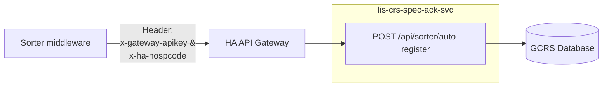

# API Specification — Specimen Sorter Auto-register

## Access — API gateway

Sorter middleware does **not** call `lis-crs-spec-ack-svc` on the OpenShift route. It calls **HA API Management (APIM)**.

1. Register the consumer: [API usage form](http://ea.home/apim/API%20Management%20Forms/apiUsageForm.html).
2. Requested API: the **specimen sorter / Spec Ack** product. Product id is filled in when APIM publishes it.
3. Per environment, APIM issues `x-gateway-apikey`. Do not put the key in source control or in the JSON body.

## Architecture


### Consumer base URL (pattern)

Path after `/gateway/` is the **new** product + version.

| Env | API Gateway host                                                                     | Method (LIS)                     |
| --- | ------------------------------------------------------------------------------------ | -------------------------------- |
| DEV | `https://apim-gateway-dev.server.ha.org.hk:8443/gateway/lis-crs-specAckServices/v1/` | `POST /api/sorter/auto-register` |
| SIT | `https://apim-gateway-sit.server.ha.org.hk:8443/gateway/lis-crs-specAckServices/v1/` | same                             |
| PPM | `https://apim-gateway-ppm.server.ha.org.hk:8443/gateway/lis-crs-specAckServices/v1/` | same                             |
| AAT | `https://apim-gateway-aat.server.ha.org.hk:8443/gateway/lis-crs-specAckServices/v1/` | same                             |
| PRD | Refer to production APIM setup                                                       | same                             |

## Service

| Item          | Value                                                                    |
| ------------- | ------------------------------------------------------------------------ |
| Service       | `lis-crs-spec-ack-svc` (behind APIM)                                     |
| Internal root | `/api/sorter` |
| Consumer      | APIM `https://apim-gateway-{env}.server.ha.org.hk/gateway/{product}/v1/` |
| Content-Type  | `application/json`                                                       |
| Auth          | Gateway: `x-gateway-apikey` (mandatory).                                 |
| HTTP Method   | POST                                                                     |

## Endpoint

`POST /api/sorter/auto-register` (APIM product forwards this path).

Looks up the GCRS order by **USID**, runs Spec Ack retrieve / validate / pack / send-out or register as the mapped sorter user, and returns a bin status on the same response.

## Request

### Headers

| Header | Required | Description |
|---|---|---|
| `Content-Type` | Yes | Media type of the request body (`application/json`). |
| `x-gateway-apikey` | Yes | API Management key issued to the consumer. |
| `x-ha-hospcode` | Yes if available | Performing hospital code. |

LIS body rules for omitted `hospital` (derive from `loe_specimen_sorter_map`) still apply **after** the gateway accepts the call.

### Body

```json
{
  "usid": "UC26CAB0079X",
  "sorterId": "UCH-SORTER-01",
  "hospital": "UCH",
  "hkid": null,
  "patientName": null
}
```

| Field         | Type   | Required         | Description                        |
| ------------- | ------ | ---------------- | ---------------------------------- |
| `usid`        | string | Yes              | USID.                              |
| `sorterId`    | string | Yes              | Identifier of the specimen sorter. |
| `hospital`    | string | Yes if available | Performing hospital.               |
| `hkid`        | string | No               | Patient HKID.                      |
| `patientName` | string | No               | Patient name.                      |

## Response envelope

Same `ResultDataResponse` as other Spec Ack APIs (`hk.org.ha.lis.model.response.ResultDataResponse`).

| Field | Type | Description |
|---|---|---|
| `code` | integer | Envelope result code. |
| `message` | string | Envelope result text. |
| `data` | object or null | Sorter result payload. |
| `timestamp` | long | Time the response was produced. |

**Middleware rule:** treat `data.status` as the bin. Do **not** treat HTTP 200 as Registered. Soft alerts are never in this body (R6).

### HTTP status

| HTTP      | Envelope `code` | Meaning                                                                                                    |
| --------- | --------------- | ---------------------------------------------------------------------------------------------------------- |
| 200       | 200             | Decision finished. Read `data.status`: `REGISTERED` / `SEND_OUT` / `RELABEL` / `FAILURE`.                  |
| 401 / 403 | (gateway)       | Bad or missing `x-gateway-apikey`, or consumer not subscribed. **Not** a sorter bin. Fix key / usage form. |
| 500       | 500             | Transport / unhandled exception **after** gateway. Middleware may retry the same USID                      |

Do not use HTTP 4xx from **LIS** for unknown sorter, bad USID, or hard Spec Ack checks — those are HTTP 200 + `FAILURE`. Gateway 4xx is auth/subscription only.

## `data` payload

```json
{
  "status": "REGISTERED",
  "code": null,
  "message": null,
  "usid": "UC26CAB0079X",
  "hospital": "UCH",
  "labCode": "CPS",
  "testCode": "LFT"
}
```

| Field      | Type    | Description                                                        |
| ---------- | ------- | ------------------------------------------------------------------ |
| `status`   | enum    | Sorter outcome: `REGISTERED`, `SEND_OUT`, `RELABEL`, or `FAILURE`. |
| `code`     | string  | Message identifier.                                                |
| `message`  | string  | Message text.                                                      |
| `usid`     | string  | GCRS Specimen Number / USID.                                       |
| `hospital` | string  | Performing hospital.                                               |
| `labCode`  | string  | Laboratory code (`Lab.getCode()`: `CPS` / `HMS`). Internal `labNo` is not returned. |
| `testCode` | string  | GCRS test / cluster code.                                          |

`REGISTERED` writes the lab request. `SEND_OUT` uses existing send-out. `RELABEL` and `FAILURE` do not write a lab request (R3). Relabel is never reported as Failure (R4).

## Status meanings (sorter bin)

| `status`     | Write                                        | Worksheet / PHLC                                                      | Sorter action            |
| ------------ | -------------------------------------------- | --------------------------------------------------------------------- | ------------------------ |
| `REGISTERED` | Lab request + `SORT_REG` / `REG`             | After HTTP return (D11). Late print does not change this status (D4). | In-house bin             |
| `SEND_OUT`   | Send-out + tracking + `SORT_SO` / `SEND_OUT` | None                                                                  | Send-out bin             |
| `RELABEL`    | Audit `SORT_RELABEL` only                    | None                                                                  | Relabel / staff Spec Ack |
| `FAILURE`    | Audit `SORT_FAIL` only                       | None                                                                  | Failure / staff Spec Ack |

## Examples

### Registered

```json
{
  "code": 200,
  "message": "Success",
  "timestamp": 1778800000000,
  "data": {
    "status": "REGISTERED",
    "usid": "UC26CAB0079X",
    "hospital": "UCH",
    "labCode": "CPS",
    "testCode": "LFT"
  }
}
```

### Send-out

```json
{
  "code": 200,
  "message": "Success",
  "timestamp": 1778800000000,
  "data": {
    "status": "SEND_OUT",
    "usid": "UC26HAB0139M",
    "hospital": "UCH",
    "labCode": "HMS",
    "testCode": "SOTEST"
  }
}
```

### Relabel

```json
{
  "code": 200,
  "message": "Success",
  "timestamp": 1778800000000,
  "data": {
    "status": "RELABEL",
    "usid": "UC26CAB00772",
    "hospital": "UCH",
    "labCode": "CPS",
    "testCode": "LFT"
  }
}
```

### Failure — missing USID

```json
{
  "code": 200,
  "message": "Success",
  "timestamp": 1778800000000,
  "data": {
    "status": "FAILURE",
    "code": "MISSING_USID",
    "message": "usid is required"
  }
}
```

### Failure — retrieve not found

```json
{
  "code": 200,
  "message": "Success",
  "timestamp": 1778800000000,
  "data": {
    "status": "FAILURE",
    "code": "1377",
    "message": "Specimen not found",
    "usid": "UC26HAB01135",
    "hospital": "UCH"
  }
}
```

### Transport error

```json
{
  "code": 500,
  "message": "<internal text — do not parse for binning>",
  "timestamp": 1778800000000,
  "data": null
}
```

HTTP 500. Middleware may retry. Do not bin as Relabel or Failure from this body.

## Failure `code` catalogue (v1)

Business codes sit on **`data.code`**, not envelope `code`.

| `data.code`                          | Typical cause                                                 |
| ------------------------------------ | ------------------------------------------------------------- |
| `MISSING_USID` / `MISSING_SORTER_ID` | Required field blank                                          |
| `UNKNOWN_SORTER`                     | `sorterId` not on `loe_specimen_sorter_map`                   |
| `HOSPITAL_MISMATCH`                  | Request hospital ≠ map `loesort_hosp`                         |
| `UNSUPPORTED_LAB`                    | Order lab not CPS / HMS                                       |
| `HKID_MISMATCH` / `NAME_MISMATCH`    | Optional identity fields do not match GCRS                    |
| `MIXED_SENDOUT`                      | Local and send-out on the same USID (D3)                      |
| `1336` / `1337` / `1338` / `1377`    | USID format / allowed hospital / check digit / not found (R2) |
| `1162` … `1170`, `1090`              | Spec Ack hard validator / mapping                             |
| `4422`                               | STAR, no workbench location (D9)                              |
| `WORKBENCH_MISSING`                  | No `workbench` row for map `wkbh_id` + retrieved lab          |

Exact string constants for the sorter-internal codes are set at implement. Spec Ack numeric codes stay as today.

## Idempotency and retry

- Middleware may re-POST the same USID.
- Already used / already registered / deleted specimen → `FAILURE` (R5), HTTP 200.
- HTTP 500 from **LIS** (envelope `code` 500) is a transport retry. Gateway 401/403 is not.

## Environments

| Env | Sorter consumer                                      | Internal LIS           |
| --- | ---------------------------------------------------- | ---------------------- |
| DEV | `apim-gateway-dev.server.ha.org.hk` + `{product}/v1` | `lis-crs-spec-ack-svc` |
| SIT | `apim-gateway-sit.server.ha.org.hk` + `{product}/v1` | same service           |
| PPM | `apim-gateway-ppm.server.ha.org.hk`                  | same service           |
| AAT | `apim-gateway-aat.server.ha.org.hk`                  | same service           |
| PRD | production APIM host                                 | same service           |

## Revision

| Date | Change |
|---|---|
| 2026-09-14 | First draft from 01 + 02. No `loesort_labno`. Envelope is `ResultDataResponse`. |
| 2026-09-15 | Consumer is HA APIM (same hosts/headers as GCRS-LIS API specification v1.0). New product, not `cms-gcrs-lisApiServices`. |
| 2026-09-15 | Dropped port numbers from this consumer spec. |
| 2026-09-15 | Sorter root is `/api/sorter` (`POST /api/sorter/auto-register`). Staff Spec Ack stays `/api/specack`. |
| 2026-09-15 | Architecture diagram: middleware → APIM → `/api/sorter`; staff stays `/api/specack`. |
| 2026-09-21 | Dropped `labNo` from `data`. Routing fields are `labCode` and `testCode` (R3, R8). |
