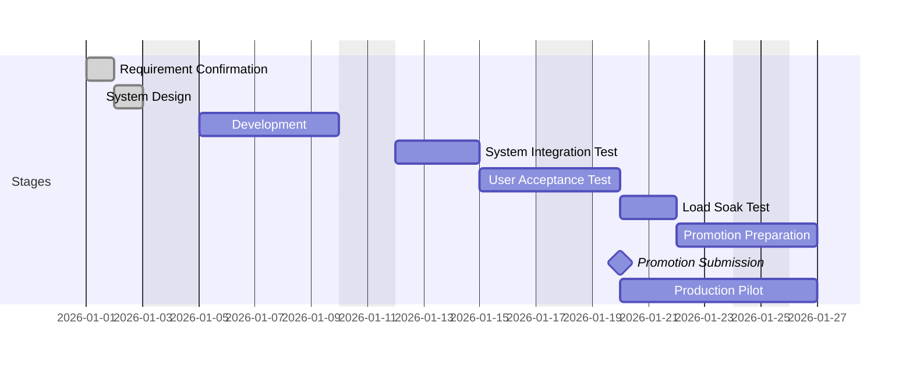

# 05 Project Plan — <Title>

Schedules backwards from **Promotion submission**. Re-run when a gate slips.

## Constraints

| Item | Value |
|---|---|
| Target completion | |
| Promotion window | |
| Submission date | |
| Pilot date | |
| Cut-off | |
| CP3 | |

## Work packages

| ID | Package | From design | Size | Days | Owner |
|---|---|---|---|---|---|

## Gantt

## Milestones

| Stage | Start | End | Owner | Gate | Slack |
|---|---|---|---|---|---|

## Dependencies

| Dependency | Owner | Needed by |
|---|---|---|

## Risk to schedule

| Risk | Effect | Mitigation |
|---|---|---|

Negative slack is listed here. Do not hide it.
