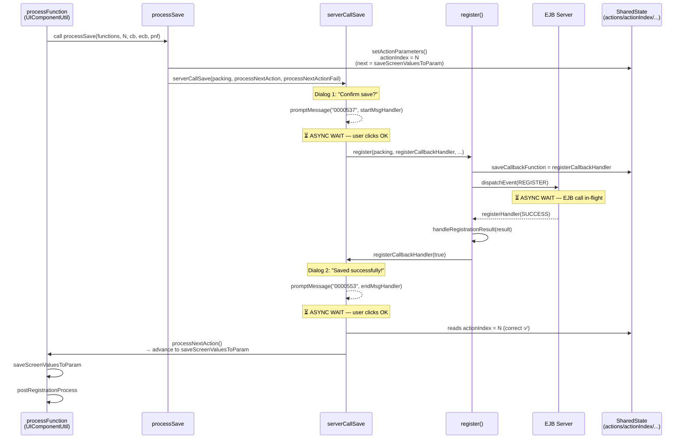
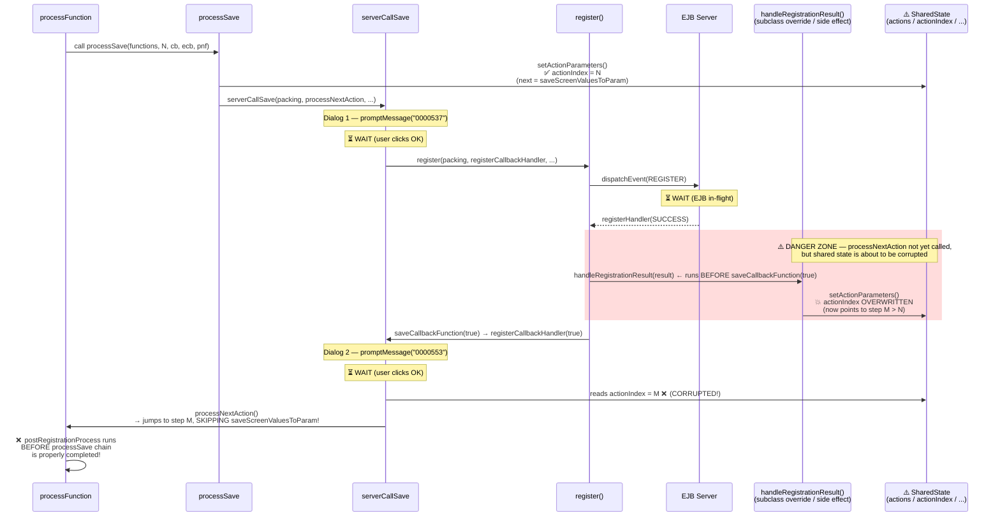
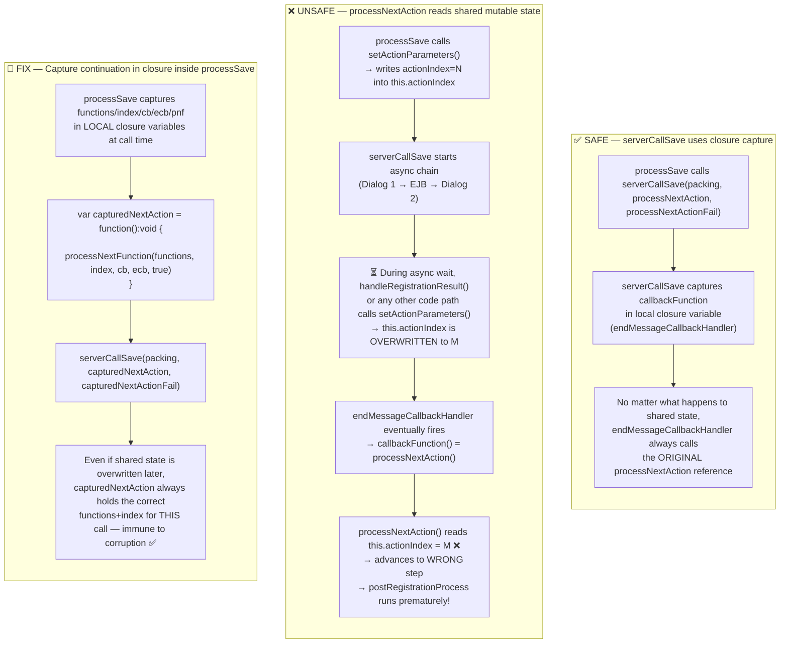
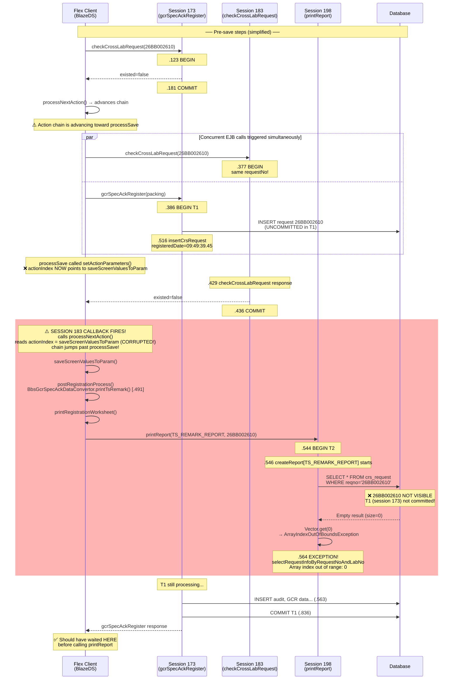
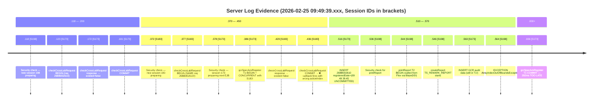
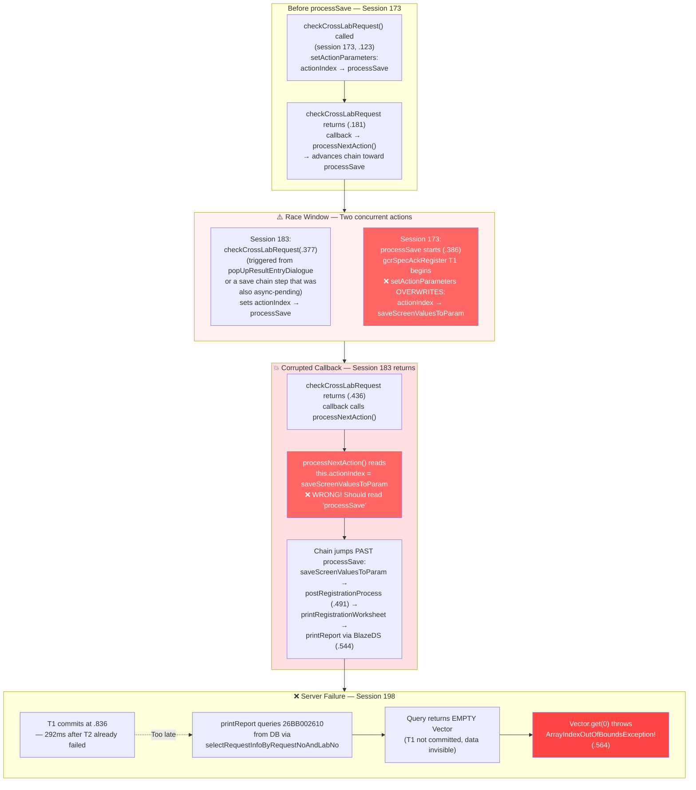

## Root Cause Analysis: `postRegistrationProcess` Running Before `processSave` Completes

### 1. The Design Pattern: How the Chain Normally Works

UIComponentUtil.processFunction passes itself as the processNextFunction argument to each step. Each step receives (functions, index, callbackFunction, errorCallbackFunction, processNextFunction) and is responsible for calling processNextFunction(...) when it finishes (either directly or via callback).

For synchronous steps this is straightforward. For async steps, the pattern is:

1. Call setActionParameters(...) to save the current chain context into instance-level shared fields.

2. Start the async operation, passing processNextAction as the "done" callback.

3. When the async op finishes, the callback fires processNextAction(), which reads back from those saved instance fields and advances the chain.

---

### 2. The Fundamental Structural Flaw: Shared Mutable Instance State

setActionParameters overwrites six shared instance-level fields on every call:

RequestBasePm.asLines 690-695

        private var actions:Array = null;       

        private var actionIndex:int=0;

        private var actionCallbackFunction:Function = null;

        private var actionErrorCallbackFunction:Function = null;

        private var actionNextFunction:Function = null;

        private var actionResult:Boolean = true;

And processNextAction() reads from these at call time, not at capture time:

RequestBasePm.asLines 735-738

        protected final function processNextAction():void

        {

            actionNextFunction(actions, actionIndex, actionCallbackFunction, actionErrorCallbackFunction, actionResult);

        }

This is safe only if exactly one async operation is in-flight at a time. If the instance-level state is overwritten between setActionParameters being called (in step N) and processNextAction() being invoked (completing step N), then processNextAction() will use the wrong actionIndex and jump to the wrong step.

---

### 3. The Specific Vulnerability in processSave → serverCallSave

processSave follows the async pattern:

RequestBasePm.asLines 919-929

        protected final function processSave(functions:Array, 

                                        index:int, 

                                        callbackFunction:Function, 

                                        errorCallbackFunction:Function,

                                        processNextFunction:Function,

                                        result:Boolean = true):void

        {

            setActionParameters(functions, index, callbackFunction, errorCallbackFunction, processNextFunction, result);

            var packing:RequestPackingVoInterface = requestDataConvertor.constructRequestPacking(); 

            serverCallSave(packing, processNextAction, processNextActionFail);

        }

After setActionParameters runs, this.actionIndex points to saveScreenValuesToParam (the step after processSave). The method reference processNextAction (not a closure — it reads shared state at call time) is passed to serverCallSave.

Now look at the full async chain inside serverCallSave:

RegistrationPm.asLines 260-295

        protected override function serverCallSave(requestPacking:RequestPackingVoInterface, callbackFunction:Function, errorCallbackFunction:Function):void

        {

            var endMessageCallbackHandler:Function = function (button:int) : void

            {

                callbackFunction();

            }

            var endFailMessageCallbackHandler:Function = function (button:int=-1) : void

            {

                errorCallbackFunction();

            }

            var registerCallbackHandler:Function = function (result:Boolean) : void

            {

                if (result) {

                    (param as RegistrationProcessParameter).isSave = true;

                    var packing:RegistrationPackingVo = requestPacking as RegistrationPackingVo;

                    var registration:RegistrationVo = packing.registrations.getItemAt(0) as RegistrationVo;

                    (param as (RegistrationProcessParameter)).labResult = registration.labResult;

                    (param as (RegistrationProcessParameter)).packing = packing;

                    promptMessage("", "0000553", UIComponentUtil.getMessageParams(requestNo), endMessageCallbackHandler);   

                } else {

                    promptMessage("", "0000752", null, endFailMessageCallbackHandler);

                }

            }

            var startMessageCallbackHandler:Function = function (button:int) : void

            {                               

                // Start Saving Request

                register(requestPacking as RegistrationPackingVo, registerCallbackHandler, endFailMessageCallbackHandler);

                //registerCallbackHandler();

            }   

            var requestNo:String = (RegistrationProcessParameter(param)).requestNo;

            promptMessage("", "0000537", UIComponentUtil.getMessageParams(requestNo), startMessageCallbackHandler);

        }

The async chain is four levels deep before callbackFunction() (i.e., processNextAction()) is finally invoked:

promptMessage("0000537", ...)        ← Dialog 1: "Confirm save?"

  → startMessageCallbackHandler

      → register(packing, registerCallbackHandler, ...)

          → dispatchEvent(RegistrationEvent.register(...))   ← EJB async call

              → registerHandler (called when EJB responds)

                  → handleRegistrationResult(result)         ← ⚠ hook point

                  → registerCallbackHandler(true)

                      → promptMessage("0000553", ...)        ← Dialog 2: "Saved!"

                          → endMessageCallbackHandler

                              → callbackFunction()           ← processNextAction()

processNextAction() is only called at the very end of this entire chain. Between setActionParameters running (at the start of processSave) and processNextAction() being called (at the end of Dialog 2), there are three asynchronous waits during which the shared instance state is exposed.

---

### 4. The Concrete Race Condition

The critical moment is between register() dispatching the event and registerHandler being invoked.

register() sets two more shared instance-level fields:

RegistrationPm.asLines 748-753

        protected function register(registrationPacking:RegistrationPackingVo, callbackFunction:Function, errorCallbackFunction:Function):void

        {

            this.saveCallbackFunction = callbackFunction;

            this.serverCallErrorCallbackFunction = errorCallbackFunction;

            dispatchEvent(RegistrationEvent.register(registrationPacking, registerHandler, serverCallErrorHandler));

        }

At this point the PM has two active "pending callback" contexts that both use shared state:

- The setActionParameters state (from processSave) — used by processNextAction() when the chain advances.

- The serverCallErrorCallbackFunction — used by serverCallErrorHandler if a server fault occurs.

If serverCallErrorHandler fires (network error, timeout, or fault from any other in-flight event on this PM):

RegistrationPm.asLines 816-824

        protected function serverCallErrorHandler(fault:FaultEvent, trigger:Event):void

        {

            //Alert.show("Server Call Error !!!");  

            promptMessage("", "0003385");

            if (serverCallErrorCallbackFunction!=null)

            {

                serverCallErrorCallbackFunction();

            }

        }

It calls serverCallErrorCallbackFunction() which is endFailMessageCallbackHandler. That calls errorCallbackFunction() = processNextActionFail(). processNextActionFail() reads the shared state and calls actionNextFunction(..., false), which triggers errorCallbackFunction() and aborts the save chain — which is the correct error path.

But here is the more dangerous scenario — the handleRegistrationResult extensibility hook:

RegistrationPm.asLines 799-801

        protected function handleRegistrationResult(result:ResponseObject):void {

        }

This is called synchronously inside registerHandler, BEFORE saveCallbackFunction(true) triggers registerCallbackHandler:

RegistrationPm.asLines 778-782

            if (result.roState == LisErrorConstants.SUCCESS)

            {

                handleRegistrationResult(result);

                saveCallbackFunction(true);             

            }

If any subclass overrides handleRegistrationResult and inside it calls any method that invokes setActionParameters — directly or indirectly (e.g., via another processFunctions() call, via triggering another save-like action, or via dispatching another RegistrationEvent whose response handler calls setActionParameters) — then by the time saveCallbackFunction(true) → ... → processNextAction() is finally called, the this.actionIndex has already been overwritten to point to a later step, and postRegistrationProcess runs before the processSave chain has cleanly completed.

---

### 5. Secondary Flaw: processNextAction Is Not a Safe Closure

The deeper design issue is this contrast:

serverCallSave correctly uses closures — callbackFunction and errorCallbackFunction are captured by value in endMessageCallbackHandler and endFailMessageCallbackHandler. No matter what happens to the outside world, those closures will call exactly the right function.

processNextAction() does NOT use a closure — it reads this.actionIndex, this.actions, etc. dynamically at call time. It is equivalent to:

// What processNextAction() effectively does:

// Reads whatever this.actionIndex currently is — vulnerable to overwrite

actionNextFunction(this.actions, this.actionIndex, ...);

Compare with what serverCallSave's closures do:

// What endMessageCallbackHandler does:

// callbackFunction is captured by value in the closure — safe

callbackFunction();

The same safety that was correctly applied in serverCallSave (capturing callbacks in closures) was NOT applied to the setActionParameters / processNextAction pattern used by processSave and all other async save actions.

---

### 6. The Fix

Every async save action should capture its continuation state in a local closure rather than in the shared instance fields. In processSave specifically:

protected final function processSave(functions:Array, 

                                     index:int, 

                                     callbackFunction:Function, 

                                     errorCallbackFunction:Function,

                                     processNextFunction:Function,

                                     result:Boolean = true):void

{

    // Capture the continuation in a closure at this exact point in time,

    // independent of any future changes to the shared instance state.

    var capturedNextAction:Function = function():void {

        processNextFunction(functions, index, callbackFunction, errorCallbackFunction, true);

    };

    var capturedNextActionFail:Function = function():void {

        processNextFunction(functions, index, callbackFunction, errorCallbackFunction, false);

    };

    var packing:RequestPackingVoInterface = requestDataConvertor.constructRequestPacking(); 

    serverCallSave(packing, capturedNextAction, capturedNextActionFail);

}

This removes the dependency on this.actions, this.actionIndex, etc. and makes the continuation immune to any subsequent setActionParameters calls. The same pattern should be applied to any other async save action where the gap between setActionParameters and the eventual processNextAction() call is long (especially those involving server calls or multi-step dialogs).

---

### Summary Table

|Layer|What can corrupt state|Window of exposure|
|---|---|---|
|processFreeze|Fast — freeze completes quickly|Minimal|
|gatherServerInformationForValidation|EJB call in-flight|Medium|
|preRegistrationProcess|EJB call in-flight|Medium|
|popUpVerificationDialogue / popUpPrivateChangeReasonDialogue / popUpResultEntryDialogue|Waiting for user|Long — user interaction time|
|processSave|Dialog 1 → EJB call → Dialog 2|Very long — 3 async layers deep|
|postRegistrationProcess|EJB call in-flight|Medium|

processSave has the longest exposure window and is the most dangerous step. Any action between the moment Dialog 1 is shown and the moment Dialog 2 is dismissed that writes to the six shared instance fields will cause the sequence to skip steps or advance prematurely — which is exactly the symptom observed (postRegistrationProcess running before processSave completes).

---

### Diagram 1 — Normal Sequential Flow (How the Chain Is Designed to Work)

---

### Diagram 2 — The Race Condition (State Corruption Path)

---

### Diagram 3 — Root Cause: Closure vs. Shared State Comparison

---

### Diagram 4 — All Async Save Actions and Their Shared-State Exposure Windows

```mermaid
gantt
    title Save Action Chain — Shared State Exposure Windows (⚠️ = vulnerable)
    dateFormat  X
    axisFormat %s

    section Action Sequence
    processFreeze           :done,    f,  0, 1
    resetRequestLabs        :done,    r,  1, 2
    gatherServerInfo ⚠️     :active,  g,  2, 4
    convertDataForSave      :done,    c,  4, 5
    validate ⚠️             :active,  v,  5, 7
    preRegistrationProcess ⚠️ :active, pr, 7, 9
    popUpPrivateReason ⚠️   :active,  pp, 9, 12
    popUpResultEntry ⚠️     :active,  pe, 12, 16
    popUpVerification ⚠️    :active,  pv, 16, 20
    processSave ⚠️⚠️⚠️      :crit,    ps, 20, 30
    saveScreenValuesToParam :done,    ss, 30, 31
    postRegistrationProcess ⚠️ :active, po, 31, 34
    printWorksheet          :active,  pw, 34, 37
    processUnfreeze         :done,    pu, 37, 38
    processClear            :done,    pc, 38, 39
    retainScreenValues      :done,    rs, 39, 40
    returnToScreen          :done,    rt, 40, 41
```

The key insight across all four diagrams: `processSave` has the **longest exposure window** (three nested async layers: Dialog 1 → EJB call → Dialog 2) and is the only step where an extensibility hook (`handleRegistrationResult`) runs synchronously **between** the EJB response arriving and `processNextAction()` being called — making it the most likely point of state corruption.

---
### Diagram 1 — Exact Log Timeline with All Server Sessions

---

### Diagram 2 — Exact Log Line Evidence

---

### Diagram 3 — The Shared State Corruption Mechanism (Root Cause)

---

### Diagram 4 — The Two Key Concurrent EJB Calls Proven by Session IDs

Mermaid Syntax Error

View diagram source

block-beta
  columns 4
  block:timeline["Timeline ms"]:1
    t386[".386"]
    t436[".436"]
    t516[".516"]
    t544[".544"]
    t564[".564"]
    t836[".836"]
  end
  block:s173["Session 173\n(gcrSpecAckRegister T1)"]:1
    r1["T1 BEGIN\ngcrSpecAckRegister\nline 131"]
    space
    r3["INSERT 26BB002610\nregisteredDate=.45\nline 168"]
    space
    space
    r6["T1 COMMIT\nline ~200+\n.836"]
  end
  block:s183["Session 183\n(checkCrossLabRequest)"]:1
    space
    r2["COMMIT .436\n❌ callback fires\nwrong actionIndex\nline 135"]
    space
    space
    space
    space
  end
  block:s198["Session 198\n(printReport T2)"]:1
    space
    space
    space
    r4["T2 BEGIN\nprintReport\nline 173"]
    r5["EXCEPTION!\nArrayIndexOutOfBounds\nVector.get(0)\nline 190"]
    space
  end

---

### Summary: What the Log Proves

|Evidence|Log Line|Significance|
|---|---|---|
|gcrSpecAckRegister T1 starts|line 131 .386|T1 begins|
|INSERT 26BB002610 with registeredDate=09:49:39.45|line 168 .516|Data written but NOT committed|
|Session 183 checkCrossLabRequest same requestNo|line 129 .377|Concurrent with T1 — will fire callback with corrupted state|
|Session 183 callback fires|line 135 .436|processNextAction() reads actionIndex pointing to saveScreenValuesToParam|
|printReport called via BlazeDS|line 234 in stacktrace|Flex client called this — NOT from within gcrSpecAckRegister|
|selectRequestInfoByRequestNoAndLabNo returns empty|line 192 stacktrace|26BB002610 not visible — T1 uncommitted|
|Vector.get(0) → ArrayIndexOutOfBoundsException|line 191|Exception caused by empty DB result|
|T1 commits at .836|292ms after T2 failed|Too late|

The fix must ensure that Session 183's checkCrossLabRequest callback, when it fires, cannot advance the chain past processSave by capturing its own continuation state in a closure rather than relying on the shared actionIndex instance field.