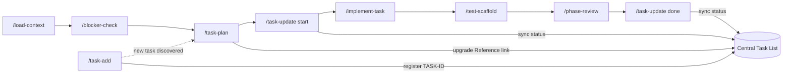

# Agent Skills Reference

Complete reference for all Agent Skills defined for the CRS Revamp project. Skills live at `obsidian-vault/.github/skills/` and are loaded by Copilot via the `chat.agentSkillsLocations` setting in [[Copilot Workflow Optimization#Layer 1 — Multi-Root Workspace|the workspace file]].

> [!info] How skills load
> Copilot reads only the `name` and `description` fields at startup. The full `SKILL.md` body loads only when the skill is invoked (manually via `/name` or automatically when Copilot judges it relevant). Resource files (`.tsx`, etc.) load only when referenced in the instructions. This keeps context usage low across many skills.

> [!tip] Generate a new skill
> Type `/create-skill` in Copilot Chat with a description of what you need. Copilot generates a `SKILL.md` with frontmatter, instructions, and directory structure.

---

## Skills Catalogue

### `load-context`

| Field | Value |
|---|---|
| **Invoke** | `/load-context {panel or topic}` |
| **Auto-loaded when** | User asks about a panel, component, or workflow by name |
| **Resource files** | None |

Searches `@workspace` across the vault for KB notes, legacy Flex component references, and related workflow/validation/interaction docs for the specified topic. Produces a structured summary: business rules, legacy behaviour, shared lib components needed, dictionary VOs required, and open questions. Ends with a handoff prompt to `/implement-task` or `/blocker-check`.

**Use before:** any unfamiliar or complex implementation task.

---

### `blocker-check`

| Field | Value |
|---|---|
| **Invoke** | `/blocker-check {task name or description}` |
| **Auto-loaded when** | User asks about starting a task or mentions a blocker |
| **Resource files** | None |

Checks which of the six open blockers (D.1–D.6) affect the specified task. For each affected blocker, states what is unknown, what assumption is needed to proceed, and what the risk is. Recommends one of: **PROCEED**, **PROCEED WITH ASSUMPTION**, **PARTIAL**, or **BLOCKED**. When proceeding with an assumption, inserts `// TODO [BLOCKER D.x]: <assumption>` comments in generated code so all assumptions are grep-searchable.

**Open blockers registry:**

| ID | Description | Affects |
|---|---|---|
| D.1 | `CrsRegController` endpoint contracts | Phase 9, Phase 8C save |
| D.2 | Keyword group codes — `AGE_UNIT`, `RACE`, `BILL`, `CONFIDENTIAL`, `LAB_ONLY` | Phases 2–3 dropdowns |
| D.3 | HKID lookup: PAS integration vs local CRS data | Phase 8A |
| D.4 | `OBJECT_ATTRIBUTE` table access route: Hub BFF or spec-ack-svc? | Phase 4 tab sequence |
| D.5 | Worksheet printing API endpoint | Phase 8D.1 |
| D.6 | Label printing API endpoint | Phase 8D.2 |

**Use before:** any task that touches dropdowns, tab sequence, save workflows, or printing.

---

### `implement-task`

| Field | Value |
|---|---|
| **Invoke** | `/implement-task {TASK-ID or phase.task} {task name} [repo]` |
| **Auto-loaded when** | User asks to implement, build, or scaffold any CRS Revamp task |
| **Resource files** | `component-template.tsx` — pre-wired frontend component with correct Emotion/apiContext patterns |

The primary implementation skill. Supports **both frontend and backend** repositories. Detects the target repo from the Task ID (Central Task List lookup) or from a repo argument, then applies the correct pre-flight checks and architecture rules for that stack.

**Frontend pre-flights** (`lis-request-app`, `lis-crs-common-app`):
1. **Shared library check** — does `@lis/lis-hub-lib` cover this? Wire it up instead of re-implementing.
2. **Phase constraint check** — enforces scope per phase (Phase 2 = layout only, etc.)
3. **Blocker check** — flags D.1–D.6 and inserts `// TODO [BLOCKER D.x]` comments.

**Backend pre-flights** (`lis-request-svc`, `lis-patient-svc`, `lis-hub-svc`):
1. **Module placement** — determines whether file belongs in `app/` or `client-lib/`.
2. **Blocker check** — same D.1–D.6 registry.

**Frontend architecture rules:**

| Rule | Detail |
|---|---|
| Emotion cache | `key: "request"` — never `"css"` or default |
| API calls | `apiContext.request.post<ResultDataResponse<T>>()` only — no direct Axios |
| Zustand store | `src/features/registration/store/` only — no Hub store imports |
| Panel visibility | `style={{ display: isVisible ? '' : 'none' }}` — never conditional unmount |
| Message box | `(cms.api.ui as any).MessageBoxApi` — no `<MessageBoxProvider>` |
| Dictionary | `apiContext.dictionary.get()` — no direct dictionary endpoint calls |
| Env values | No hardcoded URLs, lab numbers, or hospital codes |

**Backend architecture rules:**

| Rule | Detail |
|---|---|
| Base class | Controller + Service extend `AbstractService` (audit-logging) |
| DI | `@RequiredArgsConstructor` + `final` fields — no `@Autowired` |
| ServiceParameter | ThreadLocal via `AbstractService.setServiceParameter()` at controller entry |
| DataSource routing | `DataSourceContextHolder.setCurrentDb(...)` at controller entry — no manual TX helper |
| Transactions | Spring `@Transactional` only |
| Return type | `ResponseEntity<ResultDataResponse<T>>` — no raw `String` returns |
| Logging | `info()` / `warn()` from `AbstractService` — no SLF4J `logger.info/error` |

After generation, runs `npm run type-check` (frontend) or `mvn compile` (backend) and reports errors.

**Use for:** all Phase 0–9 frontend tasks AND all backend service tasks.

---

### `test-scaffold`

| Field | Value |
|---|---|
| **Invoke** | `/test-scaffold {ComponentName}` |
| **Auto-loaded when** | User asks to write, generate, or add tests for a component |
| **Resource files** | `test-template.tsx` — pre-wired test with `mockApiContext` and mandatory visibility assertion |

Reads the component file first to understand its props and rendered structure. If a `.test.tsx` already exists, extends it rather than replacing it. Generates tests in three groups: rendering (including mandatory `display:none` visibility test), props, and user interactions.

Creates `src/test-utils/mockApiContext.ts` if it does not yet exist.

Runs the test suite after generation and reports pass/fail.

> [!warning] Mandatory test
> Every Registration component test file must include the `display:none` visibility test. This is an architecture rule verification, not optional.

**Use after:** every `implement-task` invocation.

---

### `phase-review`

| Field | Value |
|---|---|
| **Invoke** | `/phase-review {phase number or "all"}` |
| **Auto-loaded when** | User says a phase is complete or asks for a code review |
| **Resource files** | None |

Scans `src/features/registration/` for 8 critical violations (V1–V8) and 5 warnings (W1–W5). Reports each finding with file, approximate line, issue description, and specific fix. Ends with a summary count and **GO / NO-GO** recommendation for the next phase.

**Critical violations scanned:**

| Code | Violation |
|---|---|
| V1 | Direct Axios import |
| V2 | Hub Zustand store import |
| V3 | Wrong Emotion cache key |
| V4 | Conditional unmount of panels |
| V5 | Direct dictionary endpoint call |
| V6 | `<MessageBoxProvider>` instantiation |
| V7 | Hardcoded environment values |
| V8 | Re-implemented shared library component |

**Warnings scanned:** missing TypeScript return types, missing test files, incomplete `useEffect` deps, unresolved `TODO [BLOCKER]` comments, phase constraint violations.

**Use after:** completing a batch of tasks or a full phase, before starting the next phase.

---

### `task-plan`

| Field | Value |
|---|---|
| **Invoke** | `/task-plan {TASK-ID or phase.task} {task name}` |
| **Auto-loaded when** | User says "plan task" or asks for a task planning note |
| **Resource files** | None |

Generates an Obsidian implementation plan note at:
`CRS/Revamp/Migration Plan/Frontend/Implementation Plans/{phase.task} — {Task Name}.md`

The note includes: YAML frontmatter (`task-id`, `repo`, phase, task, status, estimate, blockers, tags), phase constraint callout, KB context summary, blocker analysis with assumptions, technical approach (files, shared lib components, dictionary VOs, API calls), architecture checklist, and acceptance criteria.

Back-links the migration plan row AND **upgrades the Reference column in `CRS/Revamp/Central Task List.md`** to point directly to this note (replacing the `§section` link added by `task-add`).

**Use before:** starting any non-trivial task. Especially valuable for tasks with blockers or complex business rules.

---

### `task-add`

| Field | Value |
|---|---|
| **Invoke** | `/task-add {repo} {migration plan} {phase} {task name}` |
| **Auto-loaded when** | User says "add a task" or "I found a missing task" |
| **Resource files** | None |

Adds a new task row to the correct phase table in the per-screen migration plan **and** registers it in `CRS/Revamp/Central Task List.md`. Generates a global `TASK-NNN` ID, tags the migration plan row with it, updates the Progress Summary in both files, and appends Changelog entries in both files.

**Status after:** new row in migration plan (with Task ID tag), new row in Central Task List, both Progress Summaries updated.

---

### `task-update`

| Field | Value |
|---|---|
| **Invoke** | `/task-update {TASK-ID or task number(s)} {start\|done\|skip\|block}` |
| **Auto-loaded when** | User says "mark done", "start task", "complete phase", etc. |
| **Resource files** | None |

Updates task status in **both** the per-screen migration plan and `CRS/Revamp/Central Task List.md`. Accepts a global `TASK-ID` (preferred) or a local task number. After updating rows, **recounts actual status values from both files** and updates both Progress Summary tables. Appends Changelog entries in both files. Reports per-task changes plus updated progress for both the phase (migration plan) and repository (Central Task List).

For tasks created before centralization (no Task ID tag), updates the migration plan only and prompts to backfill.

**Status symbol mapping:**

| Input | Symbol | Meaning |
|---|---|---|
| `start` | `[/]` | In Progress |
| `done` | `[x]` | Completed |
| `skip` | `[-]` | Skipped / N/A |
| `block` | `[!]` | Blocked — adds blocker ID to Notes |

---

## Central Task List

The file `CRS/Revamp/Central Task List.md` is the single source of truth for all tasks across all repositories.

| Skill | Action on Central Task List |
|---|---|
| `/task-add` | Creates a new row with `TASK-NNN` ID; Reference points to migration plan `§section` |
| `/task-plan` | Upgrades Reference to direct link to the implementation plan note |
| `/task-update` | Mirrors every status change; recounts Progress Summary by repository |

**Progress Summary in this file is by repository** (cross-repo view). Progress Summary inside each migration plan remains by phase (screen-level view).

For tasks created before centralization, run `/task-add` manually to backfill. `/task-update` will warn when it encounters a task with no `TASK-ID` tag.

---

## Skill Invocation Flow



**Shortcut for simple tasks** (no unknowns, familiar component):
```
/implement-task → /test-scaffold → /task-update done
```

**Full sequence for complex tasks** (new panel, blockers, unfamiliar legacy source):
```
/load-context → /blocker-check → /task-plan → /task-update start
→ /implement-task → /test-scaffold → /phase-review → /task-update done
```

---

## Related Notes

- [[Copilot Workflow Optimization]]
- [[Registration Migration Plan]]
