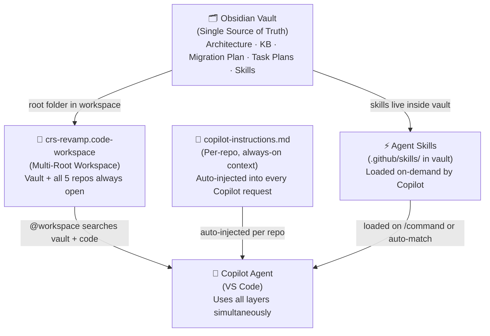

# Copilot Workflow Optimization

This note documents the design for integrating VS Code + GitHub Copilot with the Obsidian vault as a centralized knowledge base for the CRS Revamp project. The goal is to eliminate context re-explanation when switching repos, keep all architecture knowledge in one place, and use Copilot Agent Skills to automate repetitive development workflows.

---

## Design Principles

> [!tip] Core Idea
> The Obsidian vault is the **single source of truth**. Everything flows outward from it — into VS Code via the multi-root workspace, into Copilot via agent skills, and into the task list via skill-driven updates.

Three problems this design solves:

1. **Context fragmentation** — Copilot loses all context when switching repos. The multi-root workspace and `copilot-instructions.md` files fix this.
2. **Repeated re-explanation** — Architecture rules, shared library components, and phase constraints have to be re-stated every session. Agent Skills fix this.
3. **Scattered task tracking** — Status scattered across JIRA, chat, and memory. A centralized task list in the vault with skill-driven updates fixes this.

---

## Layer Overview



---

## Layer 1 — Multi-Root Workspace

**File:** `D:\ECPath5_revamp\crs-revamp\crs-revamp.code-workspace`

The workspace opens all 5 repos plus the Obsidian vault as a permanent anchor folder. `@workspace` queries in Copilot Chat search across all of them simultaneously.

```json
{
  "folders": [
    { "name": "📚 Obsidian Vault (LIS Knowledge Base)", "path": "./obsidian-vault" },
    { "name": "🖥 lis-request-app",                    "path": "./lis-request-app" },
    { "name": "🖥 lis-crs-common-app",                 "path": "./lis-crs-common-app" },
    { "name": "🖥 lis-hub-app",                        "path": "./lis-hub-app" },
    { "name": "⚙️ lis-hub-svc",                        "path": "./lis-hub-svc" }
  ],
  "settings": {
    "github.copilot.chat.codeGeneration.useInstructionFiles": true,
    "chat.agentSkillsLocations": [
      "./obsidian-vault/.github/skills"
    ]
  }
}
```

> [!note] Vault path
> Adjust `./obsidian-vault` to match the actual relative path of your vault from the workspace file location, e.g. `../LIS Obsidian Vault`.

**Key behaviours:**
- The vault folder never changes — only the project repo folders are swapped when moving between screens
- `chat.agentSkillsLocations` points at `.github/skills/` inside the vault, making all skills available regardless of which repo is active
- `@workspace` queries span both documentation (vault) and implementation (repos)

---

## Layer 2 — Per-Repo Custom Instructions

**File per repo:** `.github/copilot-instructions.md`

Auto-injected into every Copilot Chat request for that repo. Zero effort after initial setup — Copilot just knows.

> [!tip] Generate the first draft
> Run `/init` in Copilot Chat inside each repo. Copilot analyses the codebase and generates a starting file. Then enhance it with content from vault architecture notes.

**Content strategy per repo:**

| Repo | Key content |
|---|---|
| `lis-request-app` | MFE plugin lifecycle, Emotion cache key `"request"`, apiContext-only pattern, `@lis/lis-hub-lib` component list, Zustand scoped to `features/registration/store/`, `display:none` rule, phase plan summary |
| `lis-crs-common-app` | Level-1 shell role, how it loads Level-2 remotes, Module Federation singleton config |
| `lis-hub-app` | Shell rules, Zustand store ownership, dictionary loading, MessageBoxApi, theme ownership |
| `lis-hub-svc` | JWT security, ThreadLocal DB routing, POST-only endpoints, `ResultDataResponse<T>` envelope |

**Rules:**
- Keep each file **under 500 lines** — Copilot compresses long instructions
- Verify it is loaded: after any Copilot response, expand the References panel — `copilot-instructions.md` should be listed
- Version-controlled in the repo so the whole team benefits

**Related:** [[Path-Specific Instructions]]

---

## Layer 3 — Path-Specific Instructions

**Files:** `.github/instructions/*.instructions.md`

Activate only when Copilot works on files matching a path pattern. Use for rules that differ between parts of the codebase.

**Files to create for `lis-request-app`:**

| File | `applyTo` pattern | Purpose |
|---|---|---|
| `features-registration.instructions.md` | `src/features/registration/**` | Phase constraint, store scope, display:none rule, shared lib list |
| `cms-plugin.instructions.md` | `src/cms-plugin/**` | Entry point rules, Emotion cache key, component root wiring |
| `testing.instructions.md` | `**/*.test.tsx` | Test conventions, mockApiContext pattern, mandatory visibility test |

Example — `features-registration.instructions.md`:

```markdown
---
applyTo: "src/features/registration/**"
---
- Zustand store lives in store/ within this feature — never import from Hub
- API calls use apiContext.request.post<ResultDataResponse<T>>() only
- Tab panels use display:none — never conditional unmount
- Use @lis/lis-hub-lib: HkidInput, EncounterNumber, LisLocationBox, LisDoctorSingleBox
- Tab sequence is driven by ObjectAttributeVo, not hardcoded
```

---

## Layer 4 — Agent Skills

**Location:** `obsidian-vault/.github/skills/`

Agent Skills are the primary mechanism for automating repetitive workflows. They are loaded on-demand by Copilot — only their `name` and `description` are read at startup; the full content loads only when relevant. This means many skills can be installed with minimal context cost.

> [!info] Standard
> Agent Skills use the open [agentskills.io](https://agentskills.io) standard. Skills defined here also work in GitHub Copilot CLI and the Copilot coding agent — not just VS Code.

See [[Agent Skills Reference]] for the full catalogue of skills, their slash commands, descriptions, and resource files.

**Skills location in vault:**

```
obsidian-vault/
└── .github/
    └── skills/
        ├── load-context/
        ├── blocker-check/
        ├── implement-task/
        ├── test-scaffold/
        ├── phase-review/
        ├── task-plan/
        ├── task-add/
        └── task-update/
```

---

## Layer 5 — Centralized Task List

**File:** `CRS/Revamp/Migration Plan/Registration Migration Plan.md`

The migration plan is the single task list for the Registration screen migration. It is updated directly by Agent Skills — no manual table editing required.

**Status legend:**

| Symbol | Meaning |
|---|---|
| `[ ]` | Pending |
| `[/]` | In Progress |
| `[x]` | Completed |
| `[-]` | Skipped / Not Applicable |
| `[!]` | Blocked (pending blocker resolution) |

**Task plan notes** are stored at:
`CRS/Revamp/Task Plans/{phase.task} — {Task Name}.md`

Each plan note contains phase constraint, business rules from the KB, technical approach, architecture checklist, and acceptance criteria. The migration plan table links to the plan note for each task once `/task-plan` is run.

---

## Daily Workflow

### Starting a session

1. Open `crs-revamp.code-workspace` — all repos and vault are available
2. Check `CRS/Revamp/Migration Plan/Registration Migration Plan.md` for today's priorities
3. In Copilot Chat, work through the skill sequence for each task (see below)

### Skill invocation sequence per task

```
/load-context    {panel or topic}     → surface KB docs + legacy behaviour
/blocker-check   {task name}          → confirm no blockers, or state assumptions
/task-plan       {phase.task}         → generate plan note, back-link in migration plan
/task-update     {phase.task} start   → mark In Progress [/]
/implement-task  {phase.task}         → scaffold component, hook, types, test
/test-scaffold   {ComponentName}      → generate or extend test file
/phase-review    {phase number}       → audit for architecture violations
/task-update     {phase.task} done    → mark Completed [x], recalculate progress
```

### When a new task is discovered

```
/task-add  {phase} {task name}        → insert row, update Progress Summary
/task-plan {phase.task}               → plan it before implementing
```

### After completing a phase

```
/phase-review {phase}                 → get GO / NO-GO before moving on
/task-update  Phase {X} done          → batch-mark all tasks complete
```

---

## Vault Structure for This Design

```
obsidian-vault/
├── .github/
│   └── skills/                        ← Agent Skills (loaded by Copilot)
│       ├── load-context/SKILL.md
│       ├── blocker-check/SKILL.md
│       ├── implement-task/
│       │   ├── SKILL.md
│       │   └── component-template.tsx
│       ├── test-scaffold/
│       │   ├── SKILL.md
│       │   └── test-template.tsx
│       ├── phase-review/SKILL.md
│       ├── task-plan/SKILL.md
│       ├── task-add/SKILL.md
│       └── task-update/SKILL.md
│
├── ECP/
│   ├── Tooling/
│   │   ├── Copilot Workflow Optimization.md   ← this note
│   │   └── Agent Skills Reference.md
│   ├── Micro-Frontend-Backend Architecture/
│   └── lis-hub-app/
│       ├── Dictionary Loading.md
│       └── ...
│
├── CRS/
│   └── Revamp/
│       ├── Migration Plan/
│       │   └── Registration Migration Plan.md
│       └── Task Plans/
│           └── {phase.task} — {Task Name}.md
│
└── Knowledge Base/
    └── 01_Screens/
        └── Registration/
            └── ...
```

---

## Setup Checklist

> [!todo] One-time setup steps

- [ ] Place `crs-revamp.code-workspace` at `D:\ECPath5_revamp\crs-revamp\`
- [ ] Adjust the vault path in the workspace file to match your actual vault location
- [ ] Copy `.github/skills/` directory into the vault root
- [ ] Create `CRS/Revamp/Task Plans/` folder in the vault
- [ ] Open workspace in VS Code and verify all 5 folders appear in Explorer
- [ ] Type `/` in Copilot Chat — confirm all 8 skills appear in the menu
- [ ] Run `/init` in each repo to generate base `copilot-instructions.md`
- [ ] Enhance each `copilot-instructions.md` with content from vault architecture notes
- [ ] Create `.github/instructions/` files in `lis-request-app` (3 files)
- [ ] Smoke test: `/load-context Patient Demographics Panel`

---

## Related Notes

- [[Agent Skills Reference]]
- [[Registration Migration Plan]]
- [[02 - Micro-Frontend Architecture]]
- [[Dictionary Usage in Plugin Apps]]
